# ✨ Awesome AI Agents & Agentic Workflows ✨

> A curated, practical guide to understanding, building, evaluating, and securing AI agents and agentic workflows.

  

AI agents combine a model with instructions, tools, memory or state, and a control loop so they can pursue a goal over multiple steps. Agentic workflows use many of the same components, but keep the path more explicitly defined in code. This collection focuses on primary sources, maintained open-source projects, and practical material that explains both the promise and the engineering trade-offs.

## Contents

- [Start here](#start-here)
- [Agents explained](#agents-explained)
- [Agent or workflow?](#agent-or-workflow)
- [Test your knowledge](#test-your-knowledge)
- [Learning paths](#learning-paths)
- [Official educational resources](#official-educational-resources)
- [Open-source frameworks](#open-source-frameworks)
- [Tools, memory, and protocols](#tools-memory-and-protocols)
- [Architecture patterns](#architecture-patterns)
- [Use-case playbook](#use-case-playbook)
- [Evaluation and observability](#evaluation-and-observability)
- [Security and production checklist](#security-and-production-checklist)
- [Research and benchmarks](#research-and-benchmarks)
- [Related awesome lists](#related-awesome-lists)
- [Contributing](#contributing)

## Start here

**New to agents?** Follow this sequence:

1. Read [What is an AI agent?](docs/what-is-an-ai-agent.md) and Anthropic's [Building effective agents](https://www.anthropic.com/engineering/building-effective-agents).
2. Learn the difference between an agent and an agentic workflow in [Agentic workflows](docs/agentic-workflows.md).
3. Build one small tool-using loop with the [OpenAI Agents SDK quickstart](https://openai.github.io/openai-agents-python/quickstart/), [LangGraph quickstart](https://langchain-ai.github.io/langgraph/tutorials/introduction/), or [smolagents tutorial](https://huggingface.co/docs/smolagents/main/en/tutorials/building_good_agents).
4. Add deterministic checks, budgets, traces, and human approval before expanding autonomy.
5. Create task-level evaluations before adding more tools or multiple agents—see [Evaluation and security](docs/evaluation-and-security.md).

## Agents explained

An agent repeatedly observes its state, decides what to do, takes an action through a tool or response, and uses the result to decide the next step. A production system surrounds this loop with policy enforcement, limits, tracing, evaluation, and human escalation.

Diagram source: [Mermaid](assets/agent-loop.mmd).

The core components are:

- **Model** — interprets the goal, reasons over context, and chooses the next action.
- **Instructions** — define the role, policies, success criteria, and behavior boundaries.
- **Tools** — expose typed operations such as search, code execution, APIs, or database queries.
- **State and memory** — retain task progress, observations, artifacts, and approved long-term knowledge.
- **Control loop** — continues until success, a stop condition, a budget, or an escalation is reached.
- **Guardrails and permissions** — constrain inputs, outputs, tool calls, identities, and side effects.
- **Evaluation and tracing** — make trajectories inspectable and measure whether the task was actually completed.

Read [What is an AI agent?](docs/what-is-an-ai-agent.md) for the detailed model and its sources.

## Agent or workflow?

Anthropic makes a useful distinction: **workflows** orchestrate models and tools through predefined code paths, while **agents** let the model dynamically direct its process and tool use.

| Choose | When it fits | Main advantage | Main cost |
| --- | --- | --- | --- |
| Single model call | The task is well-defined and needs no external action | Lowest latency and easiest testing | Limited adaptability |
| Deterministic workflow | Steps and branches are known in advance | Predictable, auditable, and efficient | Brittle when the path cannot be anticipated |
| Agentic workflow | Some steps are fixed, but selected decisions need model judgment | Balances control and flexibility | More states and failure paths |
| Single agent | The path is open-ended and tool feedback determines the next step | Flexible generalization | Variable cost, latency, and behavior |
| Multi-agent system | Work separates into roles with distinct context or tools | Parallelism and context isolation | Coordination overhead and compounded failures |

Start with the least autonomous design that can reliably solve the task. More autonomy is justified when it produces measurable gains on representative evaluations, not merely a more impressive demo.

## Test your knowledge

Finished the guides? Open the [interactive AI Agents Knowledge Check](quiz/index.html)—18 multiple-answer questions covering foundations, the agent loop, tools and memory, workflows, multi-agent orchestration, and evaluation and safety.

The quiz:

- grades the entire test with exact multi-answer scoring;
- reports scores by technical area;
- reveals correct answers only when requested;
- explains each answer and links back to source material; and
- stores progress only in the learner's browser.

It is dependency-free and ready for GitHub Pages using the included workflow.

## Learning paths

### Foundations

- [A Practical Guide to Building AI Agents](https://openai.com/business/guides-and-resources/a-practical-guide-to-building-ai-agents/) — model, tools, instructions, orchestration, guardrails, and a practical adoption path.
- [Building effective agents](https://www.anthropic.com/engineering/building-effective-agents) — a clear taxonomy of workflows and agents, with composable patterns and design advice.
- [ReAct: Synergizing Reasoning and Acting](https://arxiv.org/abs/2210.03629) — foundational reasoning-and-action loop that interleaves thought, action, and observation.
- [Hugging Face Agents Course](https://huggingface.co/learn/agents-course/) — free course covering agent fundamentals, frameworks, use cases, and a final project.
- [Lilian Weng: LLM Powered Autonomous Agents](https://lilianweng.github.io/posts/2023-06-23-agent/) — influential technical overview of planning, memory, and tool use.

### Build a first agent

- [OpenAI Agents SDK quickstart](https://openai.github.io/openai-agents-python/quickstart/) — create agents, add tools, use handoffs, and inspect traces.
- [LangGraph quickstart](https://langchain-ai.github.io/langgraph/tutorials/introduction/) — build a stateful graph and introduce persistence and human-in-the-loop control.
- [smolagents: building good agents](https://huggingface.co/docs/smolagents/main/en/tutorials/building_good_agents) — concise tutorial on tool descriptions, task decomposition, and agent design.
- [AutoGen AgentChat tutorial](https://microsoft.github.io/autogen/stable/user-guide/agentchat-user-guide/tutorial/index.html) — high-level API for single- and multi-agent applications.
- [Google Agent Development Kit](https://google.github.io/adk-docs/) — official tutorials for agents, tools, sessions, workflows, evaluation, and deployment.

### Engineer for production

- [Agent architecture patterns](docs/architecture-patterns.md) — routing, parallelization, orchestrator-worker, evaluator-optimizer, and human approval.
- [Evaluation and security](docs/evaluation-and-security.md) — trajectory evaluation, outcome checks, threat modeling, and release gates.
- [OpenAI Agents SDK: running agents](https://openai.github.io/openai-agents-python/running_agents/) — lifecycle, turns, exceptions, sessions, and run configuration.
- [LangGraph durable execution](https://langchain-ai.github.io/langgraph/concepts/durable_execution/) — persistence and replay for long-running workflows.
- [Anthropic: demystifying evals for AI agents](https://www.anthropic.com/engineering/demystifying-evals-for-ai-agents) — practical guidance for tasks, graders, transcripts, and evaluation design.

## Official educational resources

### OpenAI

- [Agents SDK documentation](https://openai.github.io/openai-agents-python/) — official Python SDK with agents, tools, handoffs, sessions, guardrails, human-in-the-loop, and tracing.
- [Agents SDK examples](https://openai.github.io/openai-agents-python/examples/) — runnable examples from hello world through orchestration and research agents.
- [Tools](https://openai.github.io/openai-agents-python/tools/) — hosted tools, function tools, agents-as-tools, and tool behavior.
- [Handoffs](https://openai.github.io/openai-agents-python/handoffs/) — delegate a conversation or task to a specialist agent.
- [Guardrails](https://openai.github.io/openai-agents-python/guardrails/) — input, output, and tool guardrails.
- [Tracing](https://openai.github.io/openai-agents-python/tracing/) — traces, spans, processors, and sensitive-data controls.

### Anthropic

- [Building effective agents](https://www.anthropic.com/engineering/building-effective-agents) — design principles and workflow patterns.
- [Building a multi-agent research system](https://www.anthropic.com/engineering/multi-agent-research-system) — lessons from an orchestrator-worker research system.
- [Writing tools for agents](https://www.anthropic.com/engineering/writing-tools-for-agents) — designing tool interfaces and descriptions for reliable use.
- [Demystifying evals for AI agents](https://www.anthropic.com/engineering/demystifying-evals-for-ai-agents) — task suites, graders, transcripts, and common failure modes.
- [Measuring AI agent autonomy in practice](https://www.anthropic.com/research/measuring-agent-autonomy) — framework for describing and measuring agent autonomy.

### Other official learning hubs

- [LangGraph documentation](https://langchain-ai.github.io/langgraph/) — low-level orchestration for long-running, stateful agents.
- [Microsoft AutoGen documentation](https://microsoft.github.io/autogen/stable/index.html) — AgentChat and event-driven Core APIs.
- [Hugging Face smolagents documentation](https://huggingface.co/docs/smolagents/main/index) — compact agent framework with code and tool-calling agents.
- [Semantic Kernel agent framework](https://learn.microsoft.com/en-us/semantic-kernel/frameworks/agent/) — Microsoft documentation for agents and orchestration.
- [LlamaIndex agents](https://docs.llamaindex.ai/en/stable/module_guides/deploying/agents/) — agents that use tools over data and services.
- [CrewAI documentation](https://docs.crewai.com/) — agents, crews, flows, tools, memory, and production operations.
- [PydanticAI documentation](https://ai.pydantic.dev/) — typed Python agent framework built around dependency injection and structured outputs.

## Open-source frameworks

### General-purpose agent frameworks

- [OpenAI Agents SDK](https://github.com/openai/openai-agents-python) — lightweight primitives for agents, tools, handoffs, guardrails, sessions, and tracing.
- [LangGraph](https://github.com/langchain-ai/langgraph) — graph-based runtime for durable, stateful, human-in-the-loop agents.
- [AutoGen](https://github.com/microsoft/autogen) — layered framework for conversational and event-driven multi-agent applications.
- [Semantic Kernel](https://github.com/microsoft/semantic-kernel) — enterprise SDK for model, plugin, memory, process, and agent orchestration.
- [Google ADK](https://github.com/google/adk-python) — code-first toolkit for developing and evaluating sophisticated agents.
- [LlamaIndex](https://github.com/run-llama/llama_index) — data-centric agents, workflows, retrieval, and tool abstractions.
- [PydanticAI](https://github.com/pydantic/pydantic-ai) — typed, model-agnostic agent framework for Python.
- [smolagents](https://github.com/huggingface/smolagents) — minimal framework supporting code agents, tool-calling agents, and sandboxed execution.

### Multi-agent and workflow-focused

- [CrewAI](https://github.com/crewAIInc/crewAI) — role-based agents plus event-driven flows.
- [Agno](https://github.com/agno-agi/agno) — agent teams, workflows, memory, knowledge, and runtime tooling.
- [Mastra](https://github.com/mastra-ai/mastra) — TypeScript framework for agents, workflows, RAG, memory, and evals.
- [BeeAI Framework](https://github.com/i-am-bee/beeai-framework) — TypeScript/Python framework for production agent workflows.
- [Microsoft Agent Framework](https://github.com/microsoft/agent-framework) — framework for agents and graph-based workflows.

### Coding and computer-use agents

- [SWE-agent](https://github.com/SWE-agent/SWE-agent) — research system that turns language models into software-engineering agents.
- [OpenHands](https://github.com/All-Hands-AI/OpenHands) — open platform for software development agents.
- [browser-use](https://github.com/browser-use/browser-use) — browser automation designed for AI agents.
- [Stagehand](https://github.com/browserbase/stagehand) — browser automation framework mixing code and natural-language actions.
- [OSWorld](https://github.com/xlang-ai/OSWorld) — environment and benchmark for multimodal computer-use agents.

### Development, tracing, and evaluation

- [Langfuse](https://github.com/langfuse/langfuse) — open-source traces, prompts, evaluations, and metrics.
- [Arize Phoenix](https://github.com/Arize-ai/phoenix) — open-source tracing and evaluation for LLM applications and agents.
- [OpenLIT](https://github.com/openlit/openlit) — OpenTelemetry-native observability and evaluation.
- [AgentOps](https://github.com/AgentOps-AI/agentops) — session replay, costs, errors, and agent monitoring.
- [Inspect AI](https://github.com/UKGovernmentBEIS/inspect_ai) — evaluation framework from the UK AI Security Institute.
- [DeepEval](https://github.com/confident-ai/deepeval) — test framework with metrics for LLM applications and agents.

## Tools, memory, and protocols

### Tool design and execution

- [Model Context Protocol](https://modelcontextprotocol.io/) — open protocol for connecting AI applications to tools and contextual data.
- [MCP specification](https://github.com/modelcontextprotocol/specification) — source specification and schema.
- [Composio](https://github.com/ComposioHQ/composio) — integrations and managed authentication for agent tools.
- [ToolUniverse](https://github.com/mims-harvard/ToolUniverse) — tool ecosystem for scientific AI agents.
- [E2B](https://github.com/e2b-dev/E2B) — isolated cloud sandboxes for executing agent-generated code.
- [Daytona](https://github.com/daytonaio/daytona) — secure infrastructure for running AI-generated code.

Good tools have unambiguous names, narrow responsibilities, typed schemas, useful error messages, idempotency where possible, and explicit risk metadata. Treat every tool call as an untrusted request to a privileged subsystem.

### State and memory

- [LangGraph persistence](https://langchain-ai.github.io/langgraph/concepts/persistence/) — checkpoints, threads, state history, replay, and memory.
- [Mem0](https://github.com/mem0ai/mem0) — memory layer for personalized AI applications.
- [Letta](https://github.com/letta-ai/letta) — stateful agent platform influenced by the MemGPT research.
- [Zep](https://github.com/getzep/zep) — context engineering and memory infrastructure.

Separate **working state** needed for the current run from **long-term memory** that may affect future runs. Long-term writes should be validated, scoped to an identity, auditable, and reversible.

### Agent-to-agent interoperability

- [Agent2Agent Protocol](https://a2a-protocol.org/) — protocol for agents to discover capabilities, negotiate tasks, and exchange artifacts.
- [A2A source](https://github.com/a2aproject/A2A) — specification, SDKs, and samples.
- [MCP](https://modelcontextprotocol.io/) — primarily connects an AI application to context and tools; complementary to agent-to-agent protocols.

## Architecture patterns

| Pattern | Control | Best for | Watch for |
| --- | --- | --- | --- |
| Prompt chaining | Code | Fixed sequences with validation gates | Error propagation between steps |
| Routing | Code/model boundary | Choosing one specialist path | Misroutes and overlapping categories |
| Parallelization | Code | Independent subtasks or diverse opinions | Cost and merge conflicts |
| Orchestrator-worker | Model + code | Unknown decomposition and synthesis | Delegation quality and context loss |
| Evaluator-optimizer | Iterative model loop | Outputs with clear quality criteria | Infinite refinement and grader bias |
| ReAct loop | Model | Open-ended tool use with feedback | Looping, bad tool calls, hidden state |
| Human approval | Human boundary | High-impact or ambiguous actions | Approval fatigue and poor context |

See [Agent architecture patterns](docs/architecture-patterns.md) for decision rules, flow descriptions, failure modes, and sources.

## Use-case playbook

| Use case | Starting design | Essential controls |
| --- | --- | --- |
| Customer support | Router → retrieval/tool workflow → escalation | Identity, grounding, policy checks, human handoff |
| Research assistant | Planner or orchestrator → parallel search workers → synthesis | Source provenance, citation checks, time/cost budget |
| Coding agent | Single agent with shell/editor/test tools | Sandbox, repository scope, tests, diff review, approval before publish |
| Data analyst | Workflow with schema retrieval and read-only query tool | Query validation, row/column permissions, result verification |
| Browser automation | State machine with model-selected actions | Domain allowlist, confirmation for transactions, screenshot/DOM trace |
| Incident response | Deterministic runbook with agentic diagnosis | Read-only default, least privilege, immutable audit log, approvals |
| Back-office operations | Event-driven workflow with bounded agent decisions | Idempotency, reconciliation, compensation, case escalation |
| Personalized assistant | Single agent plus scoped long-term memory | Consent, tenant isolation, memory review and deletion |

## Evaluation and observability

Measure the **outcome**, the **trajectory**, and the **operational envelope**:

- **Outcome:** task success, correctness, policy compliance, and artifact validity.
- **Trajectory:** tool choice, argument accuracy, planning, recovery, grounding, and unnecessary steps.
- **Operations:** latency, token/tool cost, loop length, failure rate, escalation rate, and side effects.

Useful resources:

- [Anthropic: demystifying evals for AI agents](https://www.anthropic.com/engineering/demystifying-evals-for-ai-agents) — a practical evaluation framework.
- [OpenAI Agents SDK tracing](https://openai.github.io/openai-agents-python/tracing/) — inspect generations, tool calls, handoffs, and guardrails.
- [OpenAI Evals](https://github.com/openai/evals) — open-source framework and registry for model/application evaluation.
- [Inspect AI](https://inspect.aisi.org.uk/) — official documentation for the open-source evaluation framework.
- [BFCL](https://gorilla.cs.berkeley.edu/leaderboard) — function-calling and agentic evaluation.
- [SWE-bench](https://www.swebench.com/) — execution-based evaluation on real software issues.

Read [Evaluation and security](docs/evaluation-and-security.md) for a release-oriented evaluation loop.

## Security and production checklist

- [ ] Define success, stop, timeout, turn, token, and spend limits.
- [ ] Give every tool the least privilege needed; use short-lived, scoped credentials.
- [ ] Validate tool arguments and tool results at the trust boundary.
- [ ] Require human approval for destructive, financial, external-communication, or permission-changing actions.
- [ ] Treat user input, retrieved content, web pages, tool output, and agent messages as untrusted.
- [ ] Isolate code and browser execution; restrict files, network, processes, and secrets.
- [ ] Keep an immutable record of model decisions, tool calls, approvals, and resulting side effects.
- [ ] Partition state and long-term memory by user and tenant; support inspection and deletion.
- [ ] Make write operations idempotent or add compensation and reconciliation.
- [ ] Evaluate indirect prompt injection, tool misuse, privilege escalation, data leakage, loops, and denial-of-wallet.
- [ ] Provide a kill switch, safe fallback, and human escalation path.
- [ ] Continuously sample production traces and rerun regression and adversarial suites.

Use [OWASP's Agentic AI Threats and Mitigations](https://genai.owasp.org/resource/agentic-ai-threats-and-mitigations/), the [OWASP guide to securing agentic applications](https://genai.owasp.org/resource/securing-agentic-applications-guide-1-0/), [NIST AI RMF](https://www.nist.gov/itl/ai-risk-management-framework), and [MITRE ATLAS](https://atlas.mitre.org/) when building the threat model.

## Research and benchmarks

### Foundational and influential papers

- [ReAct](https://arxiv.org/abs/2210.03629) — interleaves reasoning traces with actions and observations.
- [Toolformer](https://arxiv.org/abs/2302.04761) — studies self-supervised learning of tool use.
- [Reflexion](https://arxiv.org/abs/2303.11366) — uses linguistic feedback and episodic memory to improve subsequent attempts.
- [Voyager](https://arxiv.org/abs/2305.16291) — embodied lifelong-learning agent with an automatic curriculum and skill library.
- [AutoGen](https://arxiv.org/abs/2308.08155) — framework for multi-agent conversations.
- [Generative Agents](https://arxiv.org/abs/2304.03442) — simulated agents with memory, reflection, and planning.
- [MemGPT](https://arxiv.org/abs/2310.08560) — virtual context management for long-running language-model applications.
- [Tree of Thoughts](https://arxiv.org/abs/2305.10601) — deliberate search over intermediate reasoning states.

### Benchmarks and environments

- [AgentBench](https://github.com/THUDM/AgentBench) — evaluates agents across multiple interactive environments.
- [GAIA](https://huggingface.co/gaia-benchmark) — real-world questions requiring reasoning, tools, and multimodal understanding.
- [BFCL](https://gorilla.cs.berkeley.edu/leaderboard) — tool selection, arguments, relevance detection, multi-turn use, and agentic tasks.
- [SWE-bench](https://www.swebench.com/) — real GitHub issues graded by applying patches and running tests.
- [WebArena](https://webarena.dev/) — realistic, reproducible websites and long-horizon browser tasks.
- [VisualWebArena](https://jykoh.com/vwa) — visually grounded web-agent tasks.
- [OSWorld](https://os-world.github.io/) — real computer environments for multimodal agents.
- [τ-bench](https://github.com/sierra-research/tau-bench) — tool-agent-user interaction benchmark for realistic domains.
- [TheAgentCompany](https://github.com/TheAgentCompany/TheAgentCompany) — benchmark for agents completing workplace-style tasks.

Benchmarks are useful directional signals, not substitutes for your own task distribution, policies, tools, and failure costs.

## Related awesome lists

- [ai-boost/awesome-a2a](https://github.com/ai-boost/awesome-a2a)
- [ai-boost/awesome-prompts](https://github.com/ai-boost/awesome-prompts)
- [ai-boost/awesome-harness-engineering](https://github.com/ai-boost/awesome-harness-engineering)
- [e2b-dev/awesome-ai-agents](https://github.com/e2b-dev/awesome-ai-agents)
- [slavakurilyak/awesome-ai-agents](https://github.com/slavakurilyak/awesome-ai-agents)
- [kyrolabs/awesome-agents](https://github.com/kyrolabs/awesome-agents)
- [punkpeye/awesome-mcp-servers](https://github.com/punkpeye/awesome-mcp-servers)

## Contributing

Contributions are welcome. Please read [CONTRIBUTING.md](CONTRIBUTING.md) before opening a pull request. Prefer official documentation, primary research, active open-source projects, and descriptions that explain why each resource belongs.

## License

This repository is licensed under the [MIT License](LICENSE).
