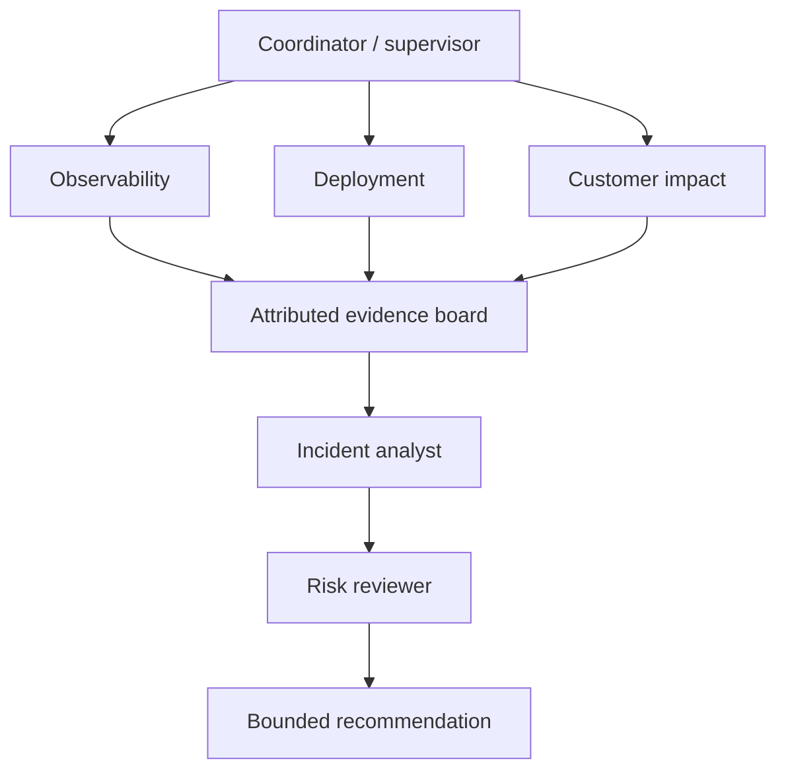
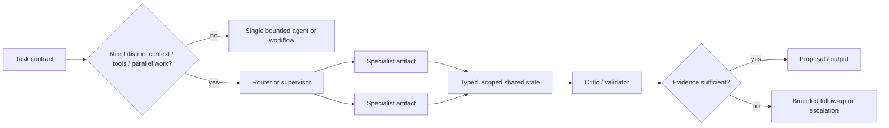

# 01 — Single agent versus multi-agent systems

**Notebook:** [`single_vs_multi_agent.ipynb`](single_vs_multi_agent.ipynb) · **Lab:** [`lab.py`](lab.py)

## Scenario

Checkout conversion falls 35% in Europe with no clear outage. A single
investigator can examine logs, deployments, customer complaints, metrics, and
runbooks. A team may isolate those contexts into specialists and use a risk
reviewer to challenge the recommendation. The team is justified only if it
improves a measured outcome enough to pay for coordination, latency, and risk.

## Why multiple agents?

| Benefit | When it is real | Cost / failure mode |
| --- | --- | --- |
| Specialization | distinct tools, rubrics, or expertise improve a subtask | duplicated reasoning and prompt drift |
| Context isolation | agents should not see each other’s sensitive/noisy context | handoff loses important evidence |
| Parallelization | independent investigations dominate latency | fan-out cost, rate limits, aggregation errors |
| Modularity | teams map to replaceable components and tests | contract/version complexity |
| Organizational modeling | accountable roles mirror a real review process | role-play is not evidence or authorization |

Use one agent or a deterministic workflow for simple, coherent tasks. A team is
not a quality feature; it is a distributed system with new coordination,
security, observability, and termination problems.

### Specialization

Specialization is real when a subtask needs a different tool set, rubric, model capability, or deep domain context. In Northstar, an observability agent may read logs and metrics while a customer-impact agent receives only SLA-safe segmentation data. A role label alone is not specialization: if every agent sees the same prompt, context, tools, and model, it mostly duplicates sampling. Define the specialist's input schema, allowed tools, expected evidence artifact, uncertainty format, budget, and stop condition before creating it.

### Context isolation

Isolation prevents a sensitive, irrelevant, or adversarial context from contaminating every decision. It can also shrink the prompt each agent must process. Isolation is not secrecy by omission: the integration contract must preserve necessary evidence IDs, provenance, uncertainty, tenant scope, and conclusions. A strong pattern is **private worker context → typed/redacted artifact → shared synthesis context**. Never broadcast raw credentials, user records, or untrusted retrieval text to every participant.

### Parallelization

Parallel work improves wall-clock latency only when tasks are independent, the backends can tolerate concurrency, and the fan-in/aggregation cost is smaller than the saved time. Metrics, deployment history, and customer-impact reads are parallel candidates; a rollout recommendation that needs all three is not. Bound concurrency, apply deadlines/cancellation, handle partial results, and measure p95 end-to-end latency rather than counting simultaneous calls as a win.

### Modularity and organizational modeling

Modularity lets teams own, test, deploy, and replace a capability behind a stable contract. Organizational modeling can map a real review process—investigator, analyst, risk reviewer—to accountable artifacts. Neither means agents inherit the authority of a job title. Application policy must still enforce identity, data scope, tool permissions, approval, audit, and ownership. If the boundary is not independently testable, it is role-play rather than architecture.

## Visual pattern map

## Architecture catalog

| Pattern | Control model | Strong fit | Guardrail |
| --- | --- | --- | --- |
| Supervisor → workers | central delegation | auditable specialized investigations | caps, explicit ownership, typed returns |
| Router → specialists | classify then dispatch | known task categories | fallback and misroute evals |
| Planner → executors | DAG plan + constrained work | long-horizon dependencies | replan budget and idempotency |
| Manager → subagents / hierarchy | layered scope | large decomposition | narrow delegated authority |
| Peer-to-peer | decentralized negotiation | resilient local coordination | protocol, quorum, termination |
| Blackboard | shared attributed evidence | synthesis across modalities | tenant scope and provenance |
| Debate / generator-critic | proposal challenged by critic | high-stakes reasoning review | independent evidence, avoid echo chamber |
| Sequential pipeline | deterministic handoffs | stable transforms | serial latency, validate each boundary |
| Parallel swarm | fan-out/fan-in | independent reads | concurrency, cancellation, aggregation |

## Architecture patterns in depth

### 1. Supervisor → workers

A supervisor owns decomposition, assigns bounded tasks, gathers typed artifacts, and decides whether to ask a worker again or escalate. It is appropriate when centralized audit, policy, and a clear accountable owner matter. Do not make the supervisor a universal expert that redoes every worker's reasoning. Give workers narrow capability contracts and require the supervisor to cite artifacts when synthesizing. Typical failure: the supervisor becomes a bottleneck, repeatedly delegates ambiguous tasks, or forwards its full context to every worker.

### 2. Router → specialists

A router classifies a task and sends it to one or more specialists. Prefer deterministic rules for obvious dimensions such as tenant, risk tier, data type, and capability eligibility; an LLM router may classify semantic ambiguity but needs a fallback and misroute evaluation. A router works well for independent verticals such as billing, incident status, and compliance. It is a poor fit when the task inherently requires repeated cross-specialist interaction.

### 3. Planner → executors

A planner produces a constrained task graph; executors perform independently validated leaves. This works for long-horizon work with visible dependencies, such as research → evidence extraction → synthesis → review. Keep planning separate from execution authority: planner output is a proposal to a graph validator, not executable policy. Add milestones, dependency checks, plan/version IDs, replan limits, and idempotency keys for external operations.

### 4. Manager → subagents and hierarchical teams

Managers reduce top-level context by aggregating a sub-team's work; hierarchy suits large decomposable programs with natural departments. Each layer must have a finite delegation depth, ownership boundary, scope/credential reduction, budget, and escalation route. A hierarchy can hide failure: a manager summary may omit uncertainty or minority evidence. Preserve source-level artifacts and make the hierarchy shallower until evaluation proves otherwise.

### 5. Peer-to-peer agents

Peers negotiate or exchange messages directly without a permanent central coordinator. This can improve resilience and local autonomy, but creates difficult questions: who resolves conflict, how are cycles detected, what is the termination/quorum rule, and which policy domain authorizes messages? Use only with explicit protocols, authenticated identities, message TTLs, correlation IDs, bounded rounds, and a human/central escalation path.

### 6. Blackboard architectures

Workers publish structured claims to a shared board; other workers subscribe to relevant updates. A blackboard is powerful for multimodal or cross-domain evidence synthesis because information becomes inspectable rather than trapped in a worker conversation. Board entries need author, source/evidence IDs, version, tenant/ACL, confidence, freshness, and correction/retraction semantics. Do not let it become an anonymous global scratchpad or a source of prompt-injection authority.

### 7. Debate, generator/critic, consensus, and voting

Generator/critic is a two-role pattern: one proposes, one challenges against a rubric and evidence. Debate adds alternating claims; consensus aggregates eligible opinions; voting selects among independently comparable candidates. These techniques help only if participants have meaningful diversity—different evidence, prompts, models, or rubrics—and if an objective verifier can adjudicate. They are weak where agents share the same information and bias. Set max rounds, require citations, preserve dissent, and escalate instead of forcing agreement.

### 8. Sequential pipelines and parallel swarms

A sequential pipeline is predictable: each stage validates/transforms a typed output before the next stage. It is ideal for stable processes but adds serial latency. A parallel swarm fans out independent tasks and uses an aggregator; it can lower latency but raises cost, backend load, duplication, and cancellation complexity. Use a map-reduce-style contract, bounded fan-out, timeouts, quorum/partial-result policy, and deterministic aggregation.

## Centralized versus decentralized coordination

Centralized patterns (supervisor, router, manager, graph) usually simplify audit, policy enforcement, and termination. Decentralized patterns (peers, negotiated task markets, distributed blackboards) may improve local autonomy or resilience, but expand the communication and trust surface. Recent work treats this as an architectural trade-off—not a maturity ladder. Start centrally, introduce decentralization only after a specific availability, locality, or organizational constraint has been measured and its governance cost accepted.

## A rigorous promotion test

Promote a task from a single agent to a team only after testing the same representative evaluation set under controlled tools, model family, data scopes, budgets, and stop conditions.

| Question | Evidence required before adding agents |
| --- | --- |
| Does specialization help? | a named subtask improves source-supported accuracy or safety with a distinct context/tool/rubric |
| Does parallelism help? | independent critical-path work reduces p95 end-to-end latency after aggregation and queue cost |
| Does isolation help? | policy/privacy/noise risk is measurably reduced without losing essential evidence |
| Does review help? | critic catches meaningful errors more often than it adds false blocks or echo agreement |
| Is the team affordable? | cost per successful safe task and operational effort fit the service objective |
| Is it governable? | every message, artifact, handoff, and action has identity, scope, trace, budget, termination, and escalation |

## Step-by-step design method

1. Establish a single-agent baseline and a representative evaluation set.
2. Name a concrete bottleneck: missing specialist tool, context overload,
   independent latency, or need for adversarial review.
3. Give every role an owner, allowed tools/data, input/output schema, budget,
   stop condition, and escalation path.
4. Choose centralized orchestration when auditability and policy dominate;
   choose decentralized patterns only when autonomy/resilience is demonstrably
   worth harder governance.
5. Use an attributed blackboard or typed artifacts, not uncontrolled full-chat
   broadcast. Preserve source IDs and uncertainty.
6. Evaluate single versus team on accuracy, policy, tokens/cost, latency,
   handoff quality, turns, conflicts, and coordination overhead.

## Experiments

Run `lab.py` for `simple`, `cross-domain`, and `ambiguous` incidents. The
single investigator should win the simple case; the supervisor team may earn
its cost only on cross-domain ambiguity. Change accuracy/cost assumptions and
write the architecture decision you would ship.

## Production checklist

- Least privilege per agent; do not share every tool, secret, or tenant context.
- Typed contracts, source provenance, redacted tracing, per-agent budgets, max
  turns/messages, cancellation, and deterministic terminal conditions.
- Human approval at external action boundaries; critics cannot authorize tools.
- Test misrouting, stale/shared-state poisoning, contradictory specialists,
  collusion/echo, worker failure, slow worker, and unbounded delegation.

## References

- [LLM-based multi-agent systems survey](https://arxiv.org/abs/2402.01680)
- [LLM multi-agent technology survey](https://arxiv.org/abs/2504.01963)
- [LLM-enabled MAS design patterns](https://arxiv.org/abs/2601.03328)
- [Anthropic: Building effective agents](https://www.anthropic.com/engineering/building-effective-agents)
