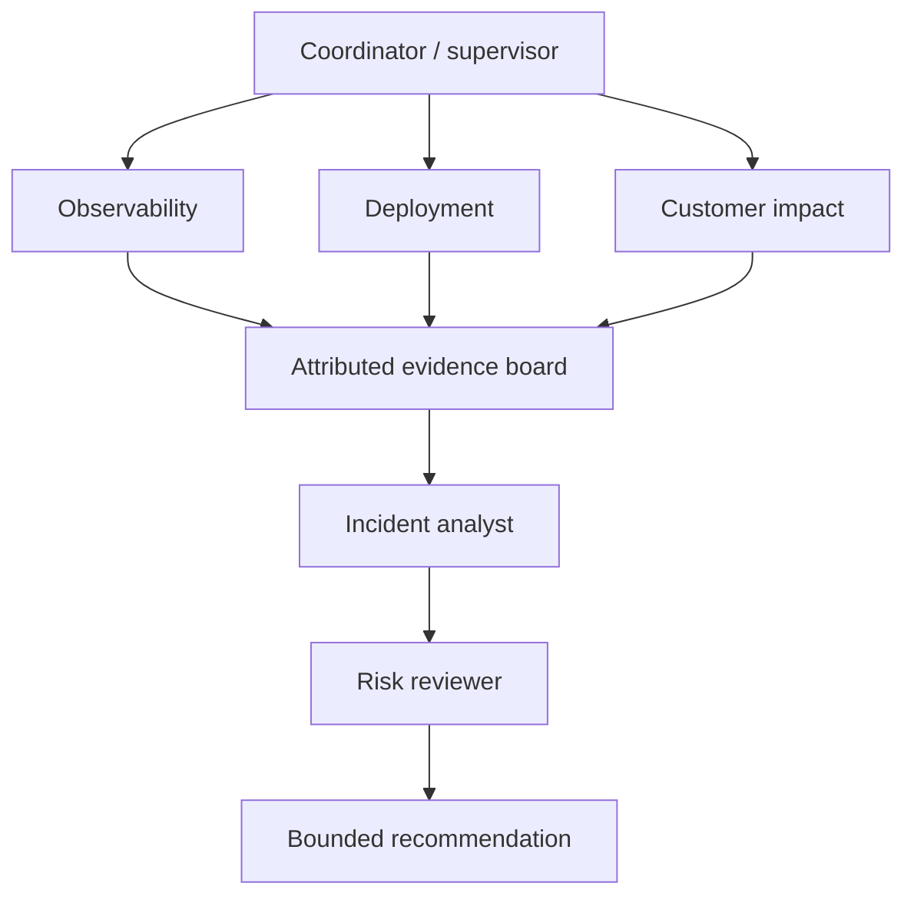

# 01 — Single agent versus multi-agent systems

**Notebook:** [`single_vs_multi_agent.ipynb`](single_vs_multi_agent.ipynb) · **Lab:** [`lab.py`](lab.py)

## Scenario

Checkout conversion falls 35% in Europe with no clear outage. A single
investigator can examine logs, deployments, customer complaints, metrics, and
runbooks. A team may isolate those contexts into specialists and use a risk
reviewer to challenge the recommendation. The team is justified only if it
improves a measured outcome enough to pay for coordination, latency, and risk.

## Why multiple agents?

| Benefit | When it is real | Cost / failure mode |
| --- | --- | --- |
| Specialization | distinct tools, rubrics, or expertise improve a subtask | duplicated reasoning and prompt drift |
| Context isolation | agents should not see each other’s sensitive/noisy context | handoff loses important evidence |
| Parallelization | independent investigations dominate latency | fan-out cost, rate limits, aggregation errors |
| Modularity | teams map to replaceable components and tests | contract/version complexity |
| Organizational modeling | accountable roles mirror a real review process | role-play is not evidence or authorization |

Use one agent or a deterministic workflow for simple, coherent tasks. A team is
not a quality feature; it is a distributed system with new coordination,
security, observability, and termination problems.

## Architecture catalog

| Pattern | Control model | Strong fit | Guardrail |
| --- | --- | --- | --- |
| Supervisor → workers | central delegation | auditable specialized investigations | caps, explicit ownership, typed returns |
| Router → specialists | classify then dispatch | known task categories | fallback and misroute evals |
| Planner → executors | DAG plan + constrained work | long-horizon dependencies | replan budget and idempotency |
| Manager → subagents / hierarchy | layered scope | large decomposition | narrow delegated authority |
| Peer-to-peer | decentralized negotiation | resilient local coordination | protocol, quorum, termination |
| Blackboard | shared attributed evidence | synthesis across modalities | tenant scope and provenance |
| Debate / generator-critic | proposal challenged by critic | high-stakes reasoning review | independent evidence, avoid echo chamber |
| Sequential pipeline | deterministic handoffs | stable transforms | serial latency, validate each boundary |
| Parallel swarm | fan-out/fan-in | independent reads | concurrency, cancellation, aggregation |

## Step-by-step design method

1. Establish a single-agent baseline and a representative evaluation set.
2. Name a concrete bottleneck: missing specialist tool, context overload,
   independent latency, or need for adversarial review.
3. Give every role an owner, allowed tools/data, input/output schema, budget,
   stop condition, and escalation path.
4. Choose centralized orchestration when auditability and policy dominate;
   choose decentralized patterns only when autonomy/resilience is demonstrably
   worth harder governance.
5. Use an attributed blackboard or typed artifacts, not uncontrolled full-chat
   broadcast. Preserve source IDs and uncertainty.
6. Evaluate single versus team on accuracy, policy, tokens/cost, latency,
   handoff quality, turns, conflicts, and coordination overhead.

## Experiments

Run `lab.py` for `simple`, `cross-domain`, and `ambiguous` incidents. The
single investigator should win the simple case; the supervisor team may earn
its cost only on cross-domain ambiguity. Change accuracy/cost assumptions and
write the architecture decision you would ship.

## Production checklist

- Least privilege per agent; do not share every tool, secret, or tenant context.
- Typed contracts, source provenance, redacted tracing, per-agent budgets, max
  turns/messages, cancellation, and deterministic terminal conditions.
- Human approval at external action boundaries; critics cannot authorize tools.
- Test misrouting, stale/shared-state poisoning, contradictory specialists,
  collusion/echo, worker failure, slow worker, and unbounded delegation.

## References

- [LLM-based multi-agent systems survey](https://arxiv.org/abs/2402.01680)
- [LLM multi-agent technology survey](https://arxiv.org/abs/2504.01963)
- [LLM-enabled MAS design patterns](https://arxiv.org/abs/2601.03328)
- [Anthropic: Building effective agents](https://www.anthropic.com/engineering/building-effective-agents)
