# Single Agent vs Multi-Agent Systems

**Level:** Advanced · **Time:** 60 min · **Prerequisites:** None

**Advanced · 01** · **Notebook:** [`01_single_vs_multi_agent.ipynb`](01_single_vs_multi_agent.ipynb)

Multi-agent systems are a **distributed systems problem**, not a prompt engineering trick. 

When you split a single monolithic agent into a multi-agent team, you inherit all the failure modes of microservices (network latency, serialization costs, state desynchronization), compounded by the non-determinism of LLMs. You should only pay this "coordination tax" when a single agent demonstrably fails due to a structural boundary.

We have broken this module down into three core deep-dives:

1. **[Deep Dive: The Cost of Coordination](THE_COST_OF_COORDINATION.md)** (Why multi-agent systems fail: latency, token limits, and state synchronization).
2. **[Deep Dive: When to Split Agents](WHEN_TO_SPLIT_AGENTS.md)** (The 3 valid reasons to split: Separation of Tool Concerns, Asymmetric Prompts, and RBAC Security Boundaries).
3. **[Deep Dive: Routing and Handoffs](ROUTING_AND_HANDOFFS.md)** (How agents communicate: Shared State vs Direct Tool Handoffs vs Deterministic Routing).

---

## State of the Art: Technology & Tools

- **[LangGraph](https://langchain-ai.github.io/langgraph/):** The standard for deterministic routing (State Machines).
- **[AutoGen](https://microsoft.github.io/autogen/):** The standard for conversational multi-agent routing.
- **[CrewAI](https://docs.crewai.com/):** The standard for strict Agent + Task dependency pipelines.
- **[OpenAI Swarm](https://github.com/openai/swarm):** The standard for lightweight direct agent-to-agent tool handoffs.

---

## Checkpoint

**1. A developer splits their `Support_Agent` into a `Greeting_Agent`, a `Database_Agent`, and a `Farewell_Agent` to "make it smarter." What is the most likely result?**
- A) The system becomes 3x faster.
- B) The system becomes 3x cheaper.
- C) The system suffers a massive latency and token tax, and the agents may forget the user's name during handoffs (state desynchronization).
- D) The LLMs will spontaneously achieve AGI.

Answer

<b>C</b>. Splitting agents unnecessarily incurs the Multi-Agent Tax. Never split without a structural reason.

**2. Which of the following is a valid structural reason to split a single agent into a multi-agent team?**
- A) To make the code look more impressive on GitHub.
- B) The single agent requires 45 tools to do its job, and the LLM is beginning to hallucinate arguments because the tool schema context is too large.
- C) Because AutoGen is popular.
- D) Because the agent needs to respond to the user in French.

Answer

<b>B</b>. Separation of Concerns (Too Many Tools) is a valid reason to split agents to protect the LLM's attention span.

