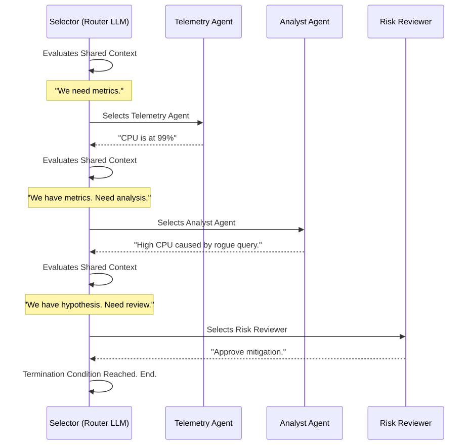

# AutoGen Selector Teams

**Level:** Advanced · **Time:** 60 min · **Prerequisites:** None

**Advanced · 02** · **Notebook:** [`02_autogen_selector_teams.ipynb`](02_autogen_selector_teams.ipynb)

AutoGen's `SelectorGroupChat` is a powerful pattern where a central "Router LLM" (the Selector) reads the shared conversation history and dynamically chooses the next speaker. 

While highly flexible, this flexibility introduces the greatest risk in multi-agent systems: the infinite polite loop. Agents can repeat work, delegate ambiguously, or argue forever. Building a production AutoGen team means enforcing strict routing prompts and hard termination boundaries.

We have broken this module down into three core deep-dives:

1. **[Deep Dive: The Selector Prompt](THE_SELECTOR_PROMPT.md)** (How to force the Router LLM to select the next agent based on concrete evidence gaps, rather than conversational defaults).
2. **[Deep Dive: Avoiding Circular Delegation](AVOIDING_CIRCULAR_DELEGATION.md)** (Using `MaxMessageTermination` and explicit `ESCALATE` states to prevent infinite argument loops).
3. **[Deep Dive: The Single Agent Baseline](SINGLE_AGENT_BASELINE.md)** (Why you must always prove a multi-agent team beats a single agent to justify the massive token tax).

---

## State of the Art: Technology & Tools

- **[AutoGen (0.4.x)](https://microsoft.github.io/autogen/):** The industry standard for conversational multi-agent systems. The new 0.4.x architecture introduces robust event-driven components.
- **[SelectorGroupChat](https://microsoft.github.io/autogen/stable/user-guide/agentchat-user-guide/selector-group-chat.html):** The core class for managing dynamic speaker selection.

---

## Checkpoint

**1. Why is it dangerous to leave the `selector_prompt` empty in a `SelectorGroupChat`?**
- A) The code won't compile.
- B) The Router LLM will fall back to conversational norms, often selecting an agent just so it can say "Thank you" or "You're welcome", wasting tokens.
- C) It will randomly delete files.
- D) It defaults to a round-robin schedule.

Answer

<b>B</b>. You must explicitly prompt the Selector to behave like a state machine router, choosing the next speaker based on unresolved evidence gaps.

**2. You are building an AutoGen team with an Analyst and a Reviewer. How do you ensure they don't argue in an infinite loop?**
- A) Tell them in the prompt to "be nice."
- B) Use `MaxMessageTermination` to enforce a hard ceiling on turns, and `TextMentionTermination` to allow the Reviewer to explicitly output `ESCALATE_TO_HUMAN`.
- C) Use a smaller, cheaper LLM so the infinite loop doesn't cost as much.
- D) Delete the Reviewer agent.

Answer

<b>B</b>. Hard termination conditions are mandatory in production conversational systems.

