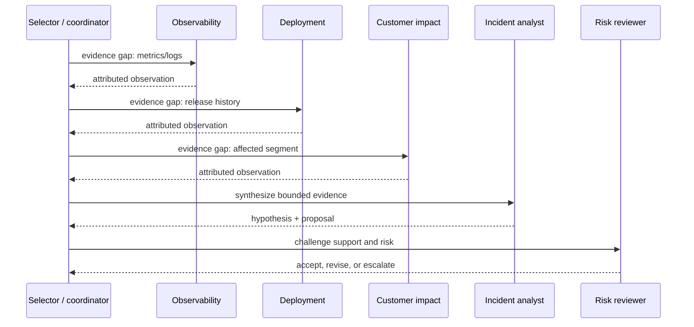

# AutoGen Selector Teams

**Advanced · 02** · **Notebook:** [`02_autogen_selector_teams.ipynb`](02_autogen_selector_teams.ipynb) · **Implementation:** [`lab.py`](lab.py)

AutoGen AgentChat makes teams and their conversation visible design objects. `SelectorGroupChat` is useful when the next contributor should be chosen from shared state rather than fixed in a static pipeline. That flexibility also adds coordination risk: agents can repeat work, delegate ambiguously, expose irrelevant context, or form a loop. The design target is a bounded, evidence-led team that demonstrably beats a simpler baseline.

## Scenario and outcomes

Northstar’s EU checkout conversion is down 38%. Logs show 3DS callback errors, a UI deployment changed VAT/redirect handling, and enterprise VAT customers report redirect loops. A coordinator selects an Observability, Deployment, Customer Impact, Incident Analyst, and Risk Reviewer agent. The team must produce an evidence-backed proposal, not execute a rollback.




## 1. Selector teams: mental model

A selector team has participants, shared messages, a next-speaker policy, a termination condition, and an observable transcript. In AutoGen, `SelectorGroupChat` uses a model client to choose among eligible participants based on team context; participant descriptions and a selector prompt influence that decision. This is not a replacement for application-owned constraints. The application controls who is eligible, maximum messages/turns, tool scopes, tenant boundaries, approval, cost, and final action.

| Feature | Why it matters | Design guidance |
| --- | --- | --- |
| Participant descriptions | Makes capabilities/ownership legible to selector | Describe evidence/product responsibility, not generic expertise |
| Selector policy/prompt | Chooses the next specialist | Require a concrete evidence gap and forbid arbitrary handoff loops |
| Shared context | Coordinates work and avoids repeating requests | Send attributed, minimal artifacts; do not share secrets or unrelated tenant context |
| Termination | Ends when a deliverable is complete or unsafe | Combine semantic condition with hard message/turn/time/cost budgets |
| Handoffs/tools | Connects roles to evidence/work | Give narrow read scopes; keep production actions outside the team |
| Streaming/tracing | Exposes how coordination happened | Record selector decision, agent, artifact, tool trace, cost, and stop reason |

## 2. Step-by-step implementation

1. Define the outcome contract: likely cause, evidence IDs, uncertainty, proposed mitigation, risk, and escalation/approval requirement.
2. Give each specialist an ownership boundary. Observability cannot infer customer impact; Deployment cannot declare a business impact; Analyst synthesizes but does not invent evidence; Reviewer challenges the proposal.
3. Restrict the selector’s candidate set by unresolved evidence gaps. The selector should not choose a participant merely because it spoke last or is conversationally persuasive.
4. Add termination: recommendation-ready only after required evidence; `MAX_TEAM_MESSAGES`, per-agent turns, total tools/cost/time, and explicit `escalate`/`abstain` terminal states.
5. Turn artifacts into structured records: owner, claim, source/evidence ID, confidence, timestamp, tenant, and limitations. This reduces shared-context ambiguity.
6. Evaluate against a bounded single-agent baseline: outcome correctness, evidence support, unsafe proposal rate, tool calls, tokens/cost, latency, coordination overhead, and recovery from conflict.

## 3. Main AutoGen pattern (optional SDK sketch)

```python
from autogen_agentchat.agents import AssistantAgent
from autogen_agentchat.teams import SelectorGroupChat
from autogen_agentchat.conditions import MaxMessageTermination, TextMentionTermination

team = SelectorGroupChat(
    participants=[observability, deployment, customer_impact, analyst, reviewer],
    model_client=model_client,
    selector_prompt="""Choose one eligible specialist for a specific unresolved
    evidence gap. Prefer an agent that has not supplied its required artifact.
    End with FINAL only after the analyst has cited artifacts and reviewer accepts
    or explicitly escalates.""",
    termination_condition=TextMentionTermination("FINAL") | MaxMessageTermination(12),
)
result = await team.run(task=incident_contract)
```

Install and configure AutoGen only for this optional path; the co-located lab and notebook default are deterministic and credential-free. Consult the current [AutoGen AgentChat](https://microsoft.github.io/autogen/stable/user-guide/agentchat-user-guide/tutorial/agents.html) and [SelectorGroupChat](https://microsoft.github.io/autogen/stable/user-guide/agentchat-user-guide/selector-group-chat.html) documentation before using a live model client.

## 4. Failure modes and production checklist

- **Circular delegation:** explicit ownership, candidate filtering, repeated-handoff detection, per-agent/max-team budgets, and an escalation terminal state.
- **Context contamination:** tenant/trust/provenance filters before a message enters shared context; retrieved content cannot become an instruction or authority.
- **False consensus:** require source IDs and reviewer challenge; majority vote is not evidence.
- **Excessive coordination:** compare to the single-agent baseline and route simple incidents away from the team.
- **Unsafe action:** specialists produce proposals; identity, tool authorization, approval, idempotency, and action execution remain outside AgentChat.

Run `python lab.py`, then work through the notebook’s successful trace, ownership map, deliberate loop, conflict/reviewer experiment, and framework mapping. Exercises: add a selector candidate filter; make the reviewer demand two evidence IDs; test a missing deployment artifact; compare sequential and parallel specialist reads; and define a release gate for the team.

## References

- [AutoGen AgentChat agents](https://microsoft.github.io/autogen/stable/user-guide/agentchat-user-guide/tutorial/agents.html) · [SelectorGroupChat](https://microsoft.github.io/autogen/stable/user-guide/agentchat-user-guide/selector-group-chat.html) · [AutoGen paper](https://arxiv.org/abs/2308.08155)
- [Building effective agents](https://www.anthropic.com/engineering/building-effective-agents) · [OpenAI practical agent guide](https://openai.com/business/guides-and-resources/a-practical-guide-to-building-ai-agents/)
