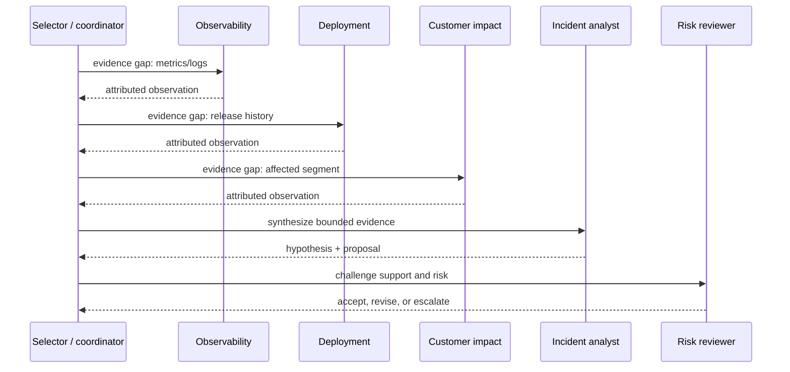

# AutoGen Selector Teams

**Level:** Advanced · **Time:** 60 min · **Prerequisites:** None

**Advanced · 02** · **Notebook:** [`02_autogen_selector_teams.ipynb`](02_autogen_selector_teams.ipynb) · **Implementation:** [`lab.py`](lab.py)

AutoGen AgentChat makes teams and their conversation visible design objects. `SelectorGroupChat` is useful when the next contributor should be chosen from shared state rather than fixed in a static pipeline. That flexibility also adds coordination risk: agents can repeat work, delegate ambiguously, expose irrelevant context, or form a loop. The design target is a bounded, evidence-led team that demonstrably beats a simpler baseline.

## Scenario and outcomes

Northstar’s EU checkout conversion is down 38%. Logs show 3DS callback errors, a UI deployment changed VAT/redirect handling, and enterprise VAT customers report redirect loops. A coordinator selects an Observability, Deployment, Customer Impact, Incident Analyst, and Risk Reviewer agent. The team must produce an evidence-backed proposal, not execute a rollback.




## 1. Selector teams: mental model

A selector team has participants, shared messages, a next-speaker policy, a termination condition, and an observable transcript. In AutoGen, `SelectorGroupChat` uses a model client to choose among eligible participants based on team context; participant descriptions and a selector prompt influence that decision. This is not a replacement for application-owned constraints. The application controls who is eligible, maximum messages/turns, tool scopes, tenant boundaries, approval, cost, and final action.

| Feature | Why it matters | Design guidance |
| --- | --- | --- |
| Participant descriptions | Makes capabilities/ownership legible to selector | Describe evidence/product responsibility, not generic expertise |
| Selector policy/prompt | Chooses the next specialist | Require a concrete evidence gap and forbid arbitrary handoff loops |
| Shared context | Coordinates work and avoids repeating requests | Send attributed, minimal artifacts; do not share secrets or unrelated tenant context |
| Termination | Ends when a deliverable is complete or unsafe | Combine semantic condition with hard message/turn/time/cost budgets |
| Handoffs/tools | Connects roles to evidence/work | Give narrow read scopes; keep production actions outside the team |
| Streaming/tracing | Exposes how coordination happened | Record selector decision, agent, artifact, tool trace, cost, and stop reason |

## 2. Step-by-step implementation

1. Define the outcome contract: likely cause, evidence IDs, uncertainty, proposed mitigation, risk, and escalation/approval requirement.
2. Give each specialist an ownership boundary. Observability cannot infer customer impact; Deployment cannot declare a business impact; Analyst synthesizes but does not invent evidence; Reviewer challenges the proposal.
3. Restrict the selector’s candidate set by unresolved evidence gaps. The selector should not choose a participant merely because it spoke last or is conversationally persuasive.
4. Add termination: recommendation-ready only after required evidence; `MAX_TEAM_MESSAGES`, per-agent turns, total tools/cost/time, and explicit `escalate`/`abstain` terminal states.
5. Turn artifacts into structured records: owner, claim, source/evidence ID, confidence, timestamp, tenant, and limitations. This reduces shared-context ambiguity.
6. Evaluate against a bounded single-agent baseline: outcome correctness, evidence support, unsafe proposal rate, tool calls, tokens/cost, latency, coordination overhead, and recovery from conflict.

## 3. Main AutoGen pattern (optional SDK sketch)

```python
from autogen_agentchat.agents import AssistantAgent
from autogen_agentchat.teams import SelectorGroupChat
from autogen_agentchat.conditions import MaxMessageTermination, TextMentionTermination

team = SelectorGroupChat(
    participants=[observability, deployment, customer_impact, analyst, reviewer],
    model_client=model_client,
    selector_prompt="""Choose one eligible specialist for a specific unresolved
    evidence gap. Prefer an agent that has not supplied its required artifact.
    End with FINAL only after the analyst has cited artifacts and reviewer accepts
    or explicitly escalates.""",
    termination_condition=TextMentionTermination("FINAL") | MaxMessageTermination(12),
)
result = await team.run(task=incident_contract)
```

Install and configure AutoGen only for this optional path; the co-located lab and notebook default are deterministic and credential-free. Consult the current [AutoGen AgentChat](https://microsoft.github.io/autogen/stable/user-guide/agentchat-user-guide/tutorial/agents.html) and [SelectorGroupChat](https://microsoft.github.io/autogen/stable/user-guide/agentchat-user-guide/selector-group-chat.html) documentation before using a live model client.

## 4. Failure modes and production checklist

- **Circular delegation:** explicit ownership, candidate filtering, repeated-handoff detection, per-agent/max-team budgets, and an escalation terminal state.
- **Context contamination:** tenant/trust/provenance filters before a message enters shared context; retrieved content cannot become an instruction or authority.
- **False consensus:** require source IDs and reviewer challenge; majority vote is not evidence.
- **Excessive coordination:** compare to the single-agent baseline and route simple incidents away from the team.
- **Unsafe action:** specialists produce proposals; identity, tool authorization, approval, idempotency, and action execution remain outside AgentChat.

Run `python lab.py`, then work through the notebook’s successful trace, ownership map, deliberate loop, conflict/reviewer experiment, and framework mapping. Exercises: add a selector candidate filter; make the reviewer demand two evidence IDs; test a missing deployment artifact; compare sequential and parallel specialist reads; and define a release gate for the team.

## Watch For

- **Assumption failure:** The model hallucinates an unsupported parameter.
- **State leak:** Context is incorrectly preserved across runs.
- **Timeout:** The tool takes too long and the agent loops.
- **Auth bypass:** The agent attempts an action it shouldn't.

## Checkpoint

**1. In the AgentOps checkout scenario, what evidence should the assistant collect before claiming there is an active incident?**
- A) Current service health for checkout or a dependency
- B) An active incident record that matches checkout/payment failure symptoms
- C) The relevant checkout runbook or response policy
- D) A user instruction that says customers are upset
- E) Enough context to distinguish evidence from speculation

**2. Why does the manual AgentOps loop include step, tool-call, and cost budgets?**
- A) They prevent open-ended investigation loops
- B) They create auditable terminal reasons
- C) They let the application stop safely when confidence is not improving
- D) They guarantee the model will choose the correct tool
- E) They keep operational cost and latency bounded

**3. When rebuilding the AgentOps incident investigator with the OpenAI Agents SDK, which responsibilities can the framework package?**
- A) Function-tool schema generation
- B) Turn execution through a runner
- C) Tool dispatch and message state
- D) Product-specific authorization policy
- E) Tracing and session continuity

**4. What is the key lesson of replacing the manual loop with an agent framework?**
- A) The loop still exists even when the SDK manages it
- B) Framework traces help inspect model and tool behavior
- C) Tool boundaries no longer matter once a framework is used
- D) Sessions can help preserve working context
- E) Application code still defines which tools are safe to expose

**5. In the AgentOps LangGraph lesson, what belongs in thread-scoped incident state?**
- A) The current request
- B) Evidence collected during this investigation
- C) Attempt count and confidence
- D) An unverified permanent claim that all checkout failures are caused by Redis
- E) The recommendation for this run

**6. Why is the accidental Acme memory 'Checkout problems are usually caused by Redis' risky?**
- A) It can bias future diagnoses before fresh evidence is collected
- B) It is an unverified operational fact
- C) It should be scoped, auditable, and reversible
- D) It proves Redis is the root cause of the current incident
- E) It needs validation before influencing recommendations

**7. Why is a broad `admin_api(command: str)` dangerous for an agent?**
- A) It hides intent inside a free-form string
- B) It mixes read-only and destructive capabilities
- C) It makes authorization and validation ambiguous
- D) It forces every operation to be safe and auditable
- E) It makes predictable error handling harder

**8. Which retry and escalation decisions are appropriate for the tool-engineering lab?**
- A) Retry `ToolTimeout` when the retry budget allows
- B) Retry or back off on `RateLimit`
- C) Escalate `PermissionDenied` to a human or higher-trust workflow
- D) Keep retrying `InvalidService` until it works
- E) Stop when validation proves the request is malformed

**9. Which permission mapping fits the AgentOps human-in-the-loop lesson?**
- A) READ: query logs and retrieve runbooks
- B) READ: restart checkout-api immediately
- C) PROPOSE: prepare rollback or draft notification
- D) EXECUTE WITH APPROVAL: restart, rollback, or send notification
- E) EXECUTE WITH APPROVAL: any tool call, including status reads

**10. What should a human approval checkpoint preserve before resuming an agent run?**
- A) The exact proposed action and arguments
- B) Evidence that motivated the action
- C) The reviewer decision: approve, modify, or reject
- D) A vague context-free approval prompt only
- E) An audit reason and actor identity

**11. How should the AgentOps guardrails lesson treat instructions found inside a retrieved runbook?**
- A) As untrusted data to summarize or cite
- B) As instructions that can override the system prompt
- C) As content that may be trying to manipulate the agent
- D) As authorization to restart services
- E) As evidence only after policy and tool boundaries are applied

**12. What should a restart tool guardrail check before executing?**
- A) Whether the action has explicit human approval
- B) Whether the request came from a trusted user or system boundary
- C) Whether retrieved text told the agent to restart immediately
- D) Whether the service target is allowed
- E) Whether the run has enough audit context for review

**13. In AgentOps Task A, why is a deterministic workflow preferable to an agent?**
- A) The steps are known before runtime
- B) The task only needs a status read and report formatting
- C) A model-controlled loop would add unnecessary cost and failure paths
- D) Agents are never useful for operations work
- E) The expected output can be produced from structured tool data

**14. What makes AgentOps Task C a better fit for a bounded agent than a fixed workflow?**
- A) The evidence path is discovered at runtime
- B) The system may need to choose among service health, incidents, deployments, logs, and runbooks
- C) The task should still have max-step and tool boundaries
- D) The model should be allowed to call any production API it can name
- E) The final recommendation should preserve uncertainty instead of inventing root cause

**15. How should the hybrid production architecture route the three AgentOps task classes?**
- A) Simple lookups go to deterministic workflows
- B) Ambiguous investigations go to a bounded single agent
- C) High-risk major-impact cases can use a specialist team inside a deterministic wrapper
- D) Every request goes directly to a fully autonomous team
- E) Policy checks run after the selected path and before consequential actions

**16. Which controls should remain outside the model in the hybrid production architecture?**
- A) Tool allowlists and authorization
- B) Budget limits and stop conditions
- C) Human approval for high-impact actions
- D) Audit logs and action receipts
- E) The ability for retrieved documents to authorize rollback

**17. In the AgentOps team notebook, what evidence can justify moving from one agent to a specialist team?**
- A) The incident requires distinct observability, deployment, customer-impact, analysis, and risk-review work
- B) Measured accuracy or risk handling improves enough to justify extra overhead
- C) The problem can be solved by a fixed two-step status workflow
- D) The team has explicit ownership and bounded delegation
- E) The design is more visually impressive than a single-agent baseline

**18. Which metrics should learners compare when running the same incident with a single agent and a multi-agent team?**
- A) Accuracy and whether the recommendation is evidence-supported
- B) Cost, latency, tool calls, tokens, and coordination overhead
- C) Whether the team used more agent names than the baseline
- D) Whether the team prevents simple incidents from becoming slower
- E) Whether risk review changes or challenges the recommendation

**19. What does the AutoGen selector-team notebook teach about selector-style group chat?**
- A) Participant roles and descriptions help the selector choose the next speaker
- B) Shared context makes coordination visible but can also amplify loops
- C) Selector teams automatically guarantee the best possible diagnosis
- D) Termination conditions are part of the team design
- E) A model can dynamically choose the next participant from the conversation state

**20. Which controls help stop a multi-agent team from bouncing responsibility forever?**
- A) `MAX_TEAM_MESSAGES`
- B) `MAX_AGENT_TURNS`
- C) Explicit ownership for each evidence domain
- D) Allowing every agent to ask every other agent indefinitely
- E) A termination condition tied to a recommendation or safe stop

**21. What does the CrewAI AgentOps notebook emphasize about the Agents + Tasks + Crew model?**
- A) Agents describe specialist roles, goals, and backstories
- B) Tasks describe concrete work products and can depend on previous task outputs
- C) The crew organizes the collaboration plan
- D) CrewAI removes the need for policy and side-effect controls
- E) Task ownership can make provenance easier to review

**22. Which framework comparisons are accurate in the AgentOps CrewAI lesson?**
- A) CrewAI helps when collaboration maps naturally to roles, tasks, and crew execution
- B) LangGraph gives more explicit control over state, branching, persistence, and checkpoints
- C) AutoGen makes conversational coordination and speaker selection visible
- D) OpenAI Agents SDK is often simpler for one bounded tool-using agent
- E) Every framework removes the need to evaluate the final trajectory

**23. In the AgentOps final capstone, how should learners decide between deterministic workflow, single bounded agent, and multi-agent team?**
- A) Run an evaluation and compare outcome, trajectory, cost, latency, and risk
- B) Default to multi-agent because the incident is important
- C) Choose the least autonomous architecture that reliably solves the incident
- D) Require the team to show a meaningful gain over the simpler baseline
- E) Ignore coordination overhead if the final answer sounds plausible

**24. Which capstone actions may be prepared but must not be executed by the agent run?**
- A) Rollback deployment
- B) Disable the risky feature flag
- C) Send customer notification
- D) Read service metrics
- E) Query logs

**25. Which memory and guardrail choices fit the final capstone?**
- A) Store the likely root cause as a permanent future truth
- B) Treat runbooks and tickets as evidence, not instructions
- C) Store only evaluated incident reports with timestamp and evidence links
- D) Block production execution without human approval
- E) Stop if step, tool-call, or cost budgets are exceeded

**26. What should the capstone evaluation suite verify?**
- A) Expected evidence tools were used
- B) Forbidden production tools were not used
- C) The recommendation is supported by metrics, logs, deployments, tickets, and SLA data
- D) Cost and latency stay within budget
- E) The system selected the architecture with the most agents

**27. Which dimensions should the AgentOps trajectory evaluation score?**
- A) Outcome quality such as task success and supported recommendation
- B) Trajectory quality such as correct tools, forbidden actions, and recovery
- C) Operational behavior such as latency, cost, calls, path length, and retry rate
- D) Only whether the final answer sounds fluent
- E) Whether the run used the most expensive model available

**28. Why is cost per successful task more useful than cost per model call?**
- A) It includes whether the task actually succeeded
- B) It discourages cheap failed trajectories
- C) It connects cost to product value
- D) It ignores forbidden actions and bad recommendations
- E) It can be compared across workflow versions

**29. What should learners optimize in the AgentOps trajectory optimization notebook?**
- A) The shortest reliable trajectory to a correct result
- B) Lower latency and cost while preserving task success
- C) Removing redundant searches and reflections
- D) Minimizing tokens even if the answer loses evidence support
- E) Reducing unnecessary tool calls without introducing forbidden actions

**30. What does the teaching efficiency score combine?**
- A) Success
- B) Latency
- C) Cost
- D) Trajectory length
- E) Brand color preference

## References

- [AutoGen AgentChat agents](https://microsoft.github.io/autogen/stable/user-guide/agentchat-user-guide/tutorial/agents.html) · [SelectorGroupChat](https://microsoft.github.io/autogen/stable/user-guide/agentchat-user-guide/selector-group-chat.html) · [AutoGen paper](https://arxiv.org/abs/2308.08155)
- [Building effective agents](https://www.anthropic.com/engineering/building-effective-agents) · [OpenAI practical agent guide](https://openai.com/business/guides-and-resources/a-practical-guide-to-building-ai-agents/)
