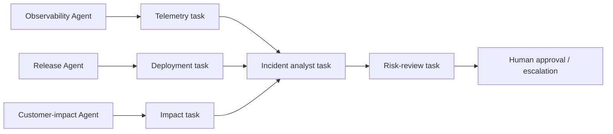

# CrewAI Teams

**Advanced · 03** · **Notebook:** [`03_crewai_teams.ipynb`](03_crewai_teams.ipynb) · **Implementation:** [`lab.py`](lab.py)

CrewAI’s core teaching model is **Agents + Tasks + Crew**. An agent owns a role and goal; a task defines a deliverable, expected output, tools/context, and dependencies; a crew runs the collaboration. This fits work that is naturally expressed as accountable work products. Use a deterministic Flow or application workflow around collaboration when ordering, branching, approval, persistence, or recovery must be explicit.

## Scenario and outcomes

Northstar’s EU checkout conversion fell 35%, without a clear outage. The program needs telemetry, release history, affected-customer evidence, a risk-aware remediation proposal, and an approval-ready incident brief. The team must determine whether a specialist crew improves on a bounded single investigator; it must not execute a rollback, notify customers, or access broad production tools.





## 1. Main CrewAI features and when to use them

| Feature | What it models | Good fit | Guardrail |
| --- | --- | --- | --- |
| `Agent` | Role, goal, backstory, permitted tools | A distinct accountable specialist | Narrow tools and application-owned identity/authorization |
| `Task` | Deliverable, expected output, owner, context | Attributed artifact with dependencies | Typed output, evidence IDs, explicit non-goals |
| `Crew` | Agents/tasks/process as collaboration unit | A bounded work plan | Time/cost/tool budgets and trace review |
| Sequential process | Ordered dependent work | Analyst uses specialist artifacts | Use for causal dependencies, not fake parallelism |
| Hierarchical process | Manager delegates work | Bounded manager with clear ownership | Manager is not broad authority; cap delegation |
| Flows | Deterministic stateful orchestration around crews | Routing, approval, retry, persistence | Keep policy/side effects outside agents |
| Guardrails/callbacks | Validation and lifecycle instrumentation | Schema/evidence checks, observability | Do not rely on prose-only safety |

## 2. Step-by-step incident program

1. Write a success contract: likely cause, evidence IDs, affected segment, uncertainty, mitigation alternatives, risk, and explicit proposal-only boundary.
2. Define three read-only specialist tasks. Telemetry returns metrics/log IDs; Release returns timestamp/change/risk; Customer Impact returns segment/tickets/SLA.
3. Give the Analyst task only these attributed artifacts as context. Require it to distinguish observation from inference and provide alternatives.
4. Add a Risk Reviewer task that checks evidence coverage, rollback safety, customer commitment risk, and missing approvals. It may accept, revise, or escalate—never silently execute.
5. Choose sequential execution when the analyst needs specialist outputs. Parallelize independent *read-only* tasks only when the runtime and upstream dependencies support it.
6. Surround the crew with a Flow/application controller for request classification, tenant scope, budgets, tool policy, human approval, durable checkpoints, and final action.

## 3. Complex scenario extensions

The notebook adds a conflicting-evidence case (metrics point to 3DS redirects while deployment history shows a VAT change), a missing-artifact escalation, a customer-SLA priority decision, and a single-agent comparison. These expose a central CrewAI trade-off: tasks make artifacts and dependencies legible, but extra agents are valuable only if specialization and review improve measured outcome enough to offset coordination cost/latency.

## 4. Optional CrewAI mapping

```python
from crewai import Agent, Task, Crew, Process

analyst_task = Task(
    description="Synthesize only cited specialist artifacts; state uncertainty and a proposal.",
    expected_output="Structured incident brief with evidence IDs and approval requirement.",
    agent=analyst,
    context=[telemetry_task, deployment_task, impact_task],
)
crew = Crew(agents=[obs, release, impact, analyst, reviewer],
            tasks=[telemetry_task, deployment_task, impact_task, analyst_task, review_task],
            process=Process.sequential)
```

The default lab is credential-free. Consult current [CrewAI concepts](https://docs.crewai.com/en/concepts/agents), [tasks](https://docs.crewai.com/en/concepts/tasks), [crews](https://docs.crewai.com/en/concepts/crews), and [flows](https://docs.crewai.com/en/concepts/flows) before enabling a live runtime.

## Production checklist and exercises

- Use typed task outputs and source/artifact IDs; do not pass uncontrolled conversational transcripts as task context.
- Keep tenant scope, tool permissions, data classification, approvals, idempotency, budgets, and action execution server-side.
- Trace task owner, input artifacts, tool calls, output, cost, latency, retry, validation, reviewer outcome, and stop reason.
- Compare a single-agent baseline; test missing/conflicting artifacts, reviewer rejection, duplicate work, timeout, and tool failure.

Run `python lab.py`, then work through the notebook. Exercises: add a legal/compliance reviewer; change the process to hierarchical and define manager limits; route a simple status request around the crew; implement an approval-ready structured output; and set a release gate using outcome, evidence, risk, cost, and latency.

## References

- [CrewAI Agents](https://docs.crewai.com/en/concepts/agents) · [Tasks](https://docs.crewai.com/en/concepts/tasks) · [Crews](https://docs.crewai.com/en/concepts/crews) · [Flows](https://docs.crewai.com/en/concepts/flows)
- [CrewAI documentation](https://docs.crewai.com/) · [Building effective agents](https://www.anthropic.com/engineering/building-effective-agents)
