# CrewAI Teams

**Level:** Advanced · **Time:** 60 min · **Prerequisites:** None

**Advanced · 03** · **Notebook:** [`03_crewai_teams.ipynb`](03_crewai_teams.ipynb)

CrewAI is a powerful framework that structures multi-agent systems using the **Agent + Task + Crew** paradigm. 

The biggest pitfall in multi-agent engineering is allowing agents to freely "chat" with each other like humans in a Slack channel, which leads to infinite polite loops and hallucinated context. CrewAI solves this by enforcing strict Task dependency graphs. Agents do not pass conversational strings; they pass the completed, typed outputs of their assigned Tasks.

We have broken this module down into three core deep-dives:

1. **[Deep Dive: Agents and Tasks](AGENTS_AND_TASKS.md)** (Separating the "Who" from the "What". Why typed artifacts prevent multi-agent hallucinations).
2. **[Deep Dive: Sequential vs Hierarchical](SEQUENTIAL_VS_HIERARCHICAL.md)** (When to use a strict ETL-style pipeline vs a dynamic Manager agent that delegates tasks).
3. **[Deep Dive: CrewAI Flows](CREWAI_FLOWS.md)** (Event-driven state machines. Wrapping specialized Crews in deterministic Python logic for routing and persistence).

---

## State of the Art: Technology & Tools

- **[CrewAI Core](https://docs.crewai.com/):** The engine for defining Agents, Tasks, and Crews.
- **[CrewAI Flows](https://docs.crewai.com/concepts/Flows/):** The newer, deterministic orchestration layer that allows you to trigger different Crews based on state changes (e.g., separating a `CodingCrew` from a `ReviewCrew`).

---

## Checkpoint

**1. You are building an Incident Report Crew. Agent A fetches metrics, and Agent B writes the report. How should Agent A communicate with Agent B?**
- A) Agent A sends a message: "Hey Agent B, the metrics are bad!"
- B) Agent A is assigned Task A. Task A's expected output is a JSON array. Task B (assigned to Agent B) is configured to depend on the exact JSON artifact produced by Task A.
- C) They should share a Redis cache.
- D) You should use a Hierarchical Manager to read the metrics aloud to Agent B.

Answer

<b>B</b>. Agents should communicate through the strict, typed output schemas of their Tasks, not through conversational text.

**2. When should you use `Process.hierarchical` instead of `Process.sequential`?**
- A) Always, because it sounds more advanced.
- B) When you want to save money on token costs.
- C) When the path to the goal is highly ambiguous, and you need a Manager agent to dynamically rethink the strategy and re-delegate sub-tasks if the worker agents fail.
- D) When the tasks are completely independent and can be run in parallel.

Answer

<b>C</b>. Hierarchical processes use a Manager agent to dynamically delegate. It is highly resilient but very expensive in tokens/latency.

