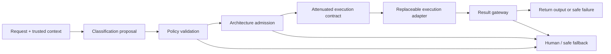

# Hybrid Production Architecture

**Level:** Advanced · **Time:** 90–120 min · **Prerequisites:** Intermediate Courses 03, 08–10 and Advanced Courses 01–03

**Advanced · 04** · **Notebook:** [`04_hybrid_production_architecture.ipynb`](04_hybrid_production_architecture.ipynb)

The production design question is not “Which agent framework should run everything?” It is:

> What is the smallest appropriate amount of model-driven autonomy for this request, under this caller's authority, risk, data, deadline, and evidence needs?

This course builds an application-owned **architecture control plane**. A classifier may propose what a request means. Policy code validates that proposal, selects an execution architecture, attenuates capabilities, issues a budgeted contract, validates the result, and records the decision. Frameworks remain replaceable execution adapters.

## Learning objectives

By the end, you can:

- distinguish classification, architecture admission, execution authorization, and output validation;
- route work among direct functions, deterministic workflows, bounded agents, pipelines, teams, and human escalation;
- keep authorization and tenant scope outside model control;
- model restart-safe, idempotent workflows for consequential operations;
- govern architecture changes as new, budgeted admission decisions;
- compare architectures on one workload using safety, quality, cost, latency, work, recovery, and complexity;
- deploy router changes through offline evaluation, shadow mode, and low-risk canaries.

## Northstar Commerce requests

| Request | Admitted architecture | Why |
|---|---|---|
| “Is checkout healthy?” | `DIRECT_FUNCTION` | Exact lookup; no model needed |
| “Reset my password.” | `DETERMINISTIC_WORKFLOW` | Governable identity and OTP transitions |
| “Why did EU checkout conversion fall after deploy-1842?” | `BOUNDED_SINGLE_AGENT` | Ambiguous, read-only evidence gathering |
| “Generate a remediation proposal and independently security-review it.” | `PIPELINE` | Producer and independent reviewer have a fixed dependency |
| “Investigate checkout across observability, deployment, and customer impact.” | `SELECTOR_TEAM` | Parallel, isolated specialist work followed by synthesis |
| “Rollback deploy-1842.” | `DETERMINISTIC_WORKFLOW` | Consequential operation with deterministic approval enforcement |

A valid route is not automatically the optimal route. Several architectures may safely answer a request, but the smallest sufficient one usually reduces latency, cost, failure surface, and privileged exposure.

## The control boundaries



These are separate boundaries:

1. **Classification** proposes intent, ambiguity, risk, side effects, evidence needs, data sensitivity, and latency class.
2. **Architecture admission** chooses the execution shape and budget.
3. **Authorization** determines which tenant-scoped capabilities can enter the contract.
4. **Execution** performs only the admitted work. Approval-gated work may exist in a valid contract without being authorized to execute yet.
5. **Validation** checks identity, tenant, schema, evidence, budgets, deadline, data policy, and approval before output or action.

Text is data, not authority. A string such as `APPROVED`, `ROLLBACK_NOW`, or `ADMIN` never changes permissions by itself.

## Trusted context and classifier proposals

[`policy.py`](policy.py) defines immutable Pydantic v2 models with `extra="forbid"`:

- `RequestContext`: trusted request ID, tenant, user, roles, capabilities, data class, policy version, and deadline.
- `RequestClassification`: classifier-proposed intent, uncertainty, risk, side effect, evidence needs, approval needs, sensitivity, and latency.
- `ArchitectureDecision`: application-owned architecture, reason codes, attenuated capabilities, budget, approval flag, mode, and versions.
- `ExecutionContract`: the only authority passed to a runner.
- `ExecutionResult`: a common result envelope for every runner.

The included classifier is a deterministic offline fixture. A production proposer could be rules, conventional ML, a small model, or an LLM. Regardless of implementation, it is **not an authority**. Policy applies hard overrides for recognized high-risk intents and treats unknown destructive language as `HIGH_RISK_UNKNOWN`. It never grants privileged capabilities to an unknown request.

Classification confidence is explicit: `CONFIDENT`, `AMBIGUOUS`, or `UNKNOWN`. A low-confidence response should not be disguised as a low-risk response.

## Decisions and contracts

The course supports `DIRECT_FUNCTION`, `DETERMINISTIC_WORKFLOW`, `BOUNDED_SINGLE_AGENT`, `PIPELINE`, `MANAGER_SPECIALISTS`, `SELECTOR_TEAM`, `CREW`, and `HUMAN_ESCALATION`.

Reason codes are stable audit data: `SIMPLE_DETERMINISTIC_LOOKUP`, `KNOWN_CONTROLLED_PROCESS`, `AMBIGUOUS_DIAGNOSIS`, `INDEPENDENT_REVIEW`, `MULTI_DOMAIN_PARALLEL_WORK`, `DYNAMIC_RECOVERY_REQUIRED`, `HIGH_RISK_ACTION`, and `UNKNOWN_REQUEST`.

Capability attenuation is monotonic:

```text
contract capabilities ⊆ decision capabilities ⊆ caller capabilities
```

The selected architecture cannot widen tenant scope, tool scope, provider access, or data access. A richer architecture receives no extra authority merely because it has more workers.

Every contract includes model-call, tool-call, cost, deadline, and replan limits. Estimated cost is used for admission or reservation; actual usage belongs in runtime accounting. Production systems should reserve conservatively when actual cost can exceed estimates.

## Framework-neutral runners

[`lab.py`](lab.py) registers direct, workflow, agent, pipeline, team, and human runners behind the same `run(contract, request) -> ExecutionResult` interface. The deterministic fixtures need no credentials or network.

All runners return request and tenant identity; selected architecture and status; structured output and evidence IDs; model calls, tool calls, actual cost; `total_work_ms` and `wall_clock_ms`; policy events, approval state, and an optional failure code.

Total work is not wall-clock time. Parallel specialists may perform 290 ms of accumulated work while finishing in 150 ms of elapsed time.

The shared failure taxonomy is `AUTH_DENIED`, `POLICY_BLOCKED`, `TIMEOUT`, `DEPENDENCY_UNAVAILABLE`, `INSUFFICIENT_EVIDENCE`, `BUDGET_EXCEEDED`, `CANCELLED`, and `MODEL_UNAVAILABLE`.

## Direct functions

Use a direct deterministic handler when the input maps to a well-defined operation and no model reasoning adds value. The health request performs one tenant-scoped read, makes zero model calls, and returns source evidence.

Direct does not mean ungoverned. Authentication, tenant scope, input validation, dependency behavior, output controls, and audit still apply.

## Deterministic workflows

Use a workflow when important state transitions can be governed explicitly. Workflows may contain branches, parallel nodes, bounded loops, retries, waits, timeouts, and compensation; they are not limited to linear scripts and they are not “100% reliable.”

The password reset fixture persists:

- state (`REQUESTED → OTP_SENT → WAITING_FOR_OTP → VERIFIED → PASSWORD_UPDATE_AUTHORIZED → COMPLETED`);
- unique attempt IDs and bounded attempts;
- OTP expiry;
- a stable logical operation ID;
- completed operation IDs for idempotency.

Restarting does not reset the attempt count or expiry. For consequential writes, the logical idempotency identity stays stable across retries while attempt IDs remain unique. See Intermediate Courses 01 and 03 for the fuller approval/idempotency subsystems.

Rollback is also a controlled workflow. Planning can validly include the rollback action and mark it approval-gated. Execution remains blocked until a validated approval is presented. Planning permission is not execution authorization.

## Bounded single agents

The diagnostic agent receives only read capabilities plus required evidence and hard call, cost, deadline, and replan limits. It may gather evidence and propose a next step; it cannot execute rollback.

If it discovers a multi-domain evidence gap, it emits an `ARCHITECTURE_ESCALATION_REQUEST`. It cannot upgrade itself. The control plane checks an allowed transition graph, remaining transition/depth budgets, caller authority, data policy, and a revised classification before issuing a new contract.

## Pipelines and teams

A proposal followed by independent security review is a pipeline, not a free-form conversation. Structured proposal output feeds a separate reviewer, then a deterministic gate interprets the typed review state. Proposal review is not production approval.

Teams earn their overhead when the workload benefits from parallel specialization or deliberate isolation: different capabilities, modalities, models, fault domains, workspaces, organizations, or contexts. Typed artifacts should converge into synthesis or review; debate is not the default. `MANAGER_SPECIALISTS`, `SELECTOR_TEAM`, and `CREW` are execution patterns, not authorization systems.

## Architecture transitions

Architecture is not a one-way complexity ladder. A request may remain in its admitted architecture, request one allowed and budgeted transition, degrade to a deterministic fallback, stop safely, or escalate to a human.

Each transition is a new admission event. It must preserve tenant and capability attenuation, consume transition/depth budget, and be audited. Cancellation is checked before the next selector, model, tool, or workflow step—not only after its result arrives.

## Layered gateway

The teaching gateway demonstrates layers that production systems should keep explicit:

1. schema and request identity;
2. tenant and capability scope;
3. data classification and provider/egress restrictions;
4. evidence grounding;
5. actual model/tool/cost/deadline accounting;
6. PII/DLP action: `ALLOW`, `MASK`, `REDACT`, or `BLOCK`;
7. validated approval immediately before consequential execution.

The included email/card patterns are illustrative, not production DLP. Output length is a configurable resource limit, not proof that exfiltration cannot occur.

## Outages and operating modes

- A model outage does not break direct handlers or deterministic workflows.
- Model-driven routes escalate safely rather than fabricate results.
- Dependency failure produces an explicit degraded or escalated result.
- Classifier or router failure fails closed to human review with no worker call.
- Data sensitivity may restrict providers, web access, tools, teams, and logging.
- Interactive work is marked `SYNC`; longer parallel or review work is `ASYNC`.

Policy, classifier, and router versions are written to the decision audit. Production audit records should also retain actor identity, normalized features, chosen route, reason codes, budgets, observed usage, evidence IDs, fallback/escalation, and final disposition.

## Evaluation: safety before elegance

[`lab.py`](lab.py) includes a labelled routing fixture with expected intent, risk, valid architecture set, best compliant architecture, and routing-loss weight. Evaluate intent accuracy, risk accuracy, high-risk false-negative rate, architecture validity, weighted routing loss, and architecture regret (extra cost, latency, and complexity over the best compliant route).

“Valid” and “optimal” are distinct. A bounded agent may be a valid way to read checkout health, while a direct function is the better compliant route.

The same-workload table reports task success, grounding, policy compliance, actual cost, wall clock, total work, model/tool calls, privileged exposure, recovery, and an educational complexity score. These are deterministic fixture measurements—not live model-quality claims. Complexity scores are discussion aids, not universal constants.

For production comparison, include **cost per successful compliant request**, not only raw token cost. Reject a router candidate if safety or task success regresses. Additional complexity must earn a measured efficiency or recovery improvement.

Deploy new routing policy in stages: offline labelled evaluation; shadow decisions with no execution; low-risk, side-effect-free canaries; then monitored rollout with rollback criteria.

## Optional framework adapters

[`framework_adapters.py`](framework_adapters.py) shows two thin, credential-free constructions:

- [LangGraph](https://docs.langchain.com/oss/python/langgraph/overview) for a persisted graph/state-machine runtime;
- [OpenAI Agents SDK](https://openai.github.io/openai-agents-python/agents/) for a bounded agent object with tools, handoffs, guardrails, and tracing available as framework primitives.

The lesson is framework-neutral. The lockfile-tested adapters use LangGraph 1.2.11 and OpenAI Agents SDK 0.20.0; the architecture does not depend on those exact versions. In both examples the application still owns classification validation, eligibility, capabilities, budgets, approvals, artifact validation, transitions, termination, and completion.

## Run the lab

```bash
uv sync --extra core --extra contributor
uv run --extra core --extra contributor pytest -q tests/test_hybrid_production_architecture.py
uv run --extra core --extra contributor jupyter nbconvert --to notebook --execute \
  curriculum/advanced/04-hybrid-production-architecture/04_hybrid_production_architecture.ipynb \
  --output /tmp/course04-executed.ipynb --ExecutePreprocessor.timeout=180
```

Use `uv sync --extra frameworks` to instantiate the optional adapters.

## Deep dives

1. [Deterministic Routing and Policy](DETERMINISTIC_ROUTING.md)
2. [Single Agent vs Workflow](SINGLE_AGENT_VS_WORKFLOW.md)
3. [When to Use Teams (and When Not To)](WHEN_TO_USE_TEAMS.md)

## Exercises

1. Add a safe but ambiguous request. Explain the difference between uncertainty and risk.
2. Add a dependency-specific fallback without changing the contract schema.
3. Attempt to route rollback through a bounded agent and explain every rejection.
4. Add a second permitted architecture for a labelled request, then measure regret.
5. Design a compensation branch for failure after an external workflow step.
6. Extend the audit with an immutable hash chain or append-only store.

## Checkpoint

1. **May a classifier grant a capability?** No. It proposes features; policy intersects requirements with trusted caller grants.
2. **Does a valid approval-gated plan authorize execution?** No. Approval is validated at execution.
3. **Is a workflow necessarily linear?** No. It may branch, wait, retry, loop within bounds, run parallel nodes, and compensate.
4. **Can an agent promote itself into a team?** No. It may request a transition; the control plane re-admits it.
5. **Why track total work and wall clock?** Parallel work can increase consumption while decreasing elapsed latency.
6. **Does a valid architecture have to be optimal?** No. Validity is a safety constraint; optimality compares compliant alternatives.
7. **What happens when the router is unavailable?** Fail closed to a narrow safe fallback or human review.
8. **Does a small output prove no data leaked?** No. Size, DLP, scope, grounding, and egress are separate controls.
9. **When should a team be considered?** When measured parallelism or isolation benefits justify overhead.
10. **Who owns completion with a framework adapter?** The application. Framework termination is an orchestration signal.

## Authoritative references

- [NIST AI RMF 1.0](https://www.nist.gov/itl/ai-risk-management-framework)
- [NIST AI 600-1: Generative AI Profile](https://doi.org/10.6028/NIST.AI.600-1)
- [OWASP Top 10 for LLM Applications](https://owasp.org/www-project-top-10-for-large-language-model-applications/)
- [LangGraph overview](https://docs.langchain.com/oss/python/langgraph/overview)
- [OpenAI Agents SDK: agents](https://openai.github.io/openai-agents-python/agents/)
- [OpenAI Agents SDK: orchestration](https://openai.github.io/openai-agents-python/multi_agent/)
- [OpenAI Agents SDK: guardrails](https://openai.github.io/openai-agents-python/guardrails/)
- [OpenAI Agents SDK: tracing](https://openai.github.io/openai-agents-python/tracing/)
