# Hybrid Production Architecture

**Level:** Advanced · **Time:** 60 min · **Prerequisites:** Modules 06-31

**Advanced · 04** · **Notebook:** [`04_hybrid_production_architecture.ipynb`](04_hybrid_production_architecture.ipynb)

The most dangerous phrase in enterprise AI is "Everything is an agent."

If you allow an LLM to dictate its own execution environment, you sacrifice reliability, latency, cost, and security. Production architectures must be **Hybrid**. They use deterministic code to route intents, bounded single agents for ambiguous diagnosis, state machines (workflows) for linear tasks, and multi-agent teams only when adversarial specialization is strictly required.

We have broken this module down into three core deep-dives:

1. **[Deep Dive: Deterministic Routing and Policy](DETERMINISTIC_ROUTING.md)** (Why an LLM should never be in charge of its own authorization or tool access. The Control Plane).
2. **[Deep Dive: Single Agent vs Workflow](SINGLE_AGENT_VS_WORKFLOW.md)** (How to choose the right abstraction: State Machines for linear predictability vs Agents for ambiguous evidence gathering).
3. **[Deep Dive: When to Use Teams (And When Not To)](WHEN_TO_USE_TEAMS.md)** (The multi-agent trap. Why spinning up a 5-agent team to answer a simple query wastes tokens and latency).

---

## State of the Art: Technology & Tools

Building hybrid systems requires frameworks that support explicit state management and deterministic handoffs.

- **[LangGraph](https://langchain-ai.github.io/langgraph/):** The industry standard for treating LLM workflows as cyclic graphs (State Machines). Excellent for mixing deterministic nodes with LLM nodes.
- **[OpenAI Swarm](https://github.com/openai/swarm):** A lightweight framework demonstrating how to orchestrate multi-agent handoffs efficiently.
- **[Semantic Router](https://github.com/aurelio-labs/semantic-router):** An ultra-fast decision layer to route requests before hitting an LLM.

---

## Checkpoint

**1. A user asks the system to reset their password. This requires 3 exact steps in order: ask for email, verify OTP, update DB. What architecture should you use?**
- A) A Single Agent with the 3 tools, prompted to do them in order.
- B) A Multi-Agent Team (Email Agent, OTP Agent, DB Agent).
- C) A Deterministic Workflow (State Machine) where an LLM is only used to parse the email address, and the execution order is hardcoded in Python.
- D) A Vector Database.

Answer

<b>C</b>. Known, linear processes must be modeled as State Machines, not Agents.

**2. Why might a production team prefer a Single Agent over a Multi-Agent Team for a standard diagnostic task?**
- A) Teams look better in demos.
- B) A Single Agent is vastly cheaper, has lower latency, and avoids infinite polite loops ("Thank you Agent A!"). Teams should only be used for asymmetric, adversarial tasks.
- C) Single Agents can use more tools.
- D) Teams are easier to debug.

Answer

<b>B</b>. Multi-agent teams incur massive latency and token taxes. They are an anti-pattern for simple tasks.

