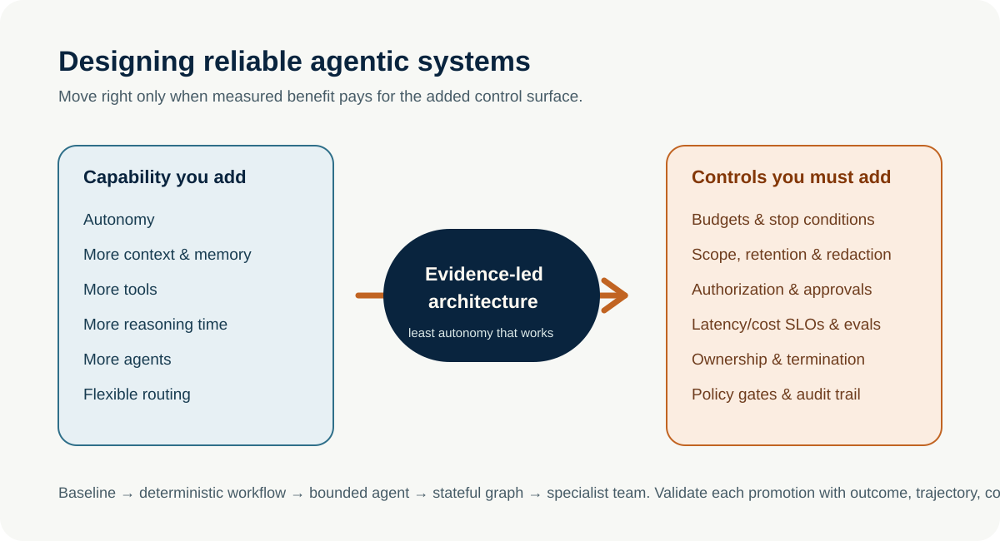
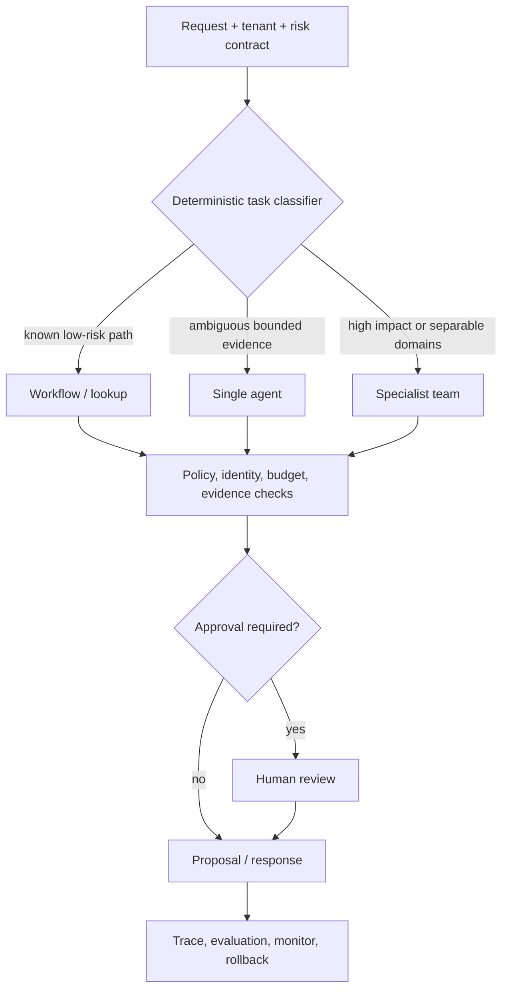

# Hybrid Production Architecture

**Level:** Advanced · **Time:** 60 min · **Prerequisites:** None

**Advanced · 04** · **Notebook:** [`04_hybrid_production_architecture.ipynb`](04_hybrid_production_architecture.ipynb) · **Implementation:** [`lab.py`](lab.py)

A credible production agent system is hybrid: deterministic code owns known paths, routing, policy, identity, budgets, approval, state, and audit; a bounded single agent handles ambiguity; a specialist team is reserved for cases where measured specialization/review improves the outcome. “Everything is an agent” is usually less controllable, more expensive, and harder to evaluate.

## Scenario and outcomes

Northstar supports three checkout cases: a status report; intermittent EU failures; and a 35% enterprise-EU conversion drop after a release. The system must select the least autonomous reliable route, gather evidence, generate a proposal, and pause before consequential action. Learners design task classification, route contracts, control planes, state/recovery, evaluation, and rollout gates.

## 1. Architecture selection

| Route | Use when | Runtime responsibilities | Do not use when |
| --- | --- | --- | --- |
| Deterministic workflow | steps/branches/data sources are known | schema, retries, idempotency, audit | evidence path genuinely changes at runtime |
| Bounded single agent | tool choice depends on evidence; scope remains manageable | loop/tool/time/cost budgets, state, stop/escalate | a workflow covers it or required roles are truly separable |
| Specialist team | distinct evidence domains/review materially improve quality | role contracts, context isolation, coordinator budget, termination | simple task or coordination adds more cost/error than value |
| Human-review path | risk, uncertainty, customer/legal/production impact is material | exact action, evidence, approval expiry/fingerprint, idempotency | as a substitute for routine deterministic work |

## 2. Step-by-step production design

1. Normalize the request into tenant, user/agent identity, task family, known-path signal, evidence ambiguity, impact/risk, data/tool scope, deadline, cost/action budget, and required output.
2. Route with deterministic rules and measured evaluation evidence. Do not let the model self-select its autonomy or tools.
3. Execute the chosen worker with typed state/artifacts and narrow tools. Keep retrieved content untrusted; enforce tenant/provenance/freshness before context.
4. Apply an independent policy layer: allow list, arguments/resources, identity/delegation, rate/time/cost limits, output/evidence validation, action authorization, and audit.
5. For consequential action, persist a proposal then pause for fresh approval. Approval never grants a wider action or survives expiry/change.
6. Observe/evaluate the full trajectory. Use staged deployment, fallback to a simpler route, rollback configuration, and incident recovery.

## 3. Complex use case and framework fit

The notebook routes the three cases above. The high-risk case sends read-only artifacts from Observability, Deployment, Customer Impact, Analyst, and Risk Reviewer through an approval-ready proposal. LangGraph is useful when state, durable checkpoints, conditional routing, or approval interrupts are core; OpenAI Agents SDK is useful for a compact managed loop/tools/guardrails/tracing; AutoGen/CrewAI are appropriate only when the team topology adds demonstrated value. No framework owns business authorization.

## 4. Evaluation and production checklist

Evaluate routing accuracy, outcome/evidence support, unsafe action blocks, approval correctness, tool/trajectory quality, cost per successful safe task, p95 latency, fallback/recovery, and tenant/risk slices. Test missing/conflicting evidence, tool failure, model outage, budget exhaustion, prompt injection, duplicate approval, queue replay, and rollback.

Run `python lab.py`; inspect the route, policy checks, and approval state. Exercises: add a policy for medium-risk customer messaging; create an unavailable-tool fallback; compare a team with a single agent; model a release gate; and design an incident rollback/kill-switch path.

## Watch For

- **Assumption failure:** The model hallucinates an unsupported parameter.
- **State leak:** Context is incorrectly preserved across runs.
- **Timeout:** The tool takes too long and the agent loops.
- **Auth bypass:** The agent attempts an action it shouldn't.

## Checkpoint

**1. What is the primary purpose of this module?**
- A) To understand the core concept.
- B) To write complex boilerplate.
- C) To ignore system errors.
- D) To bypass security.

**2. How do we mitigate the primary failure mode?**
- A) Retries.
- B) Human approval.
- C) Logging.
- D) Idempotency keys.

## References

- [OpenAI practical guide to building agents](https://openai.com/business/guides-and-resources/a-practical-guide-to-building-ai-agents/) · [Anthropic: building effective agents](https://www.anthropic.com/engineering/building-effective-agents)
- [NIST AI RMF](https://www.nist.gov/itl/ai-risk-management-framework) · [OWASP Top 10 for Agentic Applications](https://genai.owasp.org/resource/owasp-top-10-for-agentic-applications/) · [LangGraph durable execution](https://docs.langchain.com/oss/python/langgraph/durable-execution)
