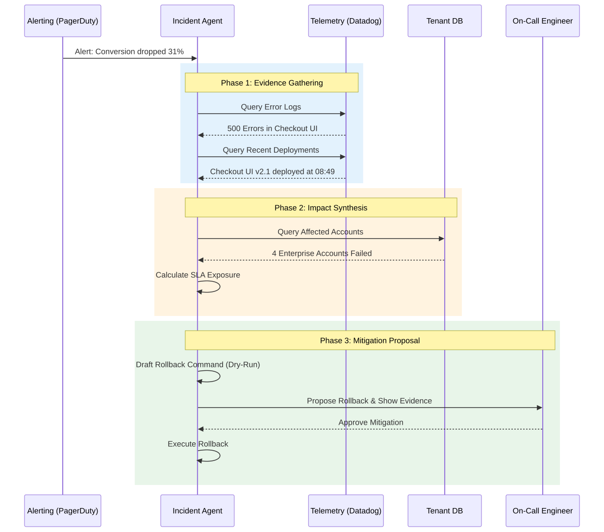

# Incident Response Capstone

**Level:** Advanced · **Time:** 60 min · **Prerequisites:** Modules 06-31

**Advanced · 05** · **Notebook:** [`05_incident_response_capstone.ipynb`](05_incident_response_capstone.ipynb)

This module is the Capstone project. It ties together World Modeling, Memory, Routing, and Orchestration into a single, concrete enterprise scenario: **An agent debugging a production outage.**

A production outage is a high-stress, high-context environment. If an agent hallucinates a root cause and autonomously executes a database flush, the company will suffer a catastrophic failure. Therefore, the agent must be strictly governed through three phases:

1. **[Deep Dive: Evidence Gathering](EVIDENCE_GATHERING.md)** (The agent is restricted to Read-Only tools to build a chronological timeline of metrics and logs, preventing it from guessing the cause).
2. **[Deep Dive: Impact Synthesis](IMPACT_SYNTHESIS.md)** (The agent queries tenant databases to identify affected enterprise accounts and calculates the potential SLA violation cost).
3. **[Deep Dive: Mitigation Proposals](MITIGATION_PROPOSALS.md)** (The agent drafts a safe, idempotent rollback plan and routes it to a human for approval rather than executing it autonomously).

---

## State of the Art: Technology & Tools

Incident Command agents require deep integrations with observability and alerting stacks.

- **[Datadog / Sentry / New Relic]:** The source of truth for telemetry. The agent uses read-only API tokens to query metrics and traces.
- **[PagerDuty / Opsgenie]:** The routing layer. The agent posts its Incident Brief and Mitigation Proposal here, triggering the Human-in-the-Loop workflow.
- **[LaunchDarkly / GitHub Actions]:** The execution layer. When the human approves the proposal, the system orchestrates a feature flag toggle or a `git revert` pipeline.

---

## Checkpoint

**1. During an outage, the agent believes the issue is caused by a bad Redis cache. What should the agent's first action be?**
- A) Flush the Redis cache to see if it fixes the issue.
- B) Use a Read-Only tool to query the Redis metrics and prove the cache hit rate is dropping, adding this to the Evidence Timeline.
- C) Page the CEO immediately.
- D) Blame the network team.

Answer

<b>B</b>. The agent must operate strictly in Read-Only mode during Evidence Gathering to prove its hypothesis.

**2. The agent has confirmed a bad deployment caused the outage. It drafts a `git revert` command. What is the correct next step?**
- A) Execute the command via a subshell. Speed is critical.
- B) Propose the mitigation to a human via PagerDuty, wait for approval, and then execute the payload using a unique idempotency key.
- C) Create a Jira ticket and go to sleep.
- D) Restart the Kubernetes cluster.

Answer

<b>B</b>. High-risk state mutations must be proposed, approved by a human, and executed idempotently.

