# Agent Memory

**Level:** Advanced · **Time:** 60 min · **Prerequisites:** None

**Advanced · 06** · **Notebook:** [`agent_memory.ipynb`](agent_memory.ipynb)

A massive misconception in agent development is that "memory" simply means dumping every conversation transcript into a vector database. This approach leads to context window exhaustion, contradiction loops, and catastrophic data leaks.

True agent memory is a governed subsystem across multiple cognitive layers (Working, Episodic, Semantic, and Procedural), complete with strict rules for consolidation, forgetting, and tenant isolation.

We have broken this module down into three core deep-dives:

1. **[Deep Dive: Memory Taxonomy](MEMORY_TAXONOMY.md)** (Differentiating Working, Episodic, Semantic, and Procedural memory, and when to use Vector vs Graph vs Relational databases).
2. **[Deep Dive: Consolidation and Forgetting](CONSOLIDATION_AND_FORGETTING.md)** (The Reflection Pattern: using background jobs to extract concrete facts from noisy logs, superseding contradictions, and expiring stale data).
3. **[Deep Dive: Memory Isolation and RAG](MEMORY_ISOLATION_AND_RAG.md)** (Multi-tenant security: Why semantic similarity searches cause data leaks, and how to use Hybrid Retrieval for hard pre-filtering).

---

## State of the Art: Technology & Tools

The industry is moving away from raw vector databases towards managed memory APIs that handle reflection and entity extraction automatically.

- **[Mem0](https://github.com/mem0ai/mem0):** A self-improving memory layer for LLMs that handles user preferences, session history, and semantic memory extraction automatically.
- **[Zep](https://www.getzep.com/):** A long-term memory store for AI apps that asynchronously extracts facts, summaries, and intents from chat histories.
- **[GraphRAG (Microsoft)](https://microsoft.github.io/graphrag/):** A framework for building Semantic Memory using Knowledge Graphs to answer global questions across massive datasets.

---

## Checkpoint

**1. A user tells the agent, "My billing address changed from New York to London." How should the agent's memory system handle this?**
- A) Append "User moved to London" to the vector database. When the agent asks for the address, the DB will return both New York and London, and the agent must guess which is correct.
- B) Use a Reflection process to extract the fact, explicitly supersede the old Semantic Memory record for "billing_address", and delete the old record to prevent contradictions.
- C) Delete the agent's procedural memory.
- D) Save it to Working Memory only.

Answer

<b>B</b>. Contradictions must be resolved in Semantic memory. Do not rely on an LLM to guess the truth from conflicting episodic logs.

**2. A SaaS platform dumps all user PDFs into a single Pinecone index. Tenant A asks "What is my revenue?" The Vector DB returns a chunk from Tenant B's PDF because the semantic similarity was 99%. What is the architectural fix?**
- A) Use a better embedding model.
- B) Hybrid Retrieval. The query MUST include a hard SQL-like pre-filter (e.g., `WHERE tenant_id = 'A'`) before the semantic vector search is allowed to run.
- C) Ask the LLM to ignore Tenant B's data.
- D) Fine-tune the model.

Answer

<b>B</b>. Semantic similarity is not an access control mechanism. Hard isolation (namespaces or pre-filtering) is mandatory.

