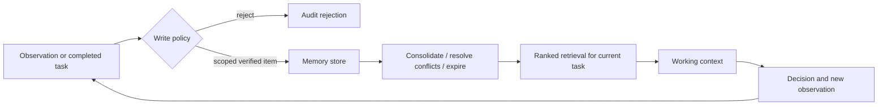

# 06 — Agent Memory

**Level:** Advanced · **Notebook:** [`agent_memory.ipynb`](agent_memory.ipynb) · **Runnable lab:** [`lab.py`](lab.py)

Memory is not a conversation transcript or a vector database feature. It is a governed **write → manage → read** subsystem: decide what may be stored, validate and scope it, consolidate or forget it, retrieve only what is useful now, and show why a memory influenced a decision.

The Northstar scenario continues with Acme’s EU payments incident. The agent must retain verified SLA and incident knowledge across runs without preserving an unverified “it is always Redis” diagnosis, crossing tenants, or making a past event look like a present fact.

## Outcomes

1. Design working, episodic, semantic, and procedural memory with separate contracts and lifecycle rules.
2. Compare short-term state, long-term memory, vector retrieval, structured records, knowledge graphs, and temporal histories.
3. Implement safe writes, ranking, consolidation, forgetting, contradiction resolution, reflection, personalization, and privacy boundaries.
4. Explain why memory needs source, confidence, scope, freshness, retention, and audit metadata.

## Memory taxonomy

| Type | Purpose | Example | Default lifetime |
| --- | --- | --- | --- |
| Working memory | current task, scratch state, intermediate artifacts | current evidence IDs and approval state | one run/thread |
| Episodic memory | previous events and task trajectories | “July incident had a region mismatch” | retained with timestamp/provenance |
| Semantic memory | durable facts/knowledge | Acme premium-SLA rule | versioned, verified, revocable |
| Procedural memory | strategies and skills | evidence-first incident workflow | policy/version controlled |

Short-term state belongs to a thread/checkpoint. Long-term memory is recalled across threads and must be explicitly namespaced. Context window capacity is not memory: only selected, current items should enter the prompt. External memory is data outside the window, subject to retrieval, access control, freshness, and deletion.

## Storage and retrieval choices

| Representation | Strength | Weakness | Use it for |
| --- | --- | --- | --- |
| Vector memory | semantic similarity across unstructured notes | approximate matches, stale/contradictory retrieval | supporting examples, document-like memories |
| Structured memory | schema, filters, audit, precise updates | needs careful schema design | preferences, SLA, approvals, facts |
| Knowledge graph | relationships and multi-hop reasoning | extraction/maintenance cost | entities, dependencies, ownership |
| Temporal/event log | sequence, recency, replay | not semantic by itself | incidents, actions, policy decisions |
| Hierarchical summary | compressed long-horizon context | can lose detail | milestones and handoffs |

Use hybrid retrieval: hard namespace/authorization filter first; then metadata (type, time, project), semantic or graph retrieval; then rank by relevance, confidence, importance, recency, and contradiction status. A vector score must never bypass tenant scope or a retention rule.

## The write → manage → read lifecycle

### 1. Write

Write only a typed item with namespace, source, confidence, sensitivity, timestamp, retention/expiry, and a reason. Do not store raw user text, tool output, hidden instructions, secrets, or an agent’s unsupported belief as a durable fact. Working notes may be lower confidence but should be explicitly labeled as provisional.

### 2. Manage

**Consolidation** combines repeated verified observations into a stable fact or summary. **Forgetting** expires irrelevant, wrong, sensitive, or policy-disallowed records. **Temporal memory** keeps past events anchored in time so “a prior incident” does not become “the current cause.” **Reflection** can propose a memory update after a task, but a deterministic validator must check evidence and write policy before commit.

### 3. Read

Retrieve memories only for a specific decision. Return a compact, attributable packet—not every historical note. Rank using relevance plus recency, confidence, importance, source authority, and task/tenant match. Include an explanation such as `fact-2 from verified postmortem` so a reviewer can challenge it.

## Contradictions and personalization

Contradictions are normal. Never overwrite silently. Keep the old record, mark it superseded/expired with a reason, write a new verified record linked to its predecessor, and retain an audit trail. The lab replaces an unverified “always Redis” claim with a scoped, evidence-first fact.

Personalized memory is an authorization problem before it is a relevance problem. Namespace by tenant/user/project, minimize collection, encrypt/control access according to the system’s policy, provide retention/deletion controls, separate preferences from sensitive attributes, and never let one tenant’s memory enter another tenant’s retrieval result or cache.

## Guided lab

1. Run `python lab.py`. Inspect the initial retrieval, consolidation event, forgetting record, replacement fact, and audit log.
2. Add an expired preference and verify it is not retrieved.
3. Add a memory from `globex` and prove Acme retrieval cannot return it.
4. Add a reflection proposal without an evidence source; make write policy reject it.
5. Change the ranking function to overvalue recency. Which correct but older SLA fact becomes at risk?

## Production checklist

- [ ] Separate working/thread state from cross-thread memory.
- [ ] Namespace every item and cache by tenant/user/project plus policy/version.
- [ ] Store provenance, timestamp, confidence, sensitivity, retention, and deletion state.
- [ ] Treat vector retrieval as a ranking feature, never access control.
- [ ] Consolidate and forget through policy; preserve supersession/audit links.
- [ ] Evaluate recall, precision, staleness, contradiction handling, personalization benefit, leakage, deletion, cost, and downstream decision quality.
- [ ] Keep sensitive and untrusted data out of memory by default; make writes reversible.

## References

- [Anthropic: Effective context engineering for AI agents](https://www.anthropic.com/engineering/effective-context-engineering-for-ai-agents) — compaction, structured notes, and long-horizon context.
- [LangGraph memory overview](https://docs.langchain.com/oss/python/concepts/memory) — thread-scoped and namespaced long-term memory concepts.
- [MemGPT](https://arxiv.org/abs/2310.08560) — virtual context management and archival memory framing.
- [Generative Agents](https://arxiv.org/abs/2304.03442) — memory stream, reflection, and retrieval for agent behavior.
- [A Survey on LLM-based Autonomous Agents](https://arxiv.org/abs/2308.11432) — memory within agent architecture.
- [OWASP LLM Top 10](https://genai.owasp.org/) — privacy, prompt injection, and data-exposure threats.
