# World Models and Environment Modeling

**Level:** Advanced · **Time:** 60 min · **Prerequisites:** None

**Advanced · 07** · **Notebook:** [`world_models_environment_modeling.ipynb`](world_models_environment_modeling.ipynb)

A purely reactive agent is dangerous. It guesses an action, executes it against Production, and waits to see if the system crashes. 

Advanced agents use **World Models** (or Digital Twins). They construct an internal, deterministic replica of the environment. Before taking any real-world action, they simulate the consequences in the twin.

We have broken this module down into three core deep-dives:

1. **[Deep Dive: Digital Twins](DIGITAL_TWINS.md)** (Building safe sandboxes. Why an agent must run `DROP TABLE` against a local SQLite replica before touching Production).
2. **[Deep Dive: Counterfactual Planning](COUNTERFACTUAL_PLANNING.md)** (Tree of Thoughts. Simulating divergent futures like `Rollback` vs `Wait`, scoring them, and selecting the highest utility path).
3. **[Deep Dive: The Sim-to-Real Gap](SIM_TO_REAL_GAP.md)** (The primary failure mode of World Models: when the simulation assumes 10ms latency but reality is 5000ms. Mitigating hallucinations with calibrated sensors).

---

## State of the Art: Technology & Tools

World modeling is transitioning from academic robotics into software agents.

- **[Google Genie 3](https://deepmind.google/models/genie/):** A foundational world model capable of simulating interactive 2D environments purely from internet video data.
- **Digital Twins (IoT/Cloud):** AWS IoT TwinMaker and Azure Digital Twins allow enterprises to build real-time, data-calibrated models of physical and digital assets for agents to query.
- **Model-Based Reinforcement Learning (MBRL):** The algorithmic foundation for counterfactual planning, allowing agents to learn the transition dynamics (`next_state = f(state, action)`) without breaking the real environment.

---

## Checkpoint

**1. An agent wants to delete a deprecated microservice. Instead of executing the terraform immediately, it runs the command against a local, mocked infrastructure graph. What is this mocked graph called?**
- A) A Vector Database.
- B) A Digital Twin / World Model.
- C) An LLM Judge.
- D) A Multi-Agent Swarm.

Answer

<b>B</b>. The agent is using a Digital Twin to verify its assumptions in a safe sandbox before executing in reality.

**2. The agent simulates a rollback. The simulation predicts 100% success. The agent executes the rollback in production, but it fails because a hard drive is unexpectedly full. What concept explains this failure?**
- A) Position Bias.
- B) The Sim-to-Real Gap. The simulation's assumptions deviated from the actual physical state of the real world.
- C) Rate Limiting.
- D) Context Window Exhaustion.

Answer

<b>B</b>. The Sim-to-Real Gap occurs when a World Model lacks perfect fidelity or up-to-date telemetry, leading the agent to trust a hallucinated simulation.

