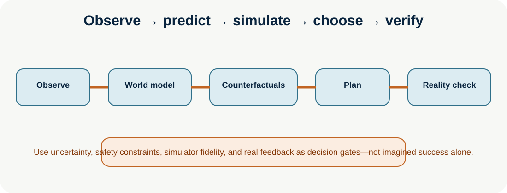

# World Models and Environment Modeling

**Level:** Advanced · **Time:** 60 min · **Prerequisites:** None

**Advanced · 07** · **Notebook:** [`world_models_environment_modeling.ipynb`](world_models_environment_modeling.ipynb) · **Implementation:** [`lab.py`](lab.py)

World models are internal predictive representations: given observed state and a candidate action, they estimate how an environment may evolve. They support model-based planning, simulation, and counterfactual questions such as “what would likely happen if we roll back versus route traffic?” A digital twin is typically a task-specific model connected to an operational asset and telemetry; a learned world model may infer dynamics from data. Both are fallible and must be calibrated against reality.

## Scenario and outcomes

Northstar’s EU checkout has low conversion and rising errors. Compare `rollback`, `route_traffic`, and `wait` in a simple digital twin before making a proposal. Learn internal representations, action-consequence prediction, environment models, simulation, model-based and counterfactual planning, digital twins, agent-environment simulation, and safety controls.

## Step-by-step training

1. **Represent state:** choose observable variables, uncertainty, latent assumptions, time horizon, and scope. Do not confuse a dashboard snapshot with causal state.
2. **Learn or engineer transition dynamics:** estimate `next_state = f(state, action, disturbance)`. A learned model can generalize; a rules/physics/process twin is often more interpretable and auditable.
3. **Roll out candidates:** simulate bounded action sequences under plausible disturbances. Counterfactuals compare candidates under equivalent starting assumptions; they do not establish real causality without validation.
4. **Plan:** choose a trajectory by expected utility subject to safety, cost, latency, policy, and uncertainty constraints. Model predictive control replans as new observations arrive.
5. **Validate:** use shadow mode, replay, sandbox/staging, simulation-to-real checks, and low-risk probes. Require human approval for high-impact action.
6. **Monitor drift:** compare predicted/observed outcomes, update the model/twin, retain calibration records, and fall back or stop when prediction uncertainty is high.

## Architecture choices and failure modes

| Approach | Best for | Main risk | Control |
| --- | --- | --- | --- |
| Rules/process twin | stable enterprise workflows | missing/changed assumptions | versioned rules, replay, owner review |
| Physics/digital twin | robotics, manufacturing | sim-to-real gap | calibrated sensors, safety envelope |
| Learned world model | complex/high-dimensional dynamics | hallucinated or long-horizon drift | uncertainty, short rollouts, real validation |
| Generative interactive environment | training/evaluation | visual plausibility without causal fidelity | task-grounded metrics, constrained evaluation |

## Practical lab

Run `python lab.py`. It compares candidate mitigations using expected conversion, error rate, and confidence; the output is a **proposal**, not authorization. Experiments: lower rollback confidence; add a cost/risk term; simulate telemetry drift; test a model that predicts high conversion but violates a policy constraint; and compare a single-step choice with receding-horizon replanning.

## Watch For

- **Assumption failure:** The model hallucinates an unsupported parameter.
- **State leak:** Context is incorrectly preserved across runs.
- **Timeout:** The tool takes too long and the agent loops.
- **Auth bypass:** The agent attempts an action it shouldn't.

## Checkpoint

**1. What is the primary purpose of this module?**
- A) To understand the core concept.
- B) To write complex boilerplate.
- C) To ignore system errors.
- D) To bypass security.

**2. How do we mitigate the primary failure mode?**
- A) Retries.
- B) Human approval.
- C) Logging.
- D) Idempotency keys.

## References

- [Genie / generative interactive environments](https://deepmind.google/research/publications/60474/) · [Genie 3](https://deepmind.google/models/genie/)
- [World Models for Embodied AI survey](https://arxiv.org/abs/2510.16732) · [World Model for Robot Learning survey](https://arxiv.org/abs/2605.00080)
- [Counterfactual world models via digital twins](https://arxiv.org/abs/2511.17481) · [Digital twin/model-based RL](https://research.dial.uclouvain.be/server/api/core/bitstreams/348ef001-d056-4e39-8c17-d3b528a32e2e/content)
