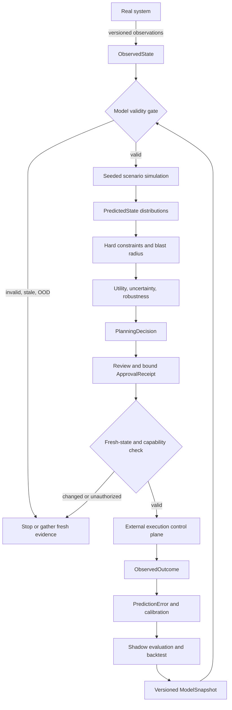

# World Models and Environment Modeling

**Level:** Advanced · **Time:** 150 minutes

**Prerequisites:** [Human approval and permissions](../../intermediate/03-human-approval-permissions/README.md), [Planning and task decomposition](../../intermediate/08-planning-task-decomposition/README.md), and [Incident response](../05-incident-response/README.md)

**Primary lab:** [`07_world_models.ipynb`](07_world_models.ipynb) · **Reusable implementation:** [`lab.py`](lab.py) · **Policy contracts:** [`policy.py`](policy.py)

> A world model is a fallible decision-support model of an environment. Simulation can reject bad plans and compare alternatives, but simulation success never proves production safety.

This course uses a deterministic, credential-free model of Northstar Commerce's EU checkout incident. The model evaluates rollback, 3DS disablement, traffic shifting, waiting, and a deliberately unsafe database rollback. It creates a proposal for review; it never performs a production side effect.

## Learning outcomes

By the end, you can:

1. distinguish a sandbox, simulator, world model, and digital twin;
2. keep observed production state and predicted state as different types;
3. bind observations, model snapshots, simulations, proposals, and approvals with provenance and digests;
4. gate simulation on freshness, sensor quality, model applicability, and out-of-distribution checks;
5. run seeded Monte Carlo counterfactuals and interpret distributions rather than point estimates;
6. combine explicit multi-objective utility with hard safety constraints, blast-radius checks, and robustness analysis;
7. prove that planning permission, execution capability, review, approval, and execution are separate boundaries; and
8. compare predicted and observed outcomes, measure calibration, detect drift, backtest a candidate model, and promote it through a controlled process.

## Scope, non-goals, and success criteria

The lab is a **deterministic educational fixture**. It teaches control boundaries and evaluation mechanics without credentials, live telemetry, or production access. It is not a faithful model of every checkout dependency, a causal proof, an optimizer for a real incident, or evidence that any action is safe.

The course succeeds when:

- a valid model produces reproducible distributions for multiple typed actions;
- missing, stale, low-quality, unit-mismatched, or out-of-domain input blocks consequential planning;
- cross-tenant effects and data-loss possibilities are hard failures even when expected utility is high;
- an approval-gated action remains a valid planning candidate;
- execution without a validated receipt is blocked;
- execution capability cannot be gained from simulation output or text; and
- material state change invalidates the simulation and requires a new cycle.

## Scenario: Northstar EU checkout degradation

Deployment `deploy-1842` is followed by elevated EU checkout latency, errors, and queue depth. Responders are considering:

| Action | Intended effect | Important risk |
|---|---|---|
| Roll back `deploy-1842` | restore the prior application version | dependencies or schema state may have changed |
| Disable the new 3DS integration | bypass a degraded provider path | authentication and conversion behavior changes |
| Shift traffic | use capacity in another region | overload or regional data-policy mismatch |
| Wait and observe | avoid intervention | customer and SLA impact continues |
| Roll back the database | recover quickly in the toy model | data loss and cross-tenant blast radius |

The model receives observations, snapshots the exact input, generates counterfactual outcome distributions, applies constraints and utility, and returns a recommendation for review.



This lab only creates an `ExecutionProposal` envelope after validation. Course 03's execution subsystem remains responsible for idempotency, authoritative approval storage, side-effect dispatch, reconciliation, and audit.

## 1. Name the artifacts correctly

These concepts overlap, but are not synonyms.

| Artifact | Primary purpose | What it does not establish |
|---|---|---|
| **Sandbox** | isolates execution from the real target | fidelity or predictive validity |
| **Simulator** | predicts outcomes under encoded assumptions | that those assumptions match current reality |
| **World model** | represents selected state and transition dynamics used by an agent | exactness, authorization, or full environmental coverage |
| **Digital twin** | models selected properties and dynamics of a real counterpart and is synchronized with observations to a defined degree | determinism, completeness, or automatic safety |

A digital twin may be deterministic or stochastic, physics-based or data-driven, a discrete-event model, a state machine, or a hybrid. NIST also notes that digital-twin definitions vary across fields; the practical question is what entity, properties, synchronization, objective, and validity envelope the implementation actually supports.

An in-memory SQLite clone can be a useful **sandbox or test replica**. It is not automatically a full digital twin. SQLite cannot reproduce all PostgreSQL semantics, permissions, triggers, locks, replication, extensions, query planning, data distribution, concurrency, or network dependencies. A query succeeding against the clone means only that the represented check passed.

## 2. The world model is a scoped transition model

At minimum, a model-based planner approximates:

\[
\hat{s}_{t+1} \sim \hat{T}(s_t, a_t, \epsilon)
\]

where `s_t` is an observed-state snapshot, `a_t` is a typed action proposal, `epsilon` captures sampled uncertainty, and `T-hat` is a versioned approximation of the environment's transition dynamics. The hat matters: this is a model, not the environment.

Northstar's fixture models only five variables:

| Variable | Unit | Why it matters |
|---|---|---|
| traffic rate | requests/second | load and applicability |
| checkout p99 latency | milliseconds | customer/SLO impact |
| checkout error rate | percent | incident severity and recovery |
| queue depth | messages | accumulated pressure |
| database utilization | percent | capacity and failure risk |

Unmodeled dependencies remain possible. Passing a represented invariant can reduce risk only when the model represents that invariant accurately.

### Observed state is not predicted state

`ObservedState` contains measurements and deployment metadata from trusted application inputs. `PredictedState` is simulator output and includes `derived_from_snapshot_id`. They are intentionally different Pydantic types with `extra="forbid"`.

This prevents code from silently turning `predicted_latency=40 ms` into `observed_latency=40 ms`. A predicted value becomes operational evidence only after an independent observation source records it as an `Observation` or `ObservedOutcome`.

### Observation provenance

Every `Observation` carries:

```text
observation_id · source · source_version · observed_at · retrieved_at
tenant · variable · unit · value · quality
```

The source identity and version make an input traceable. The two timestamps distinguish when the event occurred from when the planner retrieved it. Tenant and unit prevent accidental cross-scope or dimensionally invalid comparisons. Quality is one of `GOOD`, `DELAYED`, `MISSING`, `NOISY`, or `UNTRUSTED`.

## 3. Snapshot and validity before prediction

Each `ModelSnapshot` binds:

```text
model_version
snapshot_id
snapshot_time
calibration_time
input_state_digest
tenant
transition_model_version
validated state-variable ranges
random seed
```

Before simulation, `assess_model_validity()` computes model, snapshot, and sensor ages and returns one of:

| Status | Meaning | Consequential planning response |
|---|---|---|
| `VALID` | inputs and model are inside the fixture's validated envelope | simulation may begin |
| `DEGRADED` | usable evidence has a quality warning | gather better evidence; do not treat as fully valid |
| `STALE` | sensor, snapshot, or calibration age exceeds policy | refresh and rebuild snapshot |
| `OUT_OF_DISTRIBUTION` | at least one feature is outside a validated range | abstain or use a separately validated model |
| `UNVALIDATED` | lineage, tenant, units, required sensors, or trust checks fail | stop |

The fixture was calibrated for traffic up to 5,000 requests/second. Black Friday traffic of 7,000 requests/second returns `MODEL_OUT_OF_DOMAIN`; the planner does not “simulate anyway.” A single `confidence=0.72` would hide why the model is inapplicable, so validity is a typed status with reason codes and measurable ages.

## 4. Counterfactual planning is not Tree of Thoughts

Counterfactual planning evaluates outcomes under alternative actions. It may use model predictive control, scenario analysis, dynamic programming, search, Monte Carlo Tree Search, or other planning algorithms. **Tree of Thoughts** is a specific LLM inference/search technique for exploring intermediate reasoning candidates; it is not a synonym for environment simulation.

This course uses **deterministic fixture-driven Monte Carlo scenario analysis**. It does not use Tree of Thoughts and does not claim that the hard-coded transition profile is learned intelligence.

For each action, the lab samples 200 scenarios using a stable seed. It varies dependency availability, traffic, provider latency, database capacity, and stochastic recovery. It reports:

```text
recovery probability
data-loss probability
mean recovery time
p10 / p50 / p90 recovery time
mean customer impact
mean SLA exposure
worst-case downtime
worst-case data loss
robustness score
```

These are fixture results for teaching and tests, not benchmark claims about production performance.

## 5. Expected utility plus hard constraints

A point score such as “rollback = 85” hides assumptions. The lab instead exposes `UtilityWeights` and calculates:

\[
U(a) = 4P(recovery)
-2E(customer\ impact)
-8P(data\ loss)
-1.5E(SLA\ exposure)
-0.8E(complexity)
+E(reversibility)
-1.2(uncertainty)
\]

This formula is not universal. It is a reviewable fixture policy. Production weights should be approved by accountable owners, evaluated across incident classes, and monitored for unintended incentives.

Utility never overrides hard constraints. `score_distribution()` rejects a scenario set when it predicts:

- an affected tenant outside the proposal scope;
- an affected service outside the allowed blast radius;
- any disallowed data-loss probability;
- worst-case downtime over policy;
- insufficient robustness; or
- an invariant violation such as `CROSS_TENANT_MUTATION` or `DATA_LOSS`.

The toy database rollback has high recovery probability but touches a shared database, includes Globex in the predicted blast radius, and can lose data. It is rejected; subtracting a small “risk penalty” would not be enough.

### Preconditions, postconditions, and invariants

A deployment rollback requires the observed deployment to still equal `deploy-1842`. Predicted postconditions include the version, health, latency, queue depth, database utilization, and provider availability after each sampled outcome. Invariants protect tenant scope and data integrity.

Production systems should extend these checks with schema compatibility, write-set analysis, no orphaned foreign keys, no negative balances, regulatory region constraints, dependency health, capacity headroom, and service-specific SLOs.

## 6. Robustness and sensitivity

Expected utility asks which action is best on average under the model. Robustness asks how often it remains acceptable across plausible scenarios. Worst-case constraints ask whether any represented outcome is unacceptable.

`run_planning_cycle()` also re-evaluates actions under a high-traffic/high-latency scenario. If the winner changes or every action becomes infeasible, it returns `DECISION_UNSTABLE` and no executable recommendation. That is more informative than presenting a brittle winner as certain.

Try these experiments in the notebook:

1. increase traffic to 7,000 requests/second and observe that simulation is skipped as OOD;
2. mark queue telemetry missing and observe `UNVALIDATED`;
3. tighten minimum robustness to make the decision unstable;
4. increase the uncertainty weight and compare rankings; and
5. inspect why database rollback loses despite high recovery probability.

## 7. Planning, authorization, and execution are different boundaries

The central invariant is:

```text
SIMULATION_PASS != APPROVED
```

The planning layer is allowed to propose a rollback because the planner has `production.rollback` in its **planning capability set**. This permission means “may evaluate and propose,” not “may execute.” The proposal retains `approval_required=True` and remains valid.

Execution requires all of the following:

1. the `PlanningDecision` is `READY_FOR_REVIEW` and recommends the exact proposal;
2. the proposal digest still matches its typed payload;
3. the `SimulationResult` binds the proposal, model version, snapshot, and observed-state digest;
4. an authenticated `ApprovalReceipt` binds tenant, action, target, proposal digest, simulation run, world-model snapshot, state digest, policy version, approver role, issue time, and expiry;
5. the executor independently holds the required execution capability; and
6. fresh observed state has the same digest and preconditions as the approved simulation.

A log line, retrieved document, model response, or string containing `APPROVED` cannot create an `ApprovalReceipt`. A successful simulation cannot expand capabilities. If production changes after approval, `SIMULATION_STALE` forces new observations, a new snapshot, re-simulation, and new review/approval.

`authorize_recommended_action()` returns a typed `ExecutionProposal` envelope only. It performs no production operation. Consequential execution, stable logical idempotency keys, unique attempt IDs, replay defense, outcome reconciliation, and the authoritative approval store belong to the control plane taught in Courses 01, 03, and Advanced 05.

## 8. Sim-to-real gap and model error

Simulation can reduce the probability of unsafe actions by detecting failures that the model represents accurately. It cannot eliminate:

- model specification error;
- stale or broken sensors;
- unknown dependencies;
- unmodeled variables;
- implementation defects;
- production races;
- changing data distributions; or
- environment/model drift.

Relative error alone is not criticality. A prediction of 1 ms followed by an observation of 2 ms is a 100% relative error but only a 1 ms absolute error and may not affect an SLO or decision. A prediction of 10 ms followed by 4,200 ms has large absolute error and crosses the fixture's 500 ms SLO.

`compare_prediction()` therefore records absolute recovery error, relative recovery error, absolute latency error, SLO impact, ranking impact, and materiality.

## 9. Calibration, drift, and controlled updates

After an independently approved action is executed elsewhere, trusted telemetry produces an `ObservedOutcome`. The application compares it with the original distribution and stores a `PredictionError` and `CalibrationRecord`.

The lab calculates:

| Prediction type | Metric |
|---|---|
| numeric recovery time | MAE, RMSE, mean relative error |
| prediction interval | interval coverage |
| recovery event probability | Brier score |
| action ranking | ranking accuracy during backtest |
| safety constraint detection | constraint-violation miss rate |

The included records are explicitly labelled **historical shadow-prediction fixtures**. In shadow mode, production acts normally while a candidate model predicts without control. The prediction is compared with later observations.

A drift signal does not silently rewrite the active model. The controlled path is:

```text
model_v12
  -> calibration evidence
  -> ModelUpdateProposal for model_v13
  -> historical backtest
  -> ValidationReport
  -> approved promotion or rejection
```

The old snapshot remains immutable and available for replay. A candidate fails promotion if its MAE, interval coverage, constraint miss rate, or ranking accuracy misses policy.

## 10. Architecture and technology choices

| Pattern | Strengths | Limits | Good fit |
|---|---|---|---|
| Deterministic state machine | inspectable, fast, reproducible | narrow assumptions | workflows and policy transitions |
| Discrete-event simulation | queues, capacity, timing, concurrency | requires careful event/fidelity design | services and operations |
| Physics-based simulation | interpretable physical constraints | expensive and domain-specific | robotics and industrial systems |
| Learned dynamics/world model | can model complex observations | uncertainty, OOD, data and interpretability challenges | research and data-rich control tasks |
| Hybrid model | combines rules/physics/data | integration and calibration complexity | production decision support |
| Sandbox/test replica | isolates real side effects | may have poor environmental fidelity | schema, command, and integration checks |

Managed digital-twin platforms such as AWS IoT TwinMaker and Azure Digital Twins primarily organize and synchronize operational representations. Simulation engines, learned models, or custom transition logic may still be required for prediction. Framework selection does not remove application ownership of validity, authorization, constraints, approval, execution, or outcome verification.

## 11. Repository implementation

`policy.py` owns the trusted contracts and deterministic gates. `lab.py` owns the Northstar fixture, seeded simulator, scenario profiles, planning cycle, approval fixture, and shadow-calibration records. The notebook teaches those primitives incrementally and leaves production effects at zero.

Run the focused implementation:

```bash
uv run --frozen --extra contributor --extra core \
  python -m pytest -q tests/test_world_models.py

PYTHONPATH=curriculum/advanced/07-world-models-environment-modeling \
  uv run --frozen python \
  curriculum/advanced/07-world-models-environment-modeling/lab.py
```

Execute the canonical notebook:

```bash
uv run --frozen --extra contributor --extra core \
  python scripts/execute-notebooks.py --timeout 180 \
  curriculum/advanced/07-world-models-environment-modeling
```

## 12. Production upgrade checklist

| Teaching fixture | Production requirement |
|---|---|
| fixed observations | authenticated, tenant-scoped connectors with lineage and retention |
| fixed validity ranges | monitored applicability/OOD models by incident regime |
| in-process Monte Carlo | isolated, resource-bounded workers with cancellation and trace IDs |
| hand-authored transition profiles | validated learned, causal, physics, or hybrid models |
| fixture utility weights | accountable governance, sensitivity review, and abuse testing |
| local approval object | authoritative approval service, revocation, replay defense, and audit |
| execution envelope only | least-privilege executor with stable idempotency and reconciliation |
| five shadow records | representative historical suites, shadow traffic, canaries, and drift SLOs |
| one model snapshot | versioned registry, lineage, rollback, validation, and staged promotion |

Also define confidentiality, retention, availability, concurrency, cost, model-risk ownership, incident fallback, and manual-control procedures. Never log secrets, raw personal data, or private model reasoning; log observable inputs, versions, decisions, reason codes, and outcomes.

## 13. Failure modes and mitigations

| Failure | Why it happens | Fail-closed response |
|---|---|---|
| stale snapshot | approval occurs after production changed | `SIMULATION_STALE`; re-observe and re-simulate |
| out-of-domain traffic | model was not validated at current load | `MODEL_OUT_OF_DOMAIN`; use another validated model or human process |
| missing/noisy/untrusted sensor | world state is incomplete or corrupt | `UNVALIDATED`; repair evidence path |
| unit mismatch | incompatible raw numbers appear comparable | reject state; normalize upstream with lineage |
| cross-tenant prediction | action exceeds proposal scope | `BLAST_RADIUS_VIOLATION` |
| attractive data-loss scenario | utility hides unacceptable tail risk | hard constraint, never a penalty-only trade-off |
| unstable ranking | small assumption changes flip winner | `DECISION_UNSTABLE`; gather evidence or choose robust fallback |
| approval replay/tamper | receipt no longer binds current artifact | reject digest/run/snapshot/policy mismatch |
| silent recalibration | model learns from bad sensor or one incident | update proposal, backtest, validation, staged promotion |
| max simulations reached | resource circuit breaker fires | incomplete evaluation, not successful completion |

## 14. State of the art and open problems

**Established practice:** discrete-event and physics simulations, model predictive control, test environments, state estimation, digital representations synchronized with operational data, Monte Carlo risk analysis, and independent safety/authorization controls.

**Emerging practice:** learned and hybrid dynamics models, differentiable simulators, foundation world models, uncertainty-aware ensembles, and automated model-risk monitoring. Google DeepMind's Genie research is an example of learned interactive environment generation; it should not be read as proof that a generated environment is a validated operational twin.

**Research frontier:** causal generalization under interventions, calibrated long-horizon rollouts, distribution-shift detection, active data collection, robust planning under model misspecification, and trustworthy human/model joint decision-making.

**Open production question:** how should a system abstain when the model is useful enough to reject some actions but not reliable enough to rank the remaining actions? A single confidence number does not settle this governance decision.

## 15. Exercises

1. **Implementation:** add a typed `ScaleCheckoutCapacity` action with exact parameters, capability, invariants, and scenario profile.
2. **Diagnosis:** inject a 45-day-old dependency-graph observation and explain which validity status should win if traffic is also OOD.
3. **Evaluation:** add expected calibration error for recovery events and compare it with Brier score.
4. **Robustness:** change the uncertainty and reversibility weights. Identify a setting that flips the winner and decide whether the model should recommend or abstain.
5. **Security:** create a forged receipt containing the right text but the wrong simulation run and prove it is rejected.
6. **Architecture:** design a shadow-to-canary promotion process for `world-model-v13`, including rollback and model-risk ownership.

## Checkpoint

**1. A rollback simulation completes without represented invariant violations. What may happen next?**

- A. Execute immediately because the model verified safety.
- B. Grant the planner `production.rollback`.
- C. Create a bound proposal for fresh-state checks, policy review, and approval.
- D. Convert predicted state into observed state.

<details><summary>Answer</summary><strong>C.</strong> The simulation is decision-support evidence. It does not prove safety, grant capability, or authorize execution.</details>

**2. Why are `ObservedState` and `PredictedState` different types?**

- A. To prevent simulator output from being mistaken for production evidence.
- B. To make random sampling faster.
- C. To avoid model versioning.
- D. To remove the need for telemetry provenance.

<details><summary>Answer</summary><strong>A.</strong> Predictions remain traceable model outputs until independent sensors observe an outcome.</details>

**3. A database rollback has the highest expected utility but predicts possible data loss. What wins?**

- A. Expected utility.
- B. The hard data-loss constraint.
- C. The model confidence score.
- D. The shortest expected recovery time.

<details><summary>Answer</summary><strong>B.</strong> Hard constraints define unacceptable outcomes; utility only ranks feasible actions.</details>

## References

- NIST, [Digital twin glossary entry](https://csrc.nist.gov/glossary/term/digital_twin) and [Definitions and State of the Art](https://www.nist.gov/digital-twins/definitions-and-state-art).
- NISTIR 8356, [Considerations for Digital Twin Technology and Emerging Standards](https://csrc.nist.gov/pubs/ir/8356/ipd).
- AWS, [What is AWS IoT TwinMaker?](https://docs.aws.amazon.com/iot-twinmaker/latest/guide/what-is-twinmaker.html).
- Ha and Schmidhuber, [World Models](https://arxiv.org/abs/1803.10122), 2018.
- Yao et al., [Tree of Thoughts: Deliberate Problem Solving with Large Language Models](https://arxiv.org/abs/2305.10601), 2023.
- Tamar et al., [Policy Gradient for Coherent Risk Measures](https://arxiv.org/abs/1502.03919), 2015.
- Google DeepMind, [Genie world-model research](https://deepmind.google/models/genie/).

Continue with [Advanced 08 — Proactive Agents](../08-proactive-agents/README.md), where forecasts can trigger bounded preparation but still cannot bypass policy or approval.
