# Proactive Agents

**Level:** Advanced · **Time:** 60 min · **Prerequisites:** None

**Advanced · 08** · **Notebook:** [`proactive_agents.ipynb`](proactive_agents.ipynb)

Proactive agents shift the paradigm from reactive (user types a prompt, agent responds) to proactive (agent monitors a datastream, decides to act, and notifies the user).

However, building proactive agents introduces a massive risk: **Notification Spam and Flapping**. If an agent monitors a noisy database stream without noise-reduction mechanisms, it will trigger thousands of LLM invocations and page engineers at 3 AM for minor fluctuations.

We have broken this module down into three core deep-dives focusing on noise reduction and user consent:

1. **[Deep Dive: Event Deduplication](EVENT_DEDUPLICATION.md)** (Using Redis/Memcached with TTLs to store `alert_signatures` so the same error only alerts once).
2. **[Deep Dive: Hysteresis and Cooldowns](HYSTERESIS_AND_COOLDOWNS.md)** (Using control theory to prevent "flapping" when a metric oscillates around a threshold).
3. **[Deep Dive: Quiet Hours and Preferences](QUIET_HOURS_AND_PREFERENCES.md)** (User-scoped routing: downgrading a 3 AM low-priority alert into a morning email digest).

---

## State of the Art: Technology & Tools

Building proactive systems requires robust event-streaming and caching infrastructure.

- **[Apache Kafka](https://kafka.apache.org/) / [AWS EventBridge](https://aws.amazon.com/eventbridge/):** The industry standards for securely piping system events to your agent's webhook triggers.
- **[Redis](https://redis.io/):** The standard caching layer for storing event signatures with Time-To-Live (TTL) for ultra-fast deduplication.
- **[Courier](https://www.courier.com/) / [Knock](https://knock.app/):** Notification routing APIs that natively handle quiet hours, user preferences, and digest batching so your agent doesn't have to build it from scratch.

---

## Checkpoint

**1. A proactive agent is monitoring CPU usage and alerts the team if it exceeds 90%. The CPU hovers at 89%, hits 91%, drops to 89%, and hits 91% again over 10 seconds. The agent sends two alerts. How do you fix this "flapping"?**
- A) Upgrade to a faster LLM.
- B) Implement Hysteresis. Define a Recovery Threshold (e.g., CPU must drop below 70%) or a strict 30-minute cooldown before the agent is allowed to alert on CPU again.
- C) Delete the agent.
- D) Change the activation threshold to 95%.

Answer

<b>B</b>. Hysteresis (requiring a distinct recovery state) or strict cooldowns are mandatory for continuous metric monitoring.

**2. An agent detects a spelling error on the company website at 3:00 AM on a Sunday. What is the correct architectural pattern for notifying the on-call engineer?**
- A) Send a PagerDuty alert immediately. Accuracy is critical.
- B) Propose a notification to a Notification Router. The router checks the user's timezone and urgency, blocks the immediate push notification, and adds it to a daily digest email sent at 9:00 AM Monday.
- C) Automatically fix the spelling error without telling anyone.
- D) Sleep the Python script until Monday morning.

Answer

<b>B</b>. Notification Routing and Downgrading is essential for respecting quiet hours and user consent.

