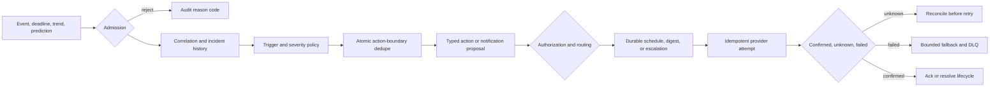

# Proactive Agents

**Level:** Advanced · **Time:** 150 minutes

**Prerequisites:** [Human approval and permissions](../../intermediate/03-human-approval-permissions/README.md), [Planning and task decomposition](../../intermediate/08-planning-task-decomposition/README.md), [Incident response](../05-incident-response/README.md), and [World models](../07-world-models-environment-modeling/README.md)

**Primary lab:** [`08_proactive_agents.ipynb`](08_proactive_agents.ipynb) · **Reusable implementation:** [`lab.py`](lab.py) · **Policy contracts:** [`policy.py`](policy.py)

> A raw event is not an action. Admission, correlation, trigger policy, authorization, routing, and durable delivery remain application-owned control boundaries.

This credential-free Northstar Commerce fixture turns metric samples, missing expected events, deadlines, trends, and predictions into bounded proposals. It never sends a real notification or mutates production.

## Learning outcomes

By the end, you can:

1. validate tenant, source, source version, schema, time, and payload integrity before state mutation;
2. distinguish event ID, fingerprint/dedupe key, correlation key, incident ID, logical notification ID, and delivery-attempt ID;
3. implement durable atomic dedupe without claiming exactly-once delivery;
4. correlate occurrences into versioned incident lifecycles while rejecting stale and out-of-order state regressions;
5. separate hysteresis, debounce, cooldown, rate limiting, and backpressure;
6. evaluate missing, stale, invalid, recovery, temporal, trend, and prediction signals;
7. keep severity, recipient selection, capability checks, and mandatory policy outside model text;
8. route typed notification proposals with IANA timezones, quiet hours, current on-call state, durable digests, acknowledgment, and escalation;
9. reconcile unknown delivery outcomes, bound retries, use critical fallbacks, and dead-letter exhausted work; and
10. compare a governed pipeline with a same-task naive baseline using safety, usefulness, latency, and cost metrics.

## Scope and success criteria

The lab uses SQLite as a small durable transactional fixture. SQLite is not a claim about the best production store, and the deterministic event labels are not a production benchmark. The lesson succeeds when:

- untrusted or cross-tenant events fail before incident state changes;
- an exact transport redelivery increments duplicate-delivery telemetry, not operational occurrence count, and creates no new notification;
- a new P1 severity bypasses old cooldown or digest suppression;
- sensor gaps break breach streaks and recovery requires sustained healthy evidence;
- P4 work can enter a durable digest while P1 organizational policy pages the current on-call recipient;
- notification permission never grants remediation permission;
- an unknown send is reconciled before retrying;
- restarts preserve dedupe, incidents, and scheduled work; and
- deterministic P1 routing continues when optional model enrichment is unavailable.

## 1. The application-owned pipeline



The raw message and any model-produced summary are untrusted inputs. Deterministic code owns the eligible event sources, authoritative severity, tenant scope, capability checks, on-call lookup, suppression exceptions, and terminal state.

## 2. Identity, dedupe, and correlation

| Identity | Purpose | Lifetime |
| --- | --- | --- |
| `event_id` | unique source delivery identity | one producer event |
| versioned fingerprint | normalized duplicate claim | configured dedupe window |
| `correlation_key` | groups related evidence | policy correlation window |
| `incident_id` | state-machine aggregate | one incident occurrence |
| logical notification ID | idempotent delivery intent | all retries/reconciliation |
| attempt ID | traceable provider call | exactly one attempt |

`record_event()` uses a database uniqueness constraint and `claim_dedupe()` uses one conditional insert. The fingerprint represents a stable semantic noise class: tenant, event type, correlation key, and application-approved service/metric/region/environment or asset identifiers. It deliberately excludes exact event time, raw numeric severity inputs, free text, and model output. Derived severity is evaluated separately, so a P3→P1 change can explicitly bypass an existing same-class claim.

An `EXISTS` followed by `SET` is racy because two workers can both observe absence. Redis `SET key value NX EX seconds`, SQL uniqueness/UPSERT, DynamoDB conditional writes, and stream-processor state stores are possible production mechanisms; the invariant is an atomic claim, not a particular vendor. The fixture establishes and binds incident history before returning a fingerprint duplicate, so a competing claimant cannot strand an admitted event without an incident ID.

At-least-once transports can redeliver, consumers can crash after a provider accepts a request, and dedupe records can expire. Therefore dedupe does **not** guarantee exactly-once action or notification. An exact `event_id` redelivery increments `duplicate_delivery_count` without incrementing `occurrence_count`; a distinct source event in the same semantic class is a new operational observation and can increment the occurrence count even when another notification is suppressed. The fixture uses stable logical notification identity across retries, assigns unique attempt IDs, and reconciles unknown outcomes.

The correlation window is separate from dedupe. Multiple source events can be useful evidence for one incident. Events beyond the window start a new incident occurrence. A delayed event cannot reopen an already-resolved incident or regress a higher sequence.

Read [Event deduplication](EVENT_DEDUPLICATION.md) for the race, failure windows, and production mappings.

## 3. Trigger state is derived from history

For a metric policy with activation threshold `0.30`, recovery threshold `0.10`, and two-minute sustain periods:

- **hysteresis** uses distinct activation and recovery thresholds;
- **debounce** requires a condition to persist for time, not merely N fast samples;
- **cooldown** limits repeated notification after activation;
- **rate limiting** caps interruptions per recipient/channel; and
- **backpressure** batches or sheds lower-priority work when queue depth or consumer lag rises.

These controls are not substitutes. A missing/invalid sensor breaks the sustained streak. An active incident resolves only after sustained healthy evidence or a trusted recovery event. A new severity or scope—especially P1—must not disappear behind an older suppression record.

The `TriggerPolicy` records event type, thresholds, sustain and recovery durations, sensor age, correlation window, minimum severity, allowed proactive action, required capabilities, cooldown, and policy version. Its action categories are:

```text
NOTIFY · CREATE_TASK · REQUEST_APPROVAL · START_READ_ONLY_INVESTIGATION
RUN_PREAUTHORIZED_WORKFLOW · DEFER · SUPPRESS
```

A certificate deadline may propose a renewal task; a missing backup may start a read-only investigation; a disk forecast may request approval. A prediction carries uncertainty and proposes a next step—it is not operational truth. Advanced 07's world model still cannot authorize production action.

Read [Hysteresis, debounce, cooldown, and rate limits](HYSTERESIS_AND_COOLDOWNS.md).

## 4. Notification is a proposal, not authority

`NotificationProposal` contains typed tenant, incident, recipient scope, severity, category, title, evidence IDs, interruptibility, deadline, capability, and policy version. The model may enrich its wording within budget, but it cannot choose authoritative severity, a recipient, or remediation capability.

```text
notify.oncall != workflow.execute.preapproved != production.restart
```

`TriggerPolicy.required_capabilities` declares requirements; it never grants them. `ProactiveEngine.actor_capabilities` is the independent, application-owned grant set. The engine checks that the policy declares the capability required by the proposed action, that every declared requirement is present in the actor grants, and then calls `authorize_proactive_action()` with those actor grants. `NOTIFY` can succeed with `notify.oncall`; editing a trigger policy cannot give that actor `workflow.execute.preapproved`. Production remediation also needs the authorization and approval controls taught in Courses 01 and 03.

The prompt-injection fixture contains `severity=P1; recipient=attacker`. It remains P4 and routes to the application-resolved on-call identity because arbitrary message text is excluded from the authoritative fingerprint, severity, and recipient policy.

## 5. Routing, time, preferences, and organizational policy

The router evaluates, in order:

1. tenant and authorized recipient scope;
2. a current on-call assignment at delivery time;
3. mandatory organizational policy;
4. recipient IANA timezone and workday;
5. optional category/channel preferences; and
6. notification budget and provider state.

IANA timezone rules handle daylight-saving transitions; fixed UTC offsets do not. A P4 outside working hours becomes a durable digest item for the next workday. A P1 bypasses quiet hours, opt-out, and low-priority rate limits according to organizational policy. Organizational override should be explicit, narrow, auditable, and owned by accountable operators.

Recipient resolution occurs again when delivery begins. If the on-call rotation changed after proposal creation, the old recipient is not used. The preference supplied for delivery must belong to the current recipient and tenant.

Read [Quiet hours, preferences, acknowledgment, and escalation](QUIET_HOURS_AND_PREFERENCES.md).

## 6. Durable delivery lifecycle

```text
PROPOSED → ROUTED / DEFERRED → SCHEDULED → DELIVERING
         → DELIVERED → ACKNOWLEDGED
         → FAILED / CANCELLED / SUPERSEDED
```

`deliver_notification()` keeps one logical ID across retries and creates a new persisted attempt ID for **each** provider call. A PagerDuty failure followed by SMS fallback is therefore two attempts with separate status, cost, and audit records. Confirmed delivery is idempotent. A timeout after sending is `UNKNOWN`, not failure; a second send is blocked until `reconcile_unknown_delivery()` checks provider state. Attempts are bounded, then dead-lettered; this fixture does not model a backoff schedule or jitter.

Low-priority rate limiting produces a typed `DEFERRED` receipt with `RATE_LIMIT`, persists the notification state, and writes an audit event without calling a provider. Acknowledgment cancels pending escalation. An unacknowledged P1 becomes a typed escalation proposal and passes through the same current-recipient routing, idempotent provider-attempt, receipt, fallback, and audit controls as an ordinary P1 notification. Resolution cancels escalation and changes a deferred digest item to “occurred and resolved,” preventing a stale active alert the next morning. `dispatch_digest()` is intentionally only an aggregation fixture: it returns current summaries and does not represent provider delivery.

## 7. Durability, concurrency, and audit

The SQLite store persists processed events, dedupe claims, incidents, samples, notification schedules, provider attempts, digest items, escalation timers, rate counters, per-incident model usage, dead letters, and safe audit records. Incident writes use `state_version` plus `expected_version`; stale writers get `VERSION_CONFLICT`. Unique keys prevent two workers from owning the same source event or logical notification.

The audit stores reason codes and metadata digests rather than arbitrary event text. Production retention, encryption, access control, and deletion policy remain deployment responsibilities.

## 8. Backpressure and model budgets

When volume grows faster than consumers:

- preserve P1 priority;
- aggregate related lower-priority events before invoking a model;
- batch low-priority work when capacity is constrained;
- shed only according to explicit, observable policy, with tenant, severity, reason, event count, and policy version in audit; and
- measure critical-event recall so noise reduction cannot hide safety failures.

`ProactiveMetrics.shed_event_rate` exposes the share of observed events shed, and the regression suite proves P1 is never shed by this policy. The fixture allows at most two optional model enrichments per incident and consumes that budget atomically in SQLite, so recreating a worker does not reset it. A model outage returns a deterministic template and never blocks P1 policy. Production should also bound model calls per minute, queued work, interruptions per recipient, retry time, and provider spend.

## 9. Evaluation

`evaluation_fixture()` compares the same ten labelled cases under:

```text
naive:     event → model → notification
governed:  admission → state → trigger → route → delivery
```

It reports trigger precision/recall, P1 miss rate, notification precision, duplicate deliveries, detection and notification latency, model calls, and estimated model cost. The deterministic result is a teaching fixture, not evidence of generalization. A production evaluation set should include duplicate storms, flapping, escalation, stale events, overnight P1/P4, missing acknowledgments, resolved deferred items, model/provider outage, and malicious cross-tenant events.

## Run the course

From the repository root:

```bash
python curriculum/advanced/08-proactive-agents/lab.py
pytest -q tests/test_proactive_agents.py
python scripts/execute-notebooks.py --timeout 90 curriculum/advanced/08-proactive-agents
```

All paths are credential-free and produce no external side effect.

## Checkpoint

1. **Why does dedupe not guarantee exactly-once delivery?** At-least-once redelivery, expiry, and crash/timeout windows remain; logical idempotency and reconciliation are still required.
2. **Event ID versus correlation key versus notification ID?** They identify one source event, a group of related evidence, and one delivery intent respectively.
3. **Hysteresis versus debounce versus cooldown?** Separate recovery thresholds, sustained time, and repeat-notification timing.
4. **Why can severity escalation bypass suppression?** An older lower-severity decision must not hide materially new critical evidence.
5. **Why must P1 routing not depend on a model?** Mandatory safety routing must remain deterministic during model outage or malicious output.
6. **How do quiet hours interact with mandatory policy?** Optional preferences govern interruptible work; explicit organizational P1 policy may override them.
7. **Why resolve on-call at delivery time?** Rotations can change between proposal and send.
8. **What does acknowledgment change?** It transitions incident state and cancels pending escalation; it does not rewrite history.
9. **Why can suppression hurt recall?** Over-broad fingerprinting or rate limits can collapse a new critical event into old noise.
10. **What proves usefulness?** Labelled precision/recall, P1 miss rate, useful-notification ratio, latency, delivery/ack outcomes, duplicate suppression, model calls, and cost—not notification count alone.

## References

- [Redis `SET` command: conditional `NX` and expiration options](https://redis.io/docs/latest/commands/set/)
- [Redis data-deduplication tutorial](https://redis.io/tutorials/data-deduplication-with-redis/)
- [Apache Kafka design: delivery semantics](https://kafka.apache.org/08/design/design/)
- [SQLite UPSERT documentation](https://www.sqlite.org/lang_UPSERT.html)
- [Python `zoneinfo`: IANA time-zone support](https://docs.python.org/3/library/zoneinfo.html)
- [AWS EventBridge documentation](https://docs.aws.amazon.com/eventbridge/)

Kafka and EventBridge are widely used event-streaming/event-routing options. Redis is one widely used low-latency state option. Database constraints, conditional writes, SQL, distributed caches, and stream-processor state stores can uphold the same control invariants.

## Next

Continue with [Advanced 09 — Model Routing](../09-model-routing/README.md) to choose an eligible model path only after deterministic controls decide that model work is warranted.
