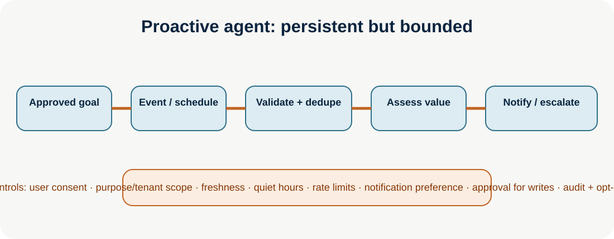

# Proactive Agents

**Level:** Advanced · **Time:** 60 min · **Prerequisites:** None

**Advanced · 08** · **Notebook:** [`proactive_agents.ipynb`](proactive_agents.ipynb) · **Implementation:** [`lab.py`](lab.py)

Proactive agents move beyond request/response by maintaining an approved goal, observing events or schedules, and offering timely assistance. They should behave like bounded digital workers—not unsolicited autonomous actors. Their most important behavior is often to *wait*, suppress a duplicate, respect quiet hours, or escalate with evidence.

## Scenario and outcomes

A Northstar checkout-health worker monitors EU conversion under an approved tenant-scoped goal. It is triggered by a metric event and scheduled heartbeat, deduplicates events, validates freshness, checks notification preference/quiet hours, and notifies on-call only when intervention is warranted. It cannot restart a service, modify a ticket, or contact customers without separate authorization.

## 1. Core patterns

| Pattern | Use | Reliability requirement |
| --- | --- | --- |
| Event-driven | React to an explicit event stream | idempotency, ordering/late-event policy, schema validation |
| Scheduled | Periodic checks/consolidation | timezone, missed-run, rate/spend, stale-data controls |
| Trigger-based | Threshold or state transition | hysteresis, dedupe, evidence/freshness check |
| Monitoring/background | Long-running observation | durable state, heartbeat, cancellation, recovery |
| Notification | Alert or recommendation | consent, relevance, preference, quiet hours, rate limit, opt-out |

## 2. Step-by-step design

1. **Create an explicit goal contract:** owner, tenant, purpose, monitored signal, trigger/expiry, notification channel/preferences, success, non-goals, and stop/cancel path.
2. **Ingest a trustworthy trigger:** verify producer, schema, timestamp, tenant, replay/idempotency key, and rate. A webhook or schedule is not permission to act broadly.
3. **Persist state safely:** store goal state, last observation, dedupe keys, cooldown, alert history, and audit trace. Separate working state from long-term user preference/memory.
4. **Assess whether intervention helps:** retrieve only permitted current evidence; compare threshold, confidence, user context, and expected value against interruption cost. Prefer `no action` for weak evidence.
5. **Act under boundaries:** notifications require opt-in and quiet-hours/rate checks. Consequential tools remain proposal-only or approval-gated. Background work has time/tool/cost/cancellation budgets.
6. **Evaluate:** measure event detection, correct timing, relevance, precision/recall, duplicate/false alerts, suppression correctness, end-to-end latency, cost, opt-out, and user correction rate.

## Goal persistence and permissions

Goal persistence is not unlimited autonomy. It is a versioned, reviewable intent with tenant/user scope, expiry, revocation, clear owner, and bounded allowed actions. Avoid stale or inferred goals, notification spam, cross-tenant memory, action on cancelled events, and unbounded background retries. Expose pause/resume/cancel controls to people.

## Practical lab and references

Run `python lab.py`. The worker emits one evidence-backed notification for a low conversion event, then suppresses a replay. Experiments: test quiet hours, opt-out, a stale event, threshold flapping/hysteresis, cancellation, event ordering, a cost budget, and escalation when data conflicts.

- [Proactive Conversational AI survey](https://doi.org/10.1145/3715097) · [ProEvent benchmark](https://arxiv.org/abs/2607.17701) · [Long-term task-oriented agent](https://arxiv.org/abs/2601.09382)
- [LangGraph ambient agents](https://www.langchain.com/blog/introducing-ambient-agents) · [background subagents](https://www.langchain.com/blog/running-subagents-in-the-background) · [persistent memory](https://docs.langchain.com/oss/python/deepagents/memory)
- [OpenAI practical agent guide](https://openai.com/business/guides-and-resources/a-practical-guide-to-building-ai-agents/)

## Watch For

- **Assumption failure:** The model hallucinates an unsupported parameter.
- **State leak:** Context is incorrectly preserved across runs.
- **Timeout:** The tool takes too long and the agent loops.
- **Auth bypass:** The agent attempts an action it shouldn't.

## Checkpoint

**1. What is the primary purpose of this module?**
- A) To understand the core concept.
- B) To write complex boilerplate.
- C) To ignore system errors.
- D) To bypass security.

**2. How do we mitigate the primary failure mode?**
- A) Retries.
- B) Human approval.
- C) Logging.
- D) Idempotency keys.

