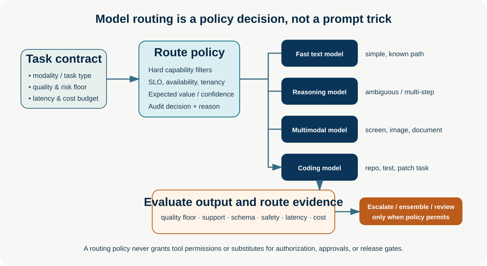
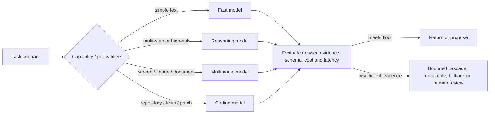

# Model Routing

**Advanced · 09** · **Notebook:** [`model_routing.ipynb`](model_routing.ipynb) · **Implementation:** [`lab.py`](lab.py)

Model routing selects the least expensive *eligible* model path for a request while preserving a measured quality, safety, and latency floor. It is a runtime product policy: it must account for what the task needs, what models can actually do, current availability, contractual data boundaries, and evidence from evaluation. It is not a claim that one model is universally “best,” and it never grants a model permission to act.

## Scenario, outcomes, and safety boundary

Northstar operates a support and incident assistant. A short request to format checkout status should use a fast text model. A regional regression investigation may need a reasoning model. A dashboard screenshot requires a multimodal model. A request to prepare a tested patch is routed to a coding-capable path. The assistant may prepare recommendations, but it cannot restart services, change a deployment, or merge code: routing is separate from authorization.

After this module, you can define a model portfolio, write a transparent routing policy, implement capability/cost/latency routing, design fallbacks and cascades, decide when an ensemble is worthwhile, and evaluate the *route* as well as the answer.

## 1. Start with a task contract, not model names

A router receives normalized, application-owned facts: modality; task class; desired output contract; tenant/data region; risk; expected tools; quality floor; latency SLO; cost budget; and whether a human must review. Do not route only from user-provided prose or a model’s self-reported confidence. Model names, prices, context limits, availability, and capabilities change; maintain a versioned catalog verified against the provider’s current documentation and your own evaluations.

| Task signal | Route when it is a hard requirement | Example | What it does **not** decide |
| --- | --- | --- | --- |
| Capability / modality | The answer needs vision, audio, a screen, code tools, or a particular structured-output capability | Read a checkout screenshot → multimodal | Whether an action is authorized |
| Complexity / ambiguity | The job requires multi-step analysis, conflict resolution, or a defensible plan | Explain an EU conversion drop using evidence | Whether reasoning is factually correct |
| Cost | Several eligible routes meet the quality floor | Format a known status report | Whether cheap output is acceptable without evaluation |
| Latency | An interaction or downstream workflow has a real deadline | 700 ms acknowledgement | Whether a fast route may violate a quality floor |
| Risk / policy | A failure has material impact or requires review | Customer-impact recommendation | Whether a stronger model may execute a tool |

### A practical portfolio

| Path | Choose it for | Avoid it when | Required controls |
| --- | --- | --- | --- |
| Small / fast text model | Known transformations, classification with a tested schema, short summaries, acknowledgement | Novel multi-hop diagnosis, image/screen evidence, high consequence unsupported claims | Schema validation, sampled evaluation, escalation threshold |
| Reasoning model | Ambiguous investigations, constraint trade-offs, evidence synthesis, long-horizon plans | A deterministic lookup or tight real-time path | Evidence checks, time/token/tool budgets, review for consequential decisions |
| Multimodal model | Screens, documents, charts, photos, OCR verification, visual grounding | Text-only requests where vision does not add information | Source/provenance, OCR/citation verification, privacy and prompt-injection controls |
| Coding model | Repository understanding, patch proposals, tests, debugging, review assistance | Unbounded shell/network/production access | Sandboxed tools, tests, diff review, protected branches, human merge authority |
| Ensemble / verifier | High-value uncertainty where independent answers can be compared | Routine traffic or correlated replicas that add no new evidence | Cost cap, independence assumption, deterministic tie-break/human review |

## 2. Capability routing: filter before ranking

Capability routing is a constraint problem. If a task requires a screenshot, a text-only route is ineligible even if it is cheaper. If it needs a code patch and tests, a generic chat model is not automatically the right route. Filter unavailable, disallowed, wrong-region, wrong-modality, or insufficiently evaluated paths first. Then rank eligible paths using observed task-family quality, predicted latency, price, queue depth, and budget.

Use *task families*, not a single generic “hardness” number: extract structured data, generate a patch, visual inspection, grounded policy answer, and incident synthesis fail differently. Track a quality floor per family and per risk tier. This prevents average benchmark scores from masking unacceptable failures on a valuable slice.

## 3. Cost and latency routing: optimize successful work

The operational objective is not the lowest token price. It is a constrained outcome such as:

`minimize expected cost subject to quality ≥ floor, p95 latency ≤ SLO, policy = allowed`.

Measure cost per successful task, p50/p95/p99 end-to-end latency, timeout rate, queue time, fallback rate, and quality floor violations. Include router overhead and the cost of escalations; a cheap first call can become expensive if it repeatedly fails. Capacity matters too: promote-or-fallback policies can create queue spikes on the expensive path, so route from live health signals and retain a safe degradation plan.

## 4. Cascades and fallback models

A **cascade** tries a cheaper eligible model first and promotes when a predetermined acceptance test fails. A **fallback** changes route because the preferred route is unavailable, timed out, exhausted its budget, or cannot meet a capability. They are not interchangeable.

1. Define a quality acceptance test external to the candidate answer whenever possible: schema validation, retrieval support, unit tests, rule checks, a calibrated evaluator, or human sampling.
2. Run the inexpensive path only when it is eligible for the task and enough time/budget remains for promotion.
3. Record acceptance evidence, model/catalog version, prompt/context version, cost, latency, and promotion reason.
4. Promote once or a bounded number of times. If the quality floor remains unmet, return an honest limitation or escalate to a person—never silently present a lower-quality fallback as equivalent.

Self-confidence alone is a weak promotion signal. A model can be confident and wrong; combine calibrated signals with deterministic checks and task-specific offline evaluation. For high-risk work, route directly to a verified high-quality path plus review rather than betting on a cheap cascade.

## 5. Ensembles: use disagreement as evidence, not decoration

An ensemble asks independent candidate paths and uses a verifier, rule, or human to select or reject an answer. It can help where complementarity is real: e.g., two different approaches interpret conflicting operational evidence and a reviewer checks citations. It also adds cost, latency, coordination complexity, and can amplify a shared blind spot if the models see the same poisoned context or use the same source.

Use an ensemble only after comparing it against a strong single-route baseline. Bound the number of candidates, ensure each gets the same permitted evidence, use an explicit disagreement/selection policy, and keep the verifier from treating a majority vote as truth. When the evidence is incomplete, abstention or human review is a valid result.

## 6. Step-by-step lab

The default implementation is deterministic and credential-free.

1. Run `python lab.py`; verify the four scenario tasks choose fast text, reasoning, multimodal, and coding routes.
2. Inspect `choose_route`: capability constraints are applied before complexity/cost/latency selection.
3. Run `run_cascade` with a weak quality signal. It promotes exactly once from the fast path to the reasoning path.
4. Mark the multimodal capability unavailable and observe the safe `human-review` result rather than a silent text downgrade.
5. Raise task risk and disagreement. The policy selects a bounded independent-models-plus-verifier pattern, not a default ensemble.
6. Add a task-family quality floor and audit event. Then compare always-reasoning, always-fast, and cascade policies on a held-out task set.

## 7. Evaluation and production checklist

Evaluate **outcome** (task success, groundedness, schema/test pass), **routing** (eligible route selected, escalation precision/recall, calibration), and **operations** (cost per success, p95 latency, timeouts, fallback and queue rate). Slice results by modality, language, tenant policy, risk tier, and task family. Audit every decision with catalog/policy version; continually re-evaluate after model, prompt, pricing, or provider changes.

- Keep model capabilities, data-processing commitments, version, pricing, limits, and health in a reviewed catalog.
- Enforce tenant/data residency, input classification, tool scope, approval, and budgets outside the router.
- Test unavailable routes, timeouts, malformed output, wrong-modality selection, cascade exhaustion, and ensemble disagreement.
- Prefer a deterministic workflow for known steps; routing does not make an architecture agentic.
- Establish rollback: pin the last known-good policy/catalog and alert on quality-floor violations.

## Exercises

1. Add a `max_cost_cents` field to `Task` and explain why a high-risk task should return review rather than violate its quality floor.
2. Create an acceptance check for a grounded support answer that requires two source IDs. Compare cascade cost-per-success to always using the reasoning route.
3. Simulate a multimodal outage during a screen-based task. Define which portions can be deferred, which can be sent to a person, and why a text-only guess is unsafe.
4. Design a routing evaluation set where average quality hides a failure for a protected language or high-value tenant. Specify the release gate.

## References

- [RouteLLM: Learning to Route LLMs with Preference Data](https://arxiv.org/abs/2406.18665) and its [open-source serving/evaluation framework](https://github.com/lm-sys/routellm)
- [RouterBench: A Benchmark for Multi-LLM Routing Systems](https://arxiv.org/abs/2403.12031) · [LLMRouterBench](https://arxiv.org/abs/2601.07206)
- [FrugalGPT: cost-aware cascades](https://arxiv.org/abs/2305.05176) · [Unified routing and cascading](https://arxiv.org/abs/2410.10347)
- [OpenAI practical guide to building agents](https://openai.com/business/guides-and-resources/a-practical-guide-to-building-ai-agents/) · [Anthropic: building effective agents](https://www.anthropic.com/engineering/building-effective-agents)
