# Model Routing

**Level:** Advanced · **Time:** 60 min · **Prerequisites:** None

**Advanced · 09** · **Notebook:** [`model_routing.ipynb`](model_routing.ipynb)

A hardcoded `gpt-4o` agent is too expensive for simple text formatting, and a hardcoded `gpt-4o-mini` agent will crash when asked to analyze a complex screenshot. 

Enterprise agent platforms require **Model Routing**. Routing is a runtime policy engine that selects the cheapest, fastest model that is capable of fulfilling the user's specific request, while maintaining high availability (HA).

We have broken this module down into three core deep-dives:

1. **[Deep Dive: Capability Filtering](CAPABILITY_FILTERING.md)** (Building a Model Registry and dynamically dropping models that don't support the required modalities, e.g., Vision).
2. **[Deep Dive: Model Cascades](MODEL_CASCADES.md)** (Cost optimization: Try a cheap model, run a programmatic assertion, and only promote to an expensive model if the assertion fails).
3. **[Deep Dive: Fallbacks and Reliability](FALLBACKS_AND_RELIABILITY.md)** (Gracefully handling `429 Rate Limit` and `503 Service Unavailable` errors by failing over to a secondary provider).

---

## State of the Art: Technology & Tools

The industry standard for routing involves decoupling the LLM application from the specific provider APIs.

- **[LiteLLM](https://litellm.vercel.app/):** The industry standard for routing and fallbacks. It translates Anthropic, Google, and OpenAI calls into a single unified API, making cross-provider fallbacks a 1-line config change.
- **[RouteLLM](https://github.com/lm-sys/RouteLLM):** A framework by LMSYS for training and deploying routing models that predict whether a cheap model can handle a prompt.
- **[Semantic Router](https://github.com/aurelio-labs/semantic-router):** A super-fast decision layer using vector embeddings to route requests based on semantic intent rather than LLM generation.

---

## Checkpoint

**1. A developer builds a Model Cascade: they route a request to `claude-3-haiku` first, and if it fails, they promote it to `claude-3-5-sonnet`. What is the critical requirement for this to work?**
- A) They must use LiteLLM.
- B) They must have a deterministic programmatic assertion (like a JSON schema validator or a Regex match) to definitively prove whether `haiku` failed. You cannot cascade open-ended tasks like "write a poem".
- C) Both models must cost the same.
- D) The user must approve the promotion.

Answer

<b>B</b>. Cascades require automated quality gates. Without a way to definitively prove failure, the system won't know when to promote to the more expensive model.

**2. Why is relying on a single LLM provider (e.g., only using OpenAI) an anti-pattern for production agents?**
- A) OpenAI doesn't support JSON mode.
- B) Lack of High Availability (HA). If the provider experiences an outage (503) or rate limits your application (429), your agent will crash. You must configure cross-provider Fallbacks.
- C) Anthropic is cheaper.
- D) It violates the MCP protocol.

Answer

<b>B</b>. Enterprise systems must be highly available. Fallbacks across providers (e.g., OpenAI -> Anthropic) are mandatory.

