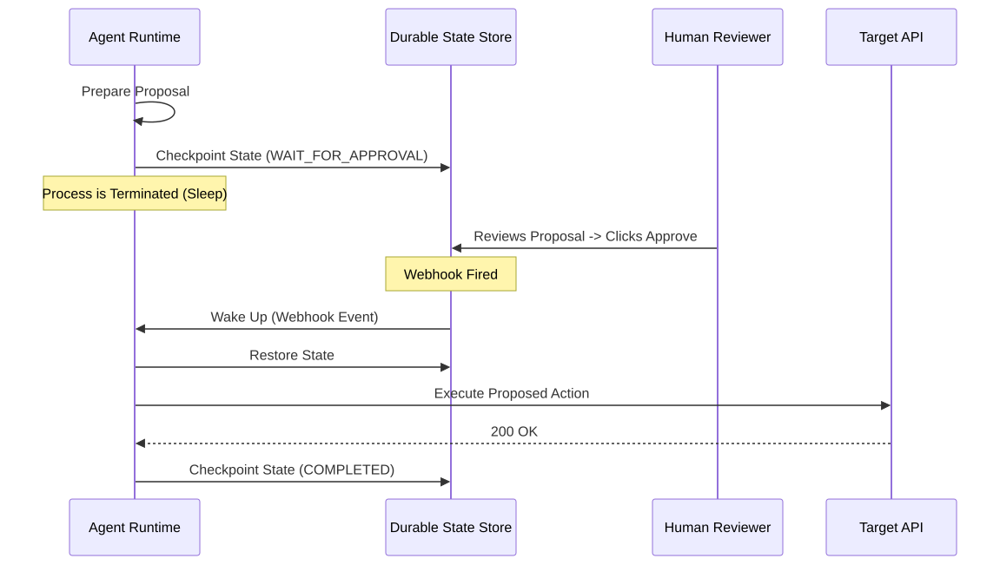

# Long-Running and Asynchronous Agents

**Level:** Advanced · **Time:** 60 min · **Prerequisites:** None

**Advanced · 10** · **Notebook:** [`long_running_asynchronous_agents.ipynb`](long_running_asynchronous_agents.ipynb)

One of the most dangerous patterns in early agent development is keeping an LLM process alive in a `while True:` loop, waiting for an external event (like a human clicking "Approve"). This wastes compute and guarantees data loss if the server restarts.

The correct architectural pattern is **Durable Execution**: persisting the agent's memory to a database, killing the process, and waking it up via a webhook when the human responds.

We have broken this module down into three core deep-dives:

1. **[Deep Dive: Durable Execution State](DURABLE_EXECUTION_STATE.md)** (Why `time.sleep()` is illegal in production, and how to serialize the context window to Postgres).
2. **[Deep Dive: Event-Driven Resumption](EVENT_DRIVEN_RESUMPTION.md)** (How to wake an agent up via Webhooks, and why you must use Idempotency Keys to survive network retries).
3. **[Deep Dive: Human Approval Timeouts](HUMAN_APPROVAL_TIMEOUTS.md)** (Handling Stale State: If a human waits 14 days to approve a proposal, the world state has likely changed and the agent must revalidate before executing).

---

## State of the Art: Technology & Tools

Durable execution is a solved problem in traditional software engineering, and those tools are now being adapted for agents.

- **[Temporal](https://temporal.io/):** The industry standard for durable execution workflows. It transparently handles sleep, retries, and state serialization.
- **[LangGraph (Checkpointers)](https://langchain-ai.github.io/langgraph/concepts/persistence/):** The built-in state persistence layer for LangGraph, allowing you to pause a graph at an `interrupt` node and resume it later.
- **[AWS Step Functions](https://aws.amazon.com/step-functions/):** A serverless orchestration service that natively supports "Wait for Callback" patterns with 1-year timeouts.

---

## Checkpoint

**1. An agent needs human approval to issue a refund. The developer writes a script that runs `time.sleep(60)` in a loop, querying the database to see if the human clicked approve. Why is this an anti-pattern?**
- A) It is too fast.
- B) It wastes compute, and if the server/pod reboots during the wait, the agent's memory is destroyed and the task will never complete.
- C) It is required by MCP.
- D) It violates the Idempotency Key standard.

Answer

<b>B</b>. Long-running agents must use Durable Execution: Checkpoint state to a database and kill the process.

**2. An agent checkpoints its state, proposing to delete a database table. The human manager goes on vacation and clicks "Approve" 14 days later. The agent wakes up via webhook. What is the immediate danger?**
- A) The webhook will fire twice.
- B) Stale State. The table might have been repurposed during those 14 days to hold critical data. The agent must revalidate the world state upon waking up before executing.
- C) The agent will run out of tokens.
- D) Position Bias.

Answer

<b>B</b>. Agents cannot blindly execute proposals that have been sitting in a queue for days. They must implement Time To Live (TTL) timeouts or strict revalidation.

