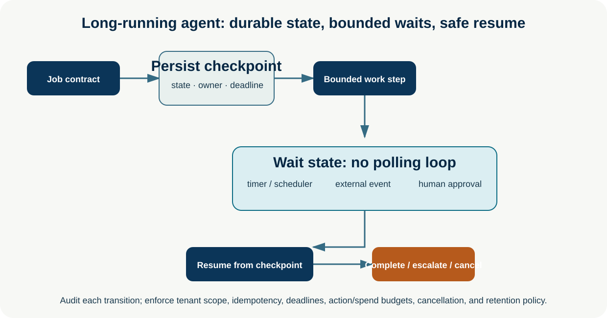
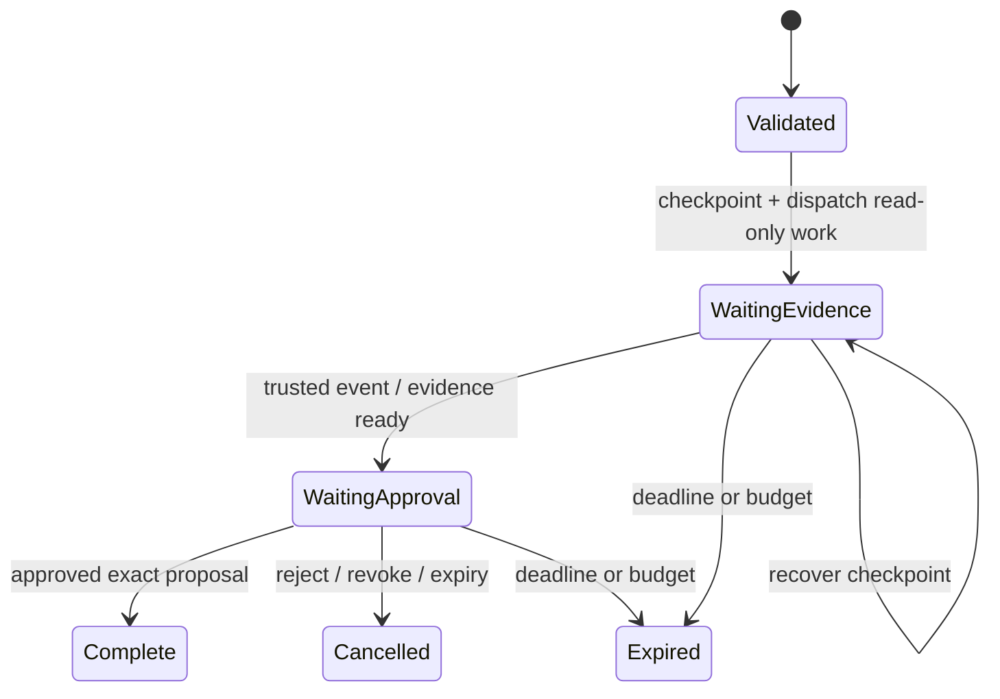

# Long-Running and Asynchronous Agents

**Level:** Advanced · **Time:** 60 min · **Prerequisites:** None

**Advanced · 10** · **Notebook:** [`long_running_asynchronous_agents.ipynb`](long_running_asynchronous_agents.ipynb) · **Implementation:** [`lab.py`](lab.py)

Long-running agents handle work that outlives one request: research that waits for sources, case work that needs approval, monitoring that wakes on an event, or a job that spans minutes, hours, or days. The correct design is durable orchestration: persist an explicit job contract and checkpointed state, then wake only for a trusted timer, event, or human decision. It is not a process that keeps an LLM loop alive indefinitely.

## Scenario and outcomes

Northstar opens a tenant-scoped EU checkout investigation. It gathers evidence, waits for a deployment event, prepares a mitigation proposal, pauses for an incident commander, and resumes after approval or rejection. A worker can disappear at any checkpoint without duplicating a consequential action. The job expires rather than silently retaining authority forever.

You will design background agents, schedules, event triggers, human pauses, checkpoint/recovery, durable execution, cancellation, idempotency, and observable run state.

## 1. Job contracts and durable execution

Persist a versioned record containing job/tenant/owner identity, purpose, input hash, state schema/version, allowed tools/actions, deadlines, token/action/spend budgets, idempotency keys, approval payload/fingerprint, event subscriptions, retention, cancellation, and audit trace. A checkpoint follows every durable transition—not just the end of the run. On recovery, resume the declared state transition rather than replaying a model transcript or repeating a write.

| Pattern | Use it for | Required controls |
| --- | --- | --- |
| Background job | Long research, batch triage, enrichment | durable queue, lease/heartbeat, cancellation, deadline/budget |
| Scheduled agent | Daily reconciliation or periodic health review | timezone, missed-run policy, idempotency, rate/spend cap |
| Event-triggered agent | Deployment, ticket, or approved webhook | producer authentication, schema/version, replay/dedupe, tenant scope |
| External-event wait | Human response, asynchronous API, data arrival | correlation ID, timeout, webhook verification, stale-event policy |
| Human approval pause | Consequential proposal | exact action/evidence/fingerprint, reviewer identity, expiry, immutable audit |

## 2. Pause, resume, and recovery

Pause before a side effect. Persist the proposal and policy decision, then return control to a durable scheduler/queue. On resume, re-check identity, tenant, policy, freshness, action fingerprint, deadline, and idempotency. An approval is for one exact proposal; edits or broadening scope require a new review. Recovery must be deterministic: retries may repeat safe reads, while writes require server-side idempotency and a reconciliation path.

Avoid polling LLMs while waiting. Use event subscriptions or timers; bound their retries, verify their producer, and capture late/out-of-order events. Make cancellation and revocation observable, durable, and effective at every wake-up boundary.

## 3. Step-by-step lab

1. Run `python lab.py`. It creates a job, checkpoints a wait for evidence, receives a trusted event, survives a simulated worker loss, then resumes on approval.
2. Inspect the state machine. `waiting-for-evidence` and `waiting-for-approval` are safe wait states, not active LLM loops.
3. Send a reject event and verify the terminal `cancelled` state.
4. Reduce `deadline_step` to simulate expiry; ensure the job cannot be revived with a late approval.
5. Add an idempotency key and test duplicate delivery of the approval event.
6. Add telemetry for queue delay, work time, wake-up count, retry rate, cancellation, cost, and end-to-end time.

## 4. Production checklist and exercises

- Choose a durable runtime/queue with persisted state, at-least-once delivery semantics understood, leases/heartbeats, observability, and retention/erasure controls.
- Revalidate authorization, policy, data freshness, and action fingerprint on each resume; a stale job does not retain authority.
- Bound schedule/event rate, tool/model work, retries, total duration, spend, and concurrent children. Provide pause/cancel/retry/escalate controls to the owner.
- Test worker loss, duplicate/late/out-of-order events, malformed webhook, approval expiry, cancellation race, schema migration, dependency outage, and replay after deployment.
- Evaluate completed tasks *and* operational behavior: recovery correctness, duplicate avoidance, stale-action blocks, queue/p95 end-to-end latency, cost per completed safe job, and human-review delay.

**Exercises:** implement a heartbeat lease; design a migration from state v1 to v2; calculate when a scheduled batch should stop under a spend cap; and compare an external event wait with an unsafe polling loop.

## Watch For

- **Assumption failure:** The model hallucinates an unsupported parameter.
- **State leak:** Context is incorrectly preserved across runs.
- **Timeout:** The tool takes too long and the agent loops.
- **Auth bypass:** The agent attempts an action it shouldn't.

## Checkpoint

**1. What is the primary purpose of this module?**
- A) To understand the core concept.
- B) To write complex boilerplate.
- C) To ignore system errors.
- D) To bypass security.

**2. How do we mitigate the primary failure mode?**
- A) Retries.
- B) Human approval.
- C) Logging.
- D) Idempotency keys.

## References

- [LangGraph durable execution](https://docs.langchain.com/oss/python/langgraph/durable-execution) · [LangGraph persistence](https://docs.langchain.com/oss/python/langgraph/persistence) · [LangGraph interrupts](https://docs.langchain.com/oss/python/langgraph/interrupts)
- [Temporal durable execution](https://docs.temporal.io/workflows) · [OpenAI practical guide to building agents](https://openai.com/business/guides-and-resources/a-practical-guide-to-building-ai-agents/) · [Anthropic: building effective agents](https://www.anthropic.com/engineering/building-effective-agents)
