# LLM-as-Judge and Evaluator Agents

**Level:** Advanced · **Time:** 60 min · **Prerequisites:** None

**Advanced · 11** · **Notebook:** [`llm_as_judge_agent_judges.ipynb`](llm_as_judge_agent_judges.ipynb)

An LLM-as-a-Judge is an automated evaluator that applies a rubric to an agent's trajectory. It allows you to scale evaluations in CI/CD without requiring humans to read every log.

However, LLM Judges are deeply flawed. They suffer from Position Bias, Verbosity Bias, and they can be easily fooled by an agent that hallucinates success.

We have broken this module down into three core deep-dives:

1. **[Deep Dive: Rubrics and Calibration](RUBRICS_AND_CALIBRATION.md)** (Why you must use strict observable anchors and measure Cohen's Kappa against human consensus).
2. **[Deep Dive: Judge Biases](JUDGE_BIASES.md)** (How to mitigate Position, Verbosity, and Self-Enhancement bias using swapped A/B pairs).
3. **[Deep Dive: Evaluator Agents](EVALUATOR_AGENTS.md)** (Why a static judge is insufficient, and how an active Evaluator Agent can query the database to verify outcomes).

---

## State of the Art: Technology & Tools

The ecosystem for automated evaluation is rapidly maturing beyond simple prompts.

- **[DeepEval](https://deepeval.com/):** The open-source testing framework for LLMs (pytest for AI), featuring dozens of pre-built metric evaluators.
- **[TruLens](https://www.trulens.org/):** Software for evaluating and tracking LLM apps using "Feedback Functions".
- **[Prometheus 2](https://github.com/prometheus-eval/prometheus-eval):** An open-source foundational model explicitly fine-tuned to act as an evaluator, rivaling GPT-4's judging capabilities without the API cost.

---

## Checkpoint

**1. You are running a Pairwise Evaluation to determine if Prompt A or Prompt B yields a safer agent trajectory. The LLM Judge picks Prompt A. What must you do next?**
- A) Deploy Prompt A to production.
- B) Run the evaluation again with the order swapped: `Prompt(B, A)`. If it still picks the first position, it is suffering from Position Bias and the result is a Tie.
- C) Ask the LLM to explain why it picked A.
- D) Use a different LLM model.

Answer

<b>B</b>. You must always swap positions to mitigate Position Bias in pairwise evaluations.

**2. A primary agent writes in its log: *"I have successfully refunded the user $50."* A static LLM Judge reads this log and scores it 5/5. Why is this dangerous?**
- A) The LLM Judge might be using a bad rubric.
- B) The agent might be hallucinating. A static judge cannot verify if the API actually executed. You need an Evaluator Agent with a `read_database` tool to verify the transaction actually occurred.
- C) $50 is too much money.
- D) The trace format is invalid JSON.

Answer

<b>B</b>. A static judge is blind and relies on the primary agent telling the truth. An Evaluator Agent verifies ground truth.

