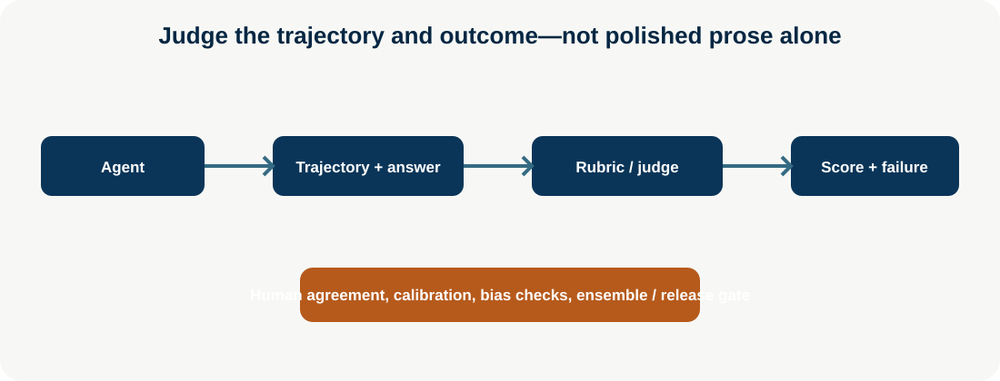

# LLM-as-Judge and Agent Judges

**Advanced · 11** · **Notebook:** [`llm_as_judge_agent_judges.ipynb`](llm_as_judge_agent_judges.ipynb) · **Implementation:** [`lab.py`](lab.py)

An LLM judge is an evaluator that applies a task-specific rubric to an answer, comparison, or agent trajectory. It can make evaluation scalable, but it is not objective ground truth: it can favor style, be biased by position/order, miss subtle policy failures, share blind spots with the system under test, and drift as models/prompts change. Use judges with deterministic checks, representative human labels, calibration, and release gates.

## Scenario and outcomes

Northstar’s incident agent produces an answer and trace for a 35% EU checkout decline. The evaluator grades outcome, evidence, tool trajectory, policy, cost/latency, and failure class. Learners compare rubric, pairwise, trajectory/tool-use, critic/evaluator-agent, and ensemble approaches; then measure agreement with humans.

## Judge designs and technology choices

| Design | Best for | Weakness/control |
| --- | --- | --- |
| Rubric judge | multi-criterion answer/agent quality | make criteria observable and anchored; validate against humans |
| Pairwise judge | compare candidate prompts/models/trajectories | randomize order/position, include ties, avoid style bias |
| Trajectory/tool judge | tool selection, arguments, recovery, forbidden actions | combine deterministic policy/tool checks with semantic assessment |
| Critic/evaluator agent | iterative critique/revision | cap loops; critic is not final authority |
| Ensemble | high-value uncertain scoring | cost/correlation; require adjudication or human sample |

Prominent technologies include [OpenAI Evals](https://github.com/openai/evals), [OpenAI evaluation best practices](https://developers.openai.com/api/docs/guides/evaluation-best-practices), [LangSmith evaluation](https://docs.smith.langchain.com/evaluation), [Arize Phoenix](https://docs.arize.com/phoenix), [DeepEval](https://deepeval.com/), [Ragas](https://docs.ragas.io/), and [MLflow GenAI evaluation](https://mlflow.org/docs/latest/genai/eval-monitor/). Select by dataset/trace integration, privacy, reproducibility, rubric support, human review workflow, and deployment constraints—not branding.

## Step-by-step training

1. Define a rubric with observable anchors: outcome/diagnosis, evidence/citations, correct tools/arguments, forbidden actions, recovery, latency/cost, and uncertainty.
2. Hard-fail deterministic violations first: tenant/policy/forbidden tool/schema/approval. A judge cannot waive them.
3. Run an LLM judge or evaluator agent over redacted answer+trajectory artifacts; require structured score, rationale, evidence IDs, and failure category.
4. Run pairwise comparisons with order randomization and ties; use trajectory/tool judges for agent behavior rather than only response prose.
5. Calibrate with human-labeled representative and adversarial samples. Measure agreement, false pass/fail, calibration by task/risk/language, and drift.
6. Use ensemble/adjudication only where value justifies cost; sample disagreement for human review and update rubric/evaluation data.

Run `python lab.py`; then use the notebook to score a supported trace and a forbidden-action trace. References: [LLM-as-a-Judge survey](https://arxiv.org/abs/2306.05685), [G-Eval](https://arxiv.org/abs/2303.16634), [JudgeLM](https://arxiv.org/abs/2310.17631), [Agent evaluation guidance](https://www.anthropic.com/engineering/demystifying-evals-for-ai-agents).
