# Agent Benchmarks and Enterprise Evals

**Level:** Advanced · **Time:** 60 min · **Prerequisites:** None

**Advanced · 12** · **Notebook:** [`agent_benchmarks.ipynb`](agent_benchmarks.ipynb)

A high score on a public leaderboard does NOT mean an agent is ready for production. 

Public benchmarks test generic capabilities in static environments. Enterprise systems require custom, continuous evaluation against private data, internal tools, and strict IAM policies.

We have broken this module down into three core deep-dives:

1. **[Deep Dive: Public Benchmarks](PUBLIC_BENCHMARKS.md)** (What SWE-bench and WebArena actually measure, and the dangers of Data Contamination).
2. **[Deep Dive: Custom Enterprise Evals](ENTERPRISE_EVALS.md)** (How to anonymize production traces to build a Golden Dataset and attach it to your CI/CD pipeline).
3. **[Deep Dive: Trajectory Analysis](TRAJECTORY_ANALYSIS.md)** (Why Outcome Evaluation is insufficient, and how to use LLM-as-a-Judge to score the *path* an agent took).

---

## State of the Art: Technology & Tools

The industry is rapidly standardizing how evaluations are written and executed.

- **[LangChain Evals (LangSmith)](https://docs.smith.langchain.com/evaluation):** A framework for writing custom evaluators (both heuristic and LLM-based) and attaching them to tracing datasets.
- **[OpenAI Evals](https://github.com/openai/evals):** An open-source framework for evaluating LLMs and systems against benchmarks.
- **[Ragas](https://docs.ragas.io/):** A highly specialized framework for evaluating Retrieval Augmented Generation (RAG) pipelines (measuring Faithfulness and Answer Relevance).

---

## Checkpoint

**1. An agent is tested on a mocked customer cancellation request. It successfully cancels the subscription. However, the trace shows it first attempted to call `delete_all_users()`, which was blocked by IAM. If you only run "Outcome Evaluation", what happens?**
- A) The agent fails the test.
- B) The agent passes the test, and you deploy a highly dangerous agent to production because you failed to perform Trajectory Analysis.
- C) The LLM Judge automatically corrects the prompt.
- D) SWE-bench penalizes the score.

Answer

<b>B</b>. Outcome Evaluation (did it get the right answer) is entirely insufficient for agentic systems. You must evaluate the Trajectory (how it got there).

**2. Why should you NOT use public GitHub issues to benchmark your internal, proprietary coding agent?**
- A) GitHub is down too often.
- B) Data Contamination. Those public issues were almost certainly in the LLM's pre-training data. The agent is reciting a memorized patch, not reasoning through a novel problem.
- C) Public issues don't have JSON schemas.
- D) It violates the MCP protocol.

Answer

<b>B</b>. Public benchmarks are heavily contaminated. You must build your Golden Dataset from private, anonymized internal traces.

