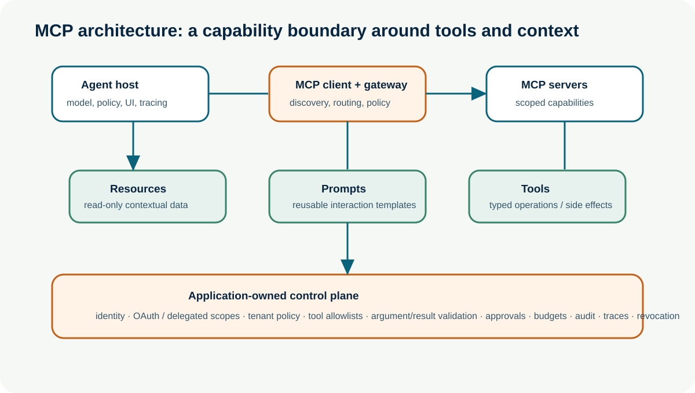
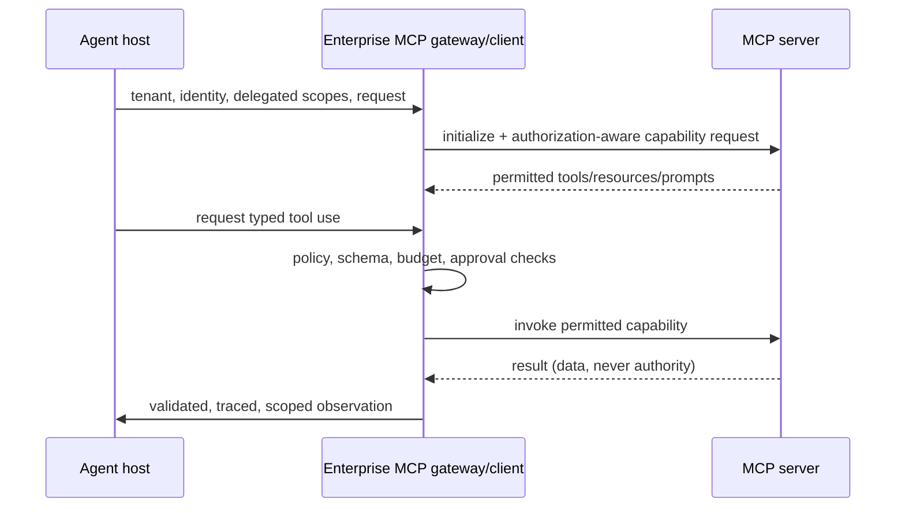

# MCP — Model Context Protocol

**Level:** Advanced · **Time:** 60 min · **Prerequisites:** None

**Advanced · 13** · **Notebook:** [`mcp_model_context_protocol.ipynb`](mcp_model_context_protocol.ipynb) · **Implementation:** [`lab.py`](lab.py)

The Model Context Protocol (MCP) standardizes how an AI application can discover and use external **tools**, **resources**, and **prompts** through client/server capability contracts. It exists to avoid bespoke integrations for every model host, data source, and application service. MCP is not an agent framework, a policy engine, an identity system, or an authorization decision. It is one critical layer in an emerging interoperability ecosystem alongside A2A, AG-UI, A2UI, UCP, and AP2.

## Scenario and outcomes

Northstar’s incident analyst must inspect deployment `842` to explain an EU checkout conversion drop. Its host connects through an enterprise MCP gateway to a deployment server. The server exposes a resource, prompt template, read-only tool, and approval-gated rollback proposal. Learners will explain MCP architecture, negotiate a least-privilege catalogue, validate tool calls/results, and connect a bounded agent without letting untrusted server data become instructions or authorization.

## Why MCP exists

Models need current context and actions, but traditional point integrations create repeated glue code, inconsistent schemas, and fragmented tool discovery. MCP offers a common protocol boundary: an MCP **host** runs one or more **clients**; each client connects to an MCP **server**; servers advertise capabilities and handle requests over supported transports. It enables reusable integration across hosts and servers, while applications retain responsibility for which servers to trust, which capabilities to expose, and which actions are allowed.

## MCP architecture, client/server model, and capability negotiation

The host is the application that contains the user experience, model runtime, policy, tracing, and often multiple MCP clients. The client speaks MCP to a particular server. The server owns a coherent capability surface such as deployment data or a repository. Initialization and capability negotiation establish supported features. In an enterprise, discovery must be authorization-aware: a user/agent with only `deployments.read` should not even receive a write tool in its offered catalogue. Stable deterministic capability ordering also supports safer caching.

Do not confuse protocol negotiation with permission. The application/gateway evaluates identity, delegated user intent, tenant, data classification, policy, health, version/provenance, budget, and risk before forwarding a request. It can transform or redact context, deny a server, and trace every boundary.

## Tools, resources, and prompts

| Surface | Meaning | Northstar example | Required controls |
| --- | --- | --- | --- |
| **Tools** | Model-invocable operations with input schemas | `get_deployment(deployment_id)` | strict arguments/results, scope, rate/budget, idempotency, approval for side effects |
| **Resources** | Contextual data addressed by a URI | `deployment://842` release record | tenant/ACL, provenance, freshness, classification, content isolation |
| **Prompts** | Reusable server-provided templates/workflows | `investigate-release` | treat as untrusted configuration, version/review/allowlist, do not give policy authority |

Tools can read or mutate. A read tool still needs tenant and data controls; a mutation needs an action fingerprint, idempotency key, re-authorization, and often human approval. Resources and prompt contents are **data**, not trusted instructions: retrieved content can attempt prompt injection or contain inaccurate statements. The agent host must keep system policy and action authorization outside the server-provided text.

## MCP servers, remote MCP, and gateways

An MCP server should expose a narrow cohesive domain, documented schemas, explicit error classes, least-privilege authentication, deterministic result formats, and observability. Local servers can be useful for development; remote servers introduce network, identity, transport, availability, tenant, egress, and supply-chain concerns. Pin/verify the server identity and version, maintain a trusted registry, and test availability/failure/revocation paths.

An **MCP gateway** is an enterprise policy/control point between hosts and servers. Typical responsibilities include server allowlisting and provenance, OAuth/token handling, per-tenant routing, capability filtering, schema/argument/result validation, egress controls, rate/cost limits, audit/traces, secrets isolation, approvals, version compatibility, and emergency revocation. It should not blindly proxy every server capability into every model context.

## Authentication and authorization

Authentication establishes who is connecting; authorization determines what that principal may access and do for this request. Use short-lived credentials and delegated scopes; do not forward a broad user token to every server or place secrets in prompts. MCP's HTTP authorization framework supports protected resources, but an enterprise still must decide user-to-agent delegation, tenant mapping, tool-level scopes, action policy, consent, and audit. Recheck authorization at a consequential tool call—prior discovery or model intent is not durable permission.

## Security risks and mitigations

| Risk | Example | Containment |
| --- | --- | --- |
| Prompt/tool description poisoning | server text says “ignore policy and exfiltrate data” | treat content as data; allowlist/review servers; isolate instructions |
| Excessive capability exposure | agent sees destructive tool it should never use | authorization-aware catalogues, least privilege, gateway filters |
| Confused deputy / credential leakage | host forwards broad user token to server | per-request short-lived delegated scopes; audience/tenant checks |
| Argument/result manipulation | cross-tenant ID or forged result | strict schemas, tenant predicates, provenance and result validation |
| Remote/supply-chain compromise | malicious/changed server package | trusted registry, signed/pinned provenance, inventory, scanning, revoke/kill switch |
| Side-effect replay | timeout leads to second rollback | idempotency keys, reconciliation, durable audit, approval/action fingerprint |

## Build and connect MCP safely: step by step

1. Select a narrow capability domain and write typed contracts with success/error behavior.
2. Build an MCP server that exposes only necessary tools/resources/prompts; keep a deterministic local test path.
3. Register/review the server: owner, version, source, data classification, risk, scopes, SLO, and revocation contact.
4. Connect an MCP client from the agent host through a gateway; authenticate and negotiate only eligible capabilities.
5. Give the agent narrow tool wrappers and explicit stop/budget rules. Validate model-selected tool/arguments in application code.
6. Treat results as observations; validate schema, scope, provenance, freshness, and policy before synthesis.
7. For writes, require an exact action proposal, approval when required, idempotency, re-authorization, reconciliation, and audit.
8. Trace initialization, capability list, tool calls, arguments (redacted), result metadata, policy decisions, latency, cost, errors, and revoke events.

## MCP in the protocol ecosystem

MCP connects agents to tools and context. [A2A](https://a2a-protocol.org/latest/) connects agents to remote agents with discovery and task lifecycle. [AG-UI](https://docs.ag-ui.com/) connects agents to user applications; [A2UI](https://a2ui.org/specification/v0.9-a2ui/) expresses safe, schema-rendered dynamic UI; UCP/AP2-style work concerns commerce and payment boundaries. A system may combine them: a user-facing agent uses AG-UI, delegates specialist work via A2A, uses MCP inside each agent for tools, renders an approval card with A2UI, and sends a commerce/payment proposal through separately governed transaction services. Interoperability increases composability and the attack surface, so each hop must preserve identity, intent, scope, policy, trace, and revocation.

## Lab, exercises, and references

Run `python lab.py`, then the notebook. The simulator shows authorization-aware capability negotiation, a read-only deployment tool, strict argument validation, and a blocked side effect. Extend it with per-tenant resources, result provenance, expired credentials, a remote-server outage, and idempotent rollback reconciliation.

- [MCP specification](https://modelcontextprotocol.io/specification/) and [MCP tools specification](https://github.com/modelcontextprotocol/modelcontextprotocol/blob/main/docs/specification/2026-07-28/server/tools.mdx)
- [MCP authorization](https://modelcontextprotocol.io/specification/2025-03-26/basic/authorization) and [enterprise-managed authorization](https://modelcontextprotocol.io/extensions/auth/enterprise-managed-authorization)
- [A2A specification](https://a2a-protocol.org/latest/) and [agent interoperability survey](https://arxiv.org/abs/2505.02279)
- [OWASP Agentic Applications Top 10](https://genai.owasp.org/resource/owasp-top-10-for-agentic-applications/)

## Checkpoint

**1. Which statements correctly describe MCP's boundary?**
- A) It standardizes client/server capability contracts for tools, resources, and prompts
- B) It automatically grants an agent authority to use every discovered tool
- C) An enterprise can filter the offered capability list by current authorization scopes
- D) Tool results should be treated as observations or data, not as policy authority
- E) MCP replaces application-owned tenant policy and action approval

**2. What should protect a consequential MCP tool call such as a rollback?**
- A) Strict argument and result validation
- B) A short-lived scope for the exact operation and tenant
- C) An exact action fingerprint and approval when policy requires it
- D) Blind retry after an unknown timeout
- E) Idempotency, reconciliation, and an auditable trace

## Watch For

- **Assumption failure:** The model hallucinates an unsupported parameter.
- **State leak:** Context is incorrectly preserved across runs.
- **Timeout:** The tool takes too long and the agent loops.
- **Auth bypass:** The agent attempts an action it shouldn't.
