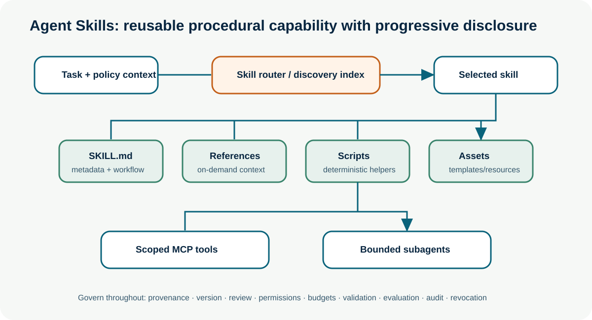
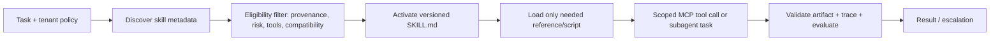

# Agent Skills

**Advanced · 14** · **Notebook:** [`agent_skills.ipynb`](agent_skills.ipynb) · **Implementation:** [`lab.py`](lab.py)

Skills are reusable packages of **procedural knowledge**: a focused description of when a capability applies, instructions for how to perform it, and optional scripts, references, templates, or assets. They are an architectural abstraction above raw tools. A tool performs one operation; a skill explains a repeatable goal-oriented workflow, constraints, expected artifacts, and how to use tools safely. Skills make agent behavior more reusable, reviewable, versionable, and progressively loadable.



## Scenario: Northstar operational playbooks

Northstar operates incident-analysis and customer-impact skills. An agent receives a task, discovers only metadata for eligible skills, activates the smallest relevant skill, progressively loads instructions and references, then uses policy-scoped MCP tools or delegates a bounded subtask. The application records which skill/version ran and does not let a skill broaden its own authority.

## Tools versus skills

| Dimension | Tool | Skill |
| --- | --- | --- |
| Unit of reuse | one typed operation | a procedure/capability package |
| Example | `read_deployment(id)` | “Investigate release contribution using evidence, stop criteria, and a report template” |
| Contents | schema, arguments, result/error | `SKILL.md` metadata/instructions plus optional scripts, references, assets |
| Loading | offered/called at runtime | discover metadata, activate instructions, load deeper material only if needed |
| Control boundary | tool authorization/validation | skill provenance/version/review plus tool authorization/validation |
| Failure to avoid | vague broad tool | vague prompt packaged and treated as executable authority |

A skill can tell an agent which tools to consider, how to sequence them, what evidence to collect, what to avoid, and when to escalate. It cannot grant access to a tool, bypass policy, execute untrusted code, or make an action safe merely by describing it.

## Skill anatomy and reusable capabilities

The open Agent Skills format centers a directory with a required `SKILL.md` containing YAML frontmatter (`name` and `description` at minimum) followed by instructions. It may include `scripts/`, `references/`, and `assets/`. A well-designed skill has a narrow capability, clear trigger, expected inputs/outputs, deterministic stop/escalation conditions, ownership/version, safety constraints, and tests. Keep the main instruction file concise; place deep references behind progressive disclosure.

```text
incident-analysis/
├── SKILL.md          # metadata, trigger, workflow, guardrails
├── scripts/          # deterministic validators/helpers
├── references/       # load only for the relevant decision
└── assets/           # report template, schema, examples
```

## Skill descriptions and discovery

The description is a routing interface: it tells an agent or orchestrator what the skill does and when it should activate. It must be specific enough to distinguish triggers and constraints, not a marketing claim such as “expert analyst.” Discovery should start with lightweight metadata, then filter by tenant, identity, ownership, provenance, compatibility, data classification, allowed tools, risk, cost/SLO, and policy. A semantic router may rank candidates, but a deterministic allowlist/policy filter decides eligibility.

**Bad description:** “Handle anything about incidents.”

**Better description:** “Use for tenant-scoped SaaS checkout incidents that need read-only metrics and deployment evidence. Produce a cited mitigation proposal; never execute actions. Escalate missing or conflicting evidence.”

## Dynamic loading and procedural knowledge

Progressive disclosure prevents every agent session from carrying every procedure. Discovery loads only name/description; activation loads `SKILL.md`; execution loads a named reference or script when the current step requires it. This reduces context cost and limits irrelevant or sensitive material. It also creates risks: a dynamically loaded skill can be stale, malicious, overly broad, or incompatible. Pin versions, verify provenance, scan scripts/assets, require review, evaluate behavior, and make activation visible in traces.

Procedural knowledge differs from semantic memory. A policy saying *how to run a release investigation* belongs in a skill; a historical fact that *deploy 842 changed the payment timeout* belongs in evidence/knowledge. Keep the two separate so a changing fact does not silently rewrite a workflow and a workflow does not become an unsupported fact.

## Skill libraries, routing, and composition

A **skill library** is a governed catalog rather than a pile of files. Record owner, version, source/provenance, description/trigger, dependencies, data/tool requirements, risk, tests/evaluations, compatibility, deprecation, and revocation. Evaluate discovery accuracy (correct selected, missed relevant, unsafe selection), activation quality, workflow success, token cost, tool behavior, and policy violations.

**Composition** combines procedures only when their contracts fit. Define handoff artifacts, precedence, shared state, budget, conflict behavior, and terminal state. Do not simply concatenate instructions or union tool privileges. The safe default is to intersect allowed tools under the caller’s policy; the orchestrator grants additional scope only after explicit authorization. A composite `incident-response` skill may orchestrate `incident-analysis` then `customer-impact`, but each must receive minimized context and return typed evidence.

## Skills + MCP and skills + subagents

MCP exposes a standardized boundary to tools, resources, and prompts. A skill provides the portable procedure that chooses and sequences approved MCP capabilities. Keep the layers distinct: skill content may recommend `read_deployment`; the MCP gateway authorizes the call and validates result/side effects. Skills can also be delegated to subagents: a coordinator assigns a skill/version plus a bounded task contract, tools/data scope, budget, expected artifact, deadline, and stop condition. The subagent does not inherit all coordinator tools merely because it activated a skill.



## Security and production checklist

- Trust skills only from approved, reviewable sources; inventory provenance, owner, version, dependencies, and revocation path.
- Treat skill instructions, scripts, references, and assets as supply-chain inputs; scan and sandbox executable content.
- Enforce policy at activation and every tool/action boundary; skill metadata cannot widen identity, tenant scope, tools, or budget.
- Use least privilege, short-lived delegated scopes, context minimization, argument/result validation, approvals, idempotency, traces, and evaluation.
- Measure selection/activation errors and maintain fallback/escalation when no safe skill matches.

## Lab and references

Run `python lab.py`, then the notebook. The simulator discovers a metadata-only library, activates a matching skill under tool policy, rejects unavailable tools, and demonstrates conservative composition. Extend it with a version/revocation record, a malicious skill test, a composite workflow, and an MCP tool adapter.

- [Agent Skills specification](https://github.com/agentskills/agentskills/blob/main/docs/specification.mdx)
- [Agent Skills project](https://github.com/agentskills/agentskills) and [OpenAI Skills overview](https://openai.com/academy/skills/)
- [NVIDIA skills catalog and governance discussion](https://github.com/NVIDIA/skills)
- [Agent Skills research survey](https://arxiv.org/abs/2602.12430)
- [MCP specification](https://modelcontextprotocol.io/specification/) and [A2A protocol](https://a2a-protocol.org/latest/)
