# Agent Skills

**Level:** Advanced · **Time:** 60 min · **Prerequisites:** None

**Advanced · 14** · **Notebook:** [`agent_skills.ipynb`](agent_skills.ipynb)

A "Tool" is a raw function (e.g., `read_database`). An "Agent Skill" is a reusable package of **Procedural Knowledge** that tells the agent *how* to use the tools to achieve a specific workflow.

If you give an agent 5 tools, it might hallucinate the wrong way to combine them. If you give an agent a Skill, it will follow the exact procedural instructions you designed, drastically improving reliability and reducing token costs.

We have broken this module down into three core deep-dives:

1. **[Deep Dive: Anatomy of a Skill](ANATOMY_OF_A_SKILL.md)** (The directory structure, `SKILL.md` metadata, and Progressive Disclosure to save context window tokens).
2. **[Deep Dive: Skill Libraries & Routing](SKILL_LIBRARIES_AND_ROUTING.md)** (How Semantic Routers choose the right skill from a library of 500, and Supply-Chain security hashes).
3. **[Deep Dive: Skills vs MCP](SKILLS_VS_MCP.md)** (Clarifying the exact architectural boundary between an MCP Server enforcing access, and a Skill providing prompt instructions).

---

## State of the Art: Technology & Tools

The industry is rapidly standardizing how procedural knowledge is packaged and shared across agentic ecosystems.

- **[Agent Skills Specification](https://github.com/agentskills/agentskills):** The open-source standard for defining skill directories with YAML frontmatter, progressive disclosure, and dependency tracking.
- **[OpenAI Skills](https://openai.com/academy/skills/):** OpenAI's approach to packaging custom instructions and RAG documents into callable routines.
- **[NVIDIA Skills Catalog](https://github.com/NVIDIA/skills):** An enterprise-grade catalog demonstrating how to govern, version, and route between hundreds of specialized agent workflows.

---

## Checkpoint

**1. Why is "Progressive Disclosure" a critical design pattern for Agent Skills?**
- A) It hides errors from the user.
- B) If an agent loads the full instructions for 50 different skills at once, the context window will be maxed out, API costs will explode, and the agent will suffer from massive instruction-confusion.
- C) It is required by MCP.
- D) It encrypts the Python scripts.

Answer

<b>B</b>. The Orchestrator should only load the YAML description of the skills to pick one, and only load the full `SKILL.md` for the single skill it activates.

**2. An agent loads an `infrastructure_admin` Skill that states: *"I have permission to reboot the production database."* However, the agent's IAM token only has `read-only` access. What happens when the agent tries to reboot the DB?**
- A) The database reboots because the Skill granted permission.
- B) The Orchestrator crashes.
- C) The MCP Server rejects the tool call because Skills are just text/prompts and cannot widen the agent's actual cryptographic authority.
- D) The agent escalates to a human.

Answer

<b>C</b>. Skills are behavioral instructions. They do not bypass application-layer security or IAM policies.

