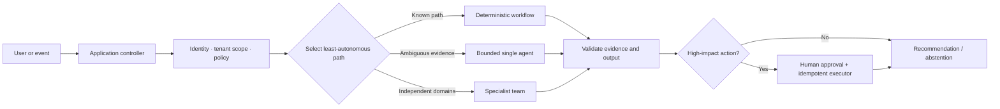

# Designing Reliable Agentic Systems

**Enterprise Agent · 01**  
**Notebook:** [`designing_reliable_agentic_systems.ipynb`](designing_reliable_agentic_systems.ipynb) · **Implementation:** [`lab.py`](lab.py)

This synthesis module turns the earlier curriculum into one engineering question:

> What is the least autonomous architecture that reliably achieves the business outcome within its security, privacy, cost, and operational constraints?

It uses Northstar Commerce's EU checkout incident: conversion has fallen 31%, dashboards are mostly green, a deployment occurred 22 minutes earlier, and support reports are increasing. The system may investigate, prepare a rollback proposal, and explain customer impact. It may **not** execute a production action without application-level authorization and an explicit human approval.

## Outcomes

By the end, you can turn a vague request into a bounded system design; choose between workflow, single agent, stateful graph, and team; define the control plane around an agent; and justify the choice with evaluation data rather than framework preference.

## 1. Reliability is a system property

An LLM can propose a next step, but it cannot by itself guarantee identity, authorization, tenant isolation, idempotency, retention, budgets, or a safe commit. Reliability therefore belongs to the system that surrounds the model: typed inputs and outputs, narrow tools, state, policies, approval, observability, evaluation, and recovery.

The key principle is progressive autonomy. Begin with a baseline whose failures you can explain. Promote the architecture only after a measured gap remains.

## 2. The enterprise trade-off ledger

| Trade-off | Engineering question | Default decision | Promotion evidence | Required control |
| --- | --- | --- | --- | --- |
| Autonomy ↔ control | How much freedom does the model need? | Known paths use code. | The task needs runtime evidence selection. | Budgets, terminal states, approval. |
| Intelligence ↔ reliability | Should it reason or follow a workflow? | Workflow for stable, auditable steps. | LLM judgment materially improves task success. | Contracts, evals, fallback. |
| Context ↔ cost | What may it see now? | Minimum trusted packet. | Missing evidence blocks a decision. | Scope, compression, cache keys. |
| Memory ↔ privacy | What should persist? | Store verified, scoped facts only. | Repeat value exceeds retention risk. | Consent, retention, deletion, audit. |
| Multi-agent ↔ complexity | Do specialists improve the baseline? | One agent first. | Parallel domains increase quality enough to pay for coordination. | Ownership, artifacts, turn caps. |
| Capability ↔ security | What can it access? | Read-only, narrow tools. | Business benefit requires a new action. | Least privilege, authorization, approval. |
| Quality ↔ latency | How much reasoning is worthwhile? | Meet an SLO, not maximum deliberation. | Added work raises quality above the release target. | Model/tool budgets, caching, routing. |
| Flexibility ↔ determinism | Where should code replace the model? | Code owns invariant policy and effects. | Variation is semantic and cannot be safely enumerated. | Validators, policy engine, replay. |

## 3. Step-by-step design method

### Step 1 — Write the outcome contract

Specify the user, tenant, decision, allowed evidence, quality target, latency/cost budget, and prohibited effects. For Northstar: identify a likely cause with attributable evidence; estimate Gold-tier impact; prepare, but do not execute, a rollback. A good contract also contains non-goals: no unsupported diagnosis, no cross-tenant data, no production write, and no endless investigation.

### Step 2 — Start with the simple baseline

Build a deterministic workflow for known work: load the incident, retrieve approved telemetry, format an evidence packet, and run policy checks. This is not a lesser version of an agent; it is the reliability baseline against which any autonomous design must be compared.

### Step 3 — Isolate bounded model decisions

Use a single agent when the evidence sequence is uncertain. Give it only narrow read tools, a typed hypothesis contract, an allow-list, `max_steps`, `max_tool_calls`, a cost ceiling, and terminals for success, abstention, escalation, and policy block. Do not ask it to "keep trying" without a measurable stop condition.

### Step 4 — Promote to a graph or a team only for a proven reason

A state graph earns its complexity when persistence, interrupts, conditional recovery, or durable replay are core. A team earns it when specialist work has independent inputs and outputs, context separation is useful, and evaluation shows a meaningful lift over one bounded agent. Add an explicit coordinator, artifact schema, ownership, and a cap on messages and turns.

### Step 5 — Put consequential effects behind a control plane

Models may propose an action. Application code validates the exact arguments, checks the caller's authority and tenant scope, records an idempotency key, shows evidence and impact to a reviewer, and then executes or rejects the request. Approval must bind to the exact action fingerprint; a broad "approved" boolean is unsafe.

### Step 6 — Measure before release and after change

Evaluate outcome quality, evidence support, forbidden actions, tool arguments, retry behavior, latency, cost, and human escalations. Re-run the suite on model, prompt, tool, policy, data, and orchestration changes. Keep traces and release gates; production feedback becomes the next evaluation case, not an anecdote.

## 4. Architecture comparison for the scenario

| Design | Best fit | Strength | Failure to watch | Do not use it when |
| --- | --- | --- | --- | --- |
| Deterministic workflow | Current status report | Predictable, low cost, replayable | Brittle if inputs are genuinely ambiguous | The path needs runtime evidence selection. |
| Bounded single agent | Evidence-led incident investigation | Flexible tool selection with little coordination | Tool loops, unsupported conclusions | Fixed rules resolve the task. |
| Stateful graph | Approval pause and recovery | Explicit state, durable resumes, conditional routing | State/version drift, duplicate side effects | A simple stateless loop is enough. |
| Specialist team | Cross-domain incident with conflicting evidence | Context isolation, parallel expertise, critique | Message loops, duplicated work, cost | One agent meets the quality target. |

## 5. Production readiness checklist

- [ ] A named business owner, success metric, non-goals, and safe fallback exist.
- [ ] Every tool has typed schema, authorization, scope, risk class, timeout, idempotency rule, and useful error contract.
- [ ] Context and memory are tenant-scoped, minimized, attributable, retained deliberately, and deletable.
- [ ] The loop/team has step, tool, cost, time, delegation, and retry limits plus terminal states.
- [ ] High-impact actions require an exact reviewable proposal and a server-side approval check.
- [ ] Traces join model/tool/policy/approval events with correlation IDs without storing unnecessary secrets.
- [ ] Offline, adversarial, and shadow evaluations cover outcome, trajectory, operational SLOs, and regressions.
- [ ] Rollback, kill switch, incident owner, and post-incident learning paths are exercised.

## Exercises

1. Run the lab. Explain why the EU incident initially selects a specialist team, then change `domains` to one and defend the new result.
2. Set `risk` to three. Which approval controls can be removed, and which controls must remain?
3. Add a candidate design whose quality is 0.91 but whose latency is 30 seconds. Define an SLO and decide whether to ship it.
4. Design a memory-write policy for a postmortem fact. Include scope, provenance, confidence, retention, deletion, and contradiction behavior.
5. Write three release-gate tests: cross-tenant retrieval attempt, an unapproved rollback, and an agent that exceeds its tool budget.

## References

- [OpenAI — A practical guide to building agents](https://openai.com/business/guides-and-resources/a-practical-guide-to-building-ai-agents/)
- [Anthropic — Building effective agents](https://www.anthropic.com/engineering/building-effective-agents)
- [Anthropic — Demystifying evals for AI agents](https://www.anthropic.com/engineering/demystifying-evals-for-ai-agents)
- [LangGraph — overview and production capabilities](https://docs.langchain.com/oss/python/langgraph/overview)
- [LangGraph — interrupts for human approval](https://docs.langchain.com/oss/python/langgraph/interrupts)
- [NIST AI Risk Management Framework](https://www.nist.gov/itl/ai-risk-management-framework)
- [OWASP Top 10 for LLM Applications](https://genai.owasp.org/)
- [AI Agent Systems: Architectures, Applications, and Evaluation](https://arxiv.org/abs/2601.01743)
