# Designing Reliable Agentic Systems

**Level:** Advanced · **Time:** 60 min · **Prerequisites:** None

**Enterprise Agent · 01** · **Notebook:** [`designing_reliable_agentic_systems.ipynb`](designing_reliable_agentic_systems.ipynb)

This module turns all of our earlier curriculum into one foundational engineering question:

> **What is the least autonomous architecture that reliably achieves the business outcome?**

An LLM cannot, by itself, guarantee idempotency, tenant isolation, or a safe database commit. Reliability belongs to the *system* that surrounds the model: the application layers, the policy boundaries, and the evaluation suite.

We have broken this module down into three core deep-dives:

1. **[Deep Dive: Progressive Autonomy](PROGRESSIVE_AUTONOMY.md)** (Why you should start with deterministic Python workflows and only upgrade to Multi-Agent Swarms when mathematically justified).
2. **[Deep Dive: Control Planes & Escalation](CONTROL_PLANES_AND_ESCALATION.md)** (Why LLMs cannot guarantee safe database commits, and how to enforce application-layer idempotency).
3. **[Deep Dive: Measurement and SLOs](MEASUREMENT_AND_SLOS.md)** (How to track an agent's "Time-to-First-Tool" and Cost-per-Accepted-Artifact like a microservice).

---

## State of the Art: Technology & Tools

When evaluating the reliability of agentic systems, enterprises rely on specialized observability and evaluation platforms.

- **[LangSmith](https://www.langchain.com/langsmith):** An industry-leading platform for tracing LLM execution. It allows engineers to visually inspect exactly which tool an agent called, what the payload was, and where the reasoning loop failed.
- **[Braintrust](https://www.braintrust.dev/):** An enterprise-grade evaluation platform. Before deploying an agent to production, Braintrust runs the agent against thousands of historical tasks to prove that a recent prompt tweak did not cause a regression in reliability or cost.
- **[AgentOps](https://www.agentops.ai/):** A specialized platform for tracking agent compliance, token burn rates, and session replay for debugging infinite loops.

---

## Checkpoint

**1. A developer builds a 5-agent swarm to parse JSON logs and extract error codes. Why is this an anti-pattern?**
- A) JSON parsing is illegal.
- B) It violates Progressive Autonomy. A deterministic python script can do this in milliseconds for zero cost. Using a multi-agent system here introduces massive latency, high token cost, and unnecessary non-determinism.
- C) The agents will get into a debate.
- D) It should be a 10-agent swarm.

Answer

<b>B</b>. Always use the least autonomous architecture possible.

**2. An agent is given a `refund_customer` tool. It experiences a network timeout and retries the tool 3 times, refunding the customer $150 instead of $50. Whose fault is this?**
- A) The LLM provider (e.g., OpenAI) for hallucinating.
- B) The Orchestrator for not stopping the loop.
- C) The Application Engineer, who failed to wrap the destructive tool with an Idempotency Key at the application layer.
- D) The customer.

Answer

<b>C</b>. LLMs cannot guarantee safe commits. Reliability belongs to the application layer wrapping the tool.

