# Human + Multi-Agent Organizations

**Level:** Advanced · **Time:** 60 min · **Prerequisites:** None

**Enterprise Agent · 02** · **Notebook:** [`human_multi_agent_organizations.ipynb`](human_multi_agent_organizations.ipynb)

An AI organization is a group of agents with distinct roles that communicate and work toward a shared objective. A *mixed organization* adds humans as goal setters, context providers, reviewers, accountable decision-makers, and escalation owners. 

It is not safe to assume that a collection of individually safe agents stays safe as a collective. Delegation fundamentally alters the flow of information and authority.

The core design rule of this architecture is **Human Accountability with Bounded Machine Agency**. We have broken this down into three deep-dives:

1. **[Deep Dive: Delegation and Accountability](DELEGATION_AND_ACCOUNTABILITY.md)** (Why agents need explicit Work Orders, and the danger of Inherited Authority).
2. **[Deep Dive: The Manager Agent](THE_MANAGER_AGENT.md)** (When to use a coordinator for Context Isolation, and how to prevent "Manager Hallucination").
3. **[Deep Dive: Human-in-the-Loop (HITL) Patterns](HUMAN_IN_THE_LOOP_PATTERNS.md)** (Why supervision isn't just a final "Approve" button, covering A Priori Control and Co-Planning).

---

## State of the Art: Technology & Tools

Building organizational multi-agent systems requires orchestration frameworks that support complex routing and state persistence.

- **[LangGraph](https://langchain-ai.github.io/langgraph/):** The industry standard for defining cyclic multi-agent graphs. It natively supports **Interrupt Nodes**, allowing you to pause execution, wait for human review (Co-Planning or Final Approval), and resume the state exactly where it left off.
- **[AutoGen](https://microsoft.github.io/autogen/):** Microsoft's framework that models multi-agent workflows as "Conversations" between agents. Excellent for Debate/Critic patterns, though less deterministic than LangGraph.
- **[CrewAI](https://www.crewai.com/):** A higher-level framework built specifically around the concept of "Role-Based Delegation." It explicitly forces you to define strict roles, goals, and backstories for a crew of agents.

---

## Checkpoint

**1. Why is "The Vague Handoff" (e.g., "Fix the EU checkout") a dangerous anti-pattern for agents?**
- A) It uses too many tokens.
- B) It forces the agent to interpret policy and guess at boundaries, potentially causing it to disable critical security checks to achieve its goal.
- C) Manager agents cannot parse natural language.
- D) It violates the LangGraph schema.

Answer

<b>B</b>. Agents must be delegated tasks via explicit Work Orders containing strict tenant scopes, allowed tools, and expected artifact schemas.

**2. When an agent encounters conflicting data from two different sources, what should it do?**
- A) Hallucinate a compromise to keep the task moving forward.
- B) Delete the conflicting data.
- C) Escalate to a human.
- D) Randomly select one source.

Answer

<b>C</b>. Agents (especially Manager Agents) are coordinators, not surrogate executives. They must be hard-coded to escalate uncertainty rather than resolve it.

