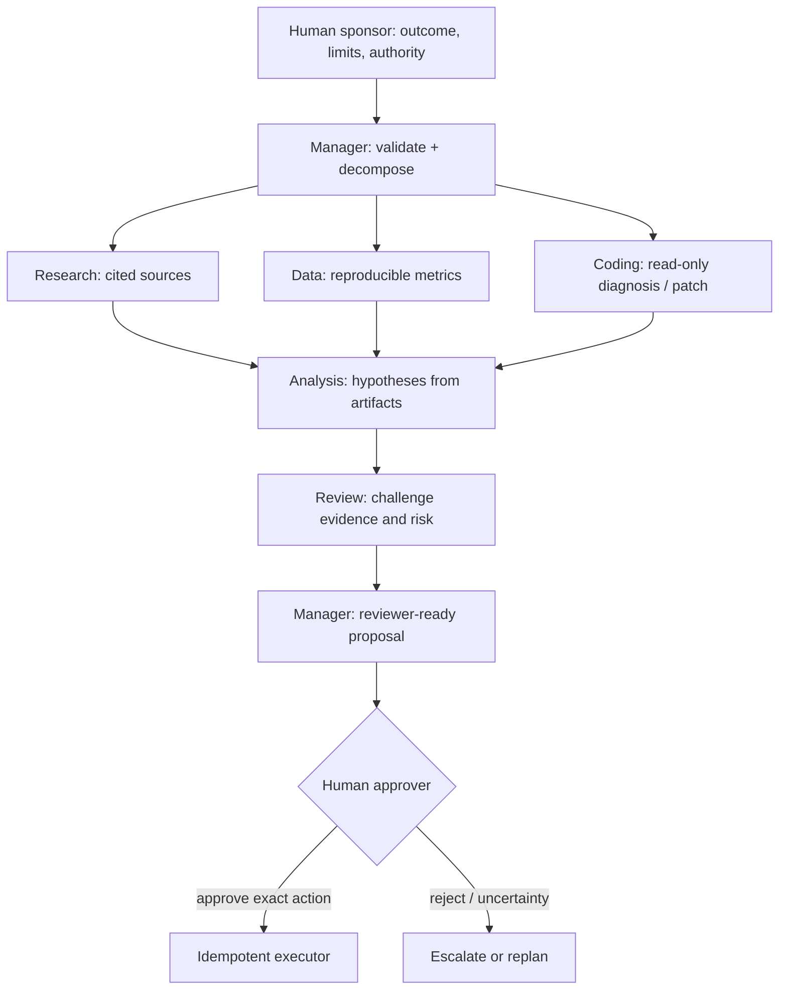

# Human + Multi-Agent Organizations

**Enterprise Agent · 02**  
**Notebook:** [`human_multi_agent_organizations.ipynb`](human_multi_agent_organizations.ipynb) · **Implementation:** [`lab.py`](lab.py)

This module designs a mixed organization for Northstar Commerce's EU checkout incident. A human sponsor sets the objective and boundaries. A manager agent breaks investigation into bounded work orders for research, data, coding, analysis, and review specialists. A human approver decides whether any consequential next step is permitted.

The aim is not to imitate a company org chart. It is to build a reviewable, secure, and effective system where every delegation has an owner, scope, expected artifact, stop condition, and escalation path.

## Outcomes

You will design AI teammates and digital workers around human accountability; distinguish delegation from supervision; decide when a manager agent is useful; specify human/agent roles and authority; and evaluate a mixed team against a single-agent baseline.

## 1. What is a human + multi-agent organization?

An AI organization is a group of agents with roles that communicate and work toward a shared objective. A mixed organization adds humans as goal setters, context providers, reviewers, accountable decision makers, and escalation owners. It is not safe to assume that a collection of individually safe agents stays safe as a collective: delegation changes the information, incentives, and pathways available to the system.

The core design rule is **human accountability with bounded machine agency**. People define legitimate purpose, authority, and acceptance criteria. Agents perform constrained, attributable work. The system makes uncertainty, conflicts, and irreversible effects visible before commitment.

## 2. Organizational roles and operating contracts

| Role | Owns | Must not own | Required output |
| --- | --- | --- | --- |
| Human sponsor | Goal, priority, constraints, acceptable risk | Silent acceptance of an agent's plan | Outcome contract and escalation authority |
| Manager agent | Decomposition, allocation, progress, synthesis | Broad production permissions or final approval | Work orders, status, conflict/escalation packet |
| Research agent | Sources and evidence claims | Policy interpretation or action authorization | Cited evidence with freshness and limitations |
| Data agent | Metrics and segment analysis | Customer-impact commitments | Reproducible metric artifact with filters |
| Coding agent | Read-only diagnosis or reviewable patch | Deployment, secret access, unreviewed changes | Diff/test results, assumptions, rollback notes |
| Analysis agent | Hypotheses from supplied artifacts | Inventing evidence or calling high-risk tools | Ranked hypothesis with evidence links |
| Review agent | Challenge, risk, missing evidence, policy checks | Rubber-stamping a manager's output | Findings, dissent, and release recommendation |
| Human approver | Exact high-impact decision | Delegating legal/accountable approval to the model | Signed approval/rejection with scope and expiry |

## 3. Delegation: make work orders, not vague handoffs

A manager should issue a typed work order containing: tenant/project scope, objective, allowed sources/tools, no-go actions, expected artifact schema, evidence threshold, budget, deadline, and escalation rule. The agent should receive only the context and tool capabilities its task needs. It cannot inherit the manager's full access merely because it is a subagent.

## 4. Supervision happens before, during, and after a run

Effective oversight is not a single approval at the end. It includes:

1. **A priori control:** role specifications, tenant/data boundaries, tool permissions, budgets, acceptable outcomes, and stop conditions.
2. **Co-planning:** a human can correct goal priority, constraints, missing context, and the task graph before costly work starts.
3. **Runtime monitoring:** event/status views show who is working, on what evidence, with which tools, and why a replan occurred.
4. **Review and learning:** humans inspect evidence and decisions; failures become regression cases and lead to changed work orders or policy.

Use a review queue when impact, ambiguity, or policy risk is high. Do not overwhelm humans with every low-risk intermediate observation; batch routine artifacts and reserve attention for decisions that change scope, cost, rights, commitments, or safety.

## 5. Manager agents and digital workers

A manager agent earns its place when it can reliably maintain a work graph, allocate bounded independent tasks, join typed artifacts, detect conflicts, and escalate rather than pretending to resolve uncertainty. It is a **coordinator**, not a surrogate executive.

Digital workers should be designed as capability-limited services with operational owners: each has a role card, approved data sources, permissions, model/prompt/version, evaluation set, expected work product, handoff protocol, SLO, incident route, and retirement criteria. Measure useful throughput, rework, escalation rate, unsupported claims, policy blocks, cost per accepted artifact, and time-to-decision—not just number of completed agent turns.

## 6. Choose organization shape deliberately

| Shape | Use it when | Strength | Primary failure | Countermeasure |
| --- | --- | --- | --- | --- |
| Human + single agent | One bounded semantic task | Easy review and evaluation | Tool/context overload | Narrow tools and routing |
| Manager + specialists | Distinct independent domains | Context isolation and parallel work | Manager hallucination / duplicate tasks | Work orders, artifact schemas, ownership |
| Human-led swarm | Humans can allocate well-defined tasks | Human judgment is central | Coordination overhead | Shared board, fixed interfaces |
| Debate / critic | Stakes justify independent challenge | Surfaces alternatives | Endless disagreement | Fixed rounds, adjudication criteria |
| Fully autonomous organization | Rare, reversible monitoring only | Continuous operation | Emergent misalignment, opaque responsibility | Avoid for high-impact work; use staged autonomy |

Start with a human and one bounded agent. Add specialists only when a controlled experiment shows that context isolation, expertise, or parallelization improves a release metric enough to pay for coordination.

## 7. Reliability, safety, and governance controls

- **Authority:** the human owner and server-side policy decide whether a tool may write; a manager's instruction is not authorization.
- **Separation of duties:** the agent that proposes a high-impact action should not be the only reviewer or executor.
- **Artifact contracts:** pass evidence IDs, assumptions, scope, confidence, provenance, and limitations—not invisible chain-of-thought or unconstrained chat history.
- **Context isolation:** apply tenant, purpose, and role filters before specialist retrieval; never pass every agent's full transcript by default.
- **Termination:** cap delegation depth, team messages, per-agent turns, tool calls, time, and spend. Define success, abstention, escalation, and cancellation states.
- **Observability:** correlate work order, model/tool invocation, artifact, policy decision, reviewer action, and outcome with trace IDs while minimizing retained sensitive content.
- **Evaluation:** score final outcome, evidence support, division of labor, forbidden actions, policy adherence, coordination overhead, latency, cost, and human rework.

## 8. Step-by-step lab

1. Run `python lab.py`. The manager creates five least-privilege, read-only work orders.
2. Inspect the artifacts. Every material claim has evidence IDs and limitations.
3. Observe the review agent's dissent: it supports a proposal but blocks automatic execution.
4. Change the human decision from escalation to approval. Explain why that approval belongs outside the manager and specialists.
5. Remove the data agent and compare the quality of the impact assessment. Does the team still earn its coordination cost?
6. Extend the evaluation with a malicious artifact, an unavailable source, and a cross-tenant retrieval request.

## Exercises

1. Add a customer-communications agent with no send permission. Define its work order, artifact, reviewer, and exact approval gate.
2. Define a conflict protocol when research and data agents disagree. Include evidence ranking, escalation, and who has authority to resolve it.
3. Build a dashboard schema for manager progress: objective, work-order status, budget, evidence coverage, risk, owner, and escalation reason.
4. Compare a single-agent incident investigation with this organization for a simple status report. Explain why the team should lose.
5. Write a sunset criterion for a digital worker whose error rate or review burden rises after a model update.

## State-of-the-art references

- [OpenAI — A practical guide to building agents](https://openai.com/business/guides-and-resources/a-practical-guide-to-building-ai-agents/)
- [OpenAI — Practices for governing agentic AI systems](https://cdn.openai.com/papers/practices-for-governing-agentic-ai-systems.pdf)
- [Anthropic — Building effective agents](https://www.anthropic.com/engineering/building-effective-agents)
- [Anthropic — AI organizations can be more effective but less aligned than individual agents](https://alignment.anthropic.com/2026/ai-organizations/)
- [Orchestrating Human-AI Teams: The Manager Agent as a Unifying Research Challenge](https://arxiv.org/abs/2510.02557)
- [Human oversight of agentic systems in practice](https://arxiv.org/abs/2606.05391)
- [Autonomy and Agency in Agentic AI: Architectural Tactics for Regulated Contexts](https://arxiv.org/abs/2605.12105)
- [NIST AI Risk Management Framework](https://www.nist.gov/itl/ai-risk-management-framework)
- [OWASP GenAI Security Project](https://genai.owasp.org/)
