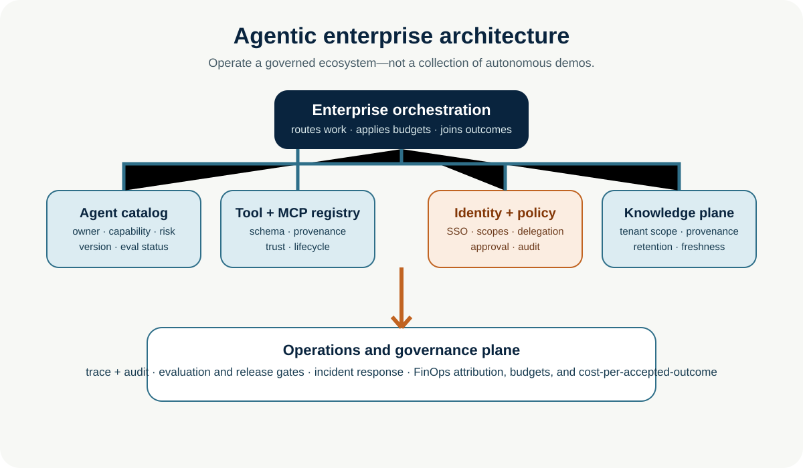
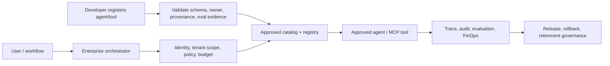

# Agentic Enterprise Architecture

**Level:** Advanced · **Time:** 60 min · **Prerequisites:** None

**Enterprise Agent · 03** · **Notebook:** [`agentic_enterprise_architecture.ipynb`](agentic_enterprise_architecture.ipynb) · **Implementation:** [`lab.py`](lab.py)

Move from “we built an agent” to “we operate a governed ecosystem of agents.” The Northstar Commerce scenario onboards a high-risk customer-impact agent and an MCP metrics service. The goal is to make them discoverable and reusable without permitting shadow agents, tool squatting, inherited authority, data leakage, unmeasured spend, or untraceable production changes.

## Outcomes

Design an enterprise control plane for agent inventory, catalogs, tool/MCP registration, identity, discovery, communication, knowledge, orchestration, governance, observability, evaluation, and FinOps. Explain which controls belong in platform code rather than prompts or individual agents.

## 1. The ecosystem mental model

An enterprise agent is a deployable, versioned capability with an accountable owner, scope, risk tier, approved tools, identity, evaluation evidence, operational SLOs, and retirement policy. A catalog makes it usable; a registry makes it governable. Discovery must return only approved, compatible, authorized capabilities—not every endpoint that advertises itself.

## 2. Registry and catalog design

| Asset | Registry metadata | Lifecycle gate |
| --- | --- | --- |
| Agent | owner, purpose, capability, risk, model/version, identity, allowed tools, data classes, eval score, SLO | register → evaluate → approve → deploy → monitor → retire |
| Tool/API | owner, typed schema, scope, side effects, auth method, idempotency, SLA, provenance/version | validate → security review → publish → deprecate/revoke |
| MCP server | server identity, transport, tools/resources, version, publisher provenance, permissions, policy | allow-list → authenticate → scope → observe → revoke |
| Knowledge source | owner, tenant/purpose, sensitivity, freshness, retention, lineage | ingest → validate → index → monitor → expire/delete |

The registry is an interface-as-code boundary. It prevents tool drift by making schemas, versions, policy, owner, and lifecycle explicit. It is not a public marketplace inside the enterprise: unknown or unsigned components should fail closed.

## 3. Identity, discovery, communication, and shared knowledge

Every request carries user, workload, tenant, purpose, delegation chain, and time-bounded scope. Agents receive their own workload identities—never a human’s blanket credentials—and tools authorize the actual request server-side. Enterprise-managed MCP authorization can centralize approved server access through an existing identity provider; agent discovery protocols such as A2A use capability metadata/Agent Cards, but a catalog must still apply enterprise trust and policy.

Pass typed tasks and artifacts with source IDs, scope, confidence, assumptions, and expiry. Do not use raw agent chat transcripts as a shared blackboard. Shared knowledge is tenant-scoped, provenance-tagged, freshness-aware, minimally retained, and filtered before it reaches a model.

## 4. Enterprise orchestration

The orchestrator routes a task to a deterministic workflow, bounded agent, state graph, or agent team. It establishes trace IDs, policy and budget envelopes, context scope, timeouts, retries, approval pauses, and terminal/recovery states. It should keep the simplest viable route; agent discovery is not permission to delegate or execute.

## 5. Governance, observability, evaluation, and FinOps

- **Governance:** ownership, risk tiers, change control, acceptable-use policy, separation of duties, incident/kill-switch procedures, and audit retention.
- **Observability:** correlate user/workload identity, registry version, model, prompt/policy version, tool call, scope, result, approval, error, and outcome. Redact or minimize sensitive payloads.
- **Evaluation:** gate registration and promotion on outcome quality, groundedness, policy adherence, tool trajectory, security tests, latency, and regressions. Re-evaluate on model/tool/knowledge/policy changes.
- **FinOps:** attribute model/tool/compute costs to agent, workflow, tenant, business unit, and accepted outcome; enforce quotas and budgets; optimize cost per successful or accepted task rather than a single model-call price.

## 6. Step-by-step implementation

1. Define the agent’s business purpose, human owner, scope, risk tier, SLO, and safe fallback.
2. Register its versioned capability only after evaluation evidence exists.
3. Register the MCP/tool with provenance, schema, scopes, security review, and revocation path.
4. Give the agent a workload identity and a narrow, tenant/purpose-bound token at call time.
5. Discover only registry-approved capabilities that match the task and policy.
6. Orchestrate under cost/time/tool/delegation budgets; pause high-impact writes for human approval.
7. Export redacted trace/audit events, evaluate outcomes and trajectories, and attribute costs.
8. Promote, rollback, deprecate, or revoke agents/tools using evidence—not popularity.

## Practical lab and failure cases

Run `python lab.py`. The platform rejects agents without an owner/evaluation, rejects unverified MCP tools, discovers only authorized capabilities, applies a FinOps ceiling, and turns high-risk execution into proposal-only work until approval exists.

Test: a tool-squatting registration; an agent requesting a scope it does not own; a model/tool version change without new evaluation; cross-tenant knowledge retrieval; an expired delegation token; budget exhaustion; missing telemetry; and an emergency registry revoke.

## Watch For

- **Assumption failure:** The model hallucinates an unsupported parameter.
- **State leak:** Context is incorrectly preserved across runs.
- **Timeout:** The tool takes too long and the agent loops.
- **Auth bypass:** The agent attempts an action it shouldn't.

## Checkpoint

**1. What is the primary purpose of this module?**
- A) To understand the core concept.
- B) To write complex boilerplate.
- C) To ignore system errors.
- D) To bypass security.

**2. How do we mitigate the primary failure mode?**
- A) Retries.
- B) Human approval.
- C) Logging.
- D) Idempotency keys.

## References

- [MCP: Enterprise-Managed Authorization](https://modelcontextprotocol.io/extensions/auth/enterprise-managed-authorization)
- [MCP Registry quickstart](https://modelcontextprotocol.io/registry/quickstart) and [MCP enterprise roadmap](https://modelcontextprotocol.io/development/roadmap)
- [A2A Agent Discovery](https://a2a-protocol.org/latest/topics/agent-discovery/)
- [OpenAI Frontier](https://openai.com/business/frontier/) and [Practical guide to building agents](https://openai.com/business/guides-and-resources/a-practical-guide-to-building-ai-agents/)
- [Survey of AI Agent Registry Solutions](https://arxiv.org/abs/2508.03095)
- [SAGA: Security Architecture for Governing AI Agentic Systems](https://arxiv.org/abs/2504.21034)
- [Zero-trust registry approach to tool squatting](https://arxiv.org/abs/2504.19951)
- [NIST AI RMF](https://www.nist.gov/itl/ai-risk-management-framework)
