# Agentic Enterprise Architecture

**Level:** Advanced · **Time:** 60 min · **Prerequisites:** None

**Enterprise Agent · 03** · **Notebook:** [`agentic_enterprise_architecture.ipynb`](agentic_enterprise_architecture.ipynb)

When you deploy a single agent, you write a python script. When you deploy a thousand agents across a Fortune 500 company, you must build an **Enterprise Control Plane**.

Moving from "we built an agent" to "we operate a governed ecosystem of agents" requires solving hard infrastructure problems: preventing "Shadow Agents" from leaking data, stopping malicious developers from Tool Squatting, managing FinOps budgets, and separating human identity from workload identity.

We have broken this massive architectural topic down into three core deep-dives:

1. **[Deep Dive: Agent Identity & IAM](AGENT_IDENTITY_AND_IAM.md)** (Why you must never give an agent a human's API key, and how to issue scoped JWTs).
2. **[Deep Dive: Registries and Tool Squatting](REGISTRIES_AND_TOOL_SQUATTING.md)** (How a central registry uses cryptographic signatures to prevent malicious tools from stealing payloads).
3. **[Deep Dive: Model Context Protocol (MCP)](MODEL_CONTEXT_PROTOCOL_MCP.md)** (How to standardize tool discovery and centralize authorization across the enterprise using MCP).

---

## State of the Art: Technology & Tools

Enterprise control planes are rapidly standardizing around a few core frameworks and protocols.

- **[Model Context Protocol (MCP)](https://modelcontextprotocol.io/):** Anthropic's open standard for connecting AI models to data sources and tools. It acts as a universal adapter, ending the era of writing custom integration code for every tool.
- **[LangGraph Cloud](https://langchain-ai.github.io/langgraph/cloud/):** A production-ready orchestration platform that handles persistence, background execution, Human-in-the-Loop approval pausing, and horizontally scaling multi-agent graphs.
- **[AWS Bedrock Agents](https://aws.amazon.com/bedrock/agents/):** A managed enterprise service that natively integrates IAM (Identity and Access Management) with agent tool execution, ensuring strict enterprise boundaries are maintained.
- **[AgentOps](https://www.agentops.ai/) / [LangSmith](https://www.langchain.com/langsmith):** Leading enterprise observability platforms that allow you to track exact token spend, latency, and tool execution traces across massive fleets of deployed agents.

---

## Checkpoint

**1. Why is "Inherited Authority" a catastrophic security risk for agents?**
- A) It costs too much in API credits.
- B) If an agent uses the triggering human's blanket credentials, a prompt injection or hallucination could cause the agent to execute actions (like deleting databases) using the human's admin privileges.
- C) It causes the LLM to output syntax errors.
- D) It violates the Model Context Protocol.

Answer

<b>B</b>. Agents must be treated as non-human workloads and issued their own, narrow-scope, time-bound JWTs to prevent privilege escalation.

**2. How does a Central Registry prevent "Tool Squatting"?**
- A) By checking if the code is written in Python.
- B) By enforcing cryptographic provenance, ensuring that only the official owner of a tool namespace (e.g., the Billing Team) can register or update the `stripe_refund` tool.
- C) By blocking internet access.
- D) By running the tool through SWE-bench.

Answer

<b>B</b>. Without cryptographic provenance in a central registry, a malicious actor could register a fake tool with the same name and steal the agent's payloads.

