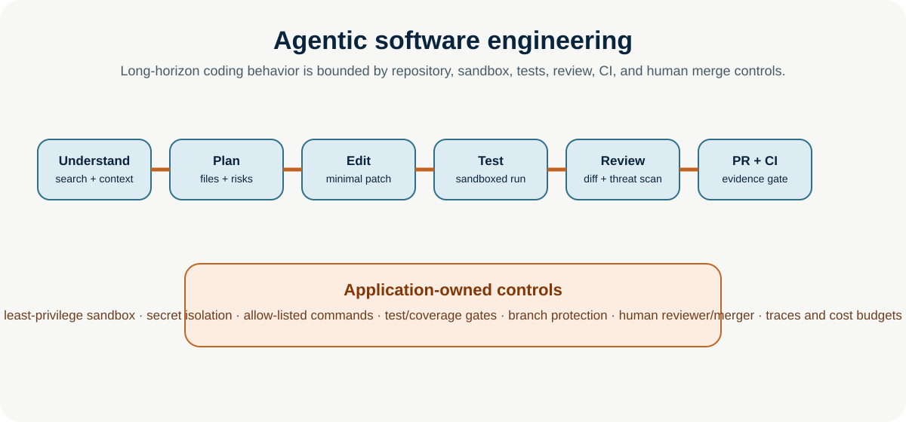
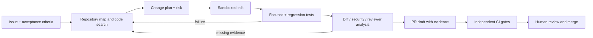

# Agentic Software Engineering

**Enterprise Agent · 04** · **Notebook:** [`agentic_software_engineering.ipynb`](agentic_software_engineering.ipynb) · **Implementation:** [`lab.py`](lab.py)

Coding agents make long-horizon behavior concrete: they must understand a repository, localize a change, plan, use a terminal, edit, generate and run tests, debug failures, review a patch, prepare a PR, and cooperate with CI/CD. The key production insight is that an agent may accelerate the engineering loop, but the repository, sandbox, tests, review, CI, and merge policy remain the safety and quality system.

## Scenario and outcomes

Northstar Commerce has an EU checkout bug: an incompatible provider-region mapping can reach checkout. Build a bounded agent harness that creates a minimal, tested patch and a reviewer-ready PR draft—never an automatic merge or production deploy.

You will learn repository understanding, code search, planning, code generation, terminal tools, test generation/execution, debugging, review and PR agents, CI/CD agents, and coding-agent benchmarks.

## 1. The reliable coding-agent loop

### Step 1 — Understand before editing

Give the agent a scoped checkout of a pinned commit, issue text, architecture/readme pointers, build/test commands, and explicit acceptance criteria. It should map modules, symbols, tests, dependencies, and ownership using code search/AST/IDE indexes; it must not infer behavior from filename similarity. Record files read and evidence for the suspected change location.

### Step 2 — Plan the smallest safe change

The plan names affected files, intended behavior, invariant, tests, migration/compatibility impact, security/privacy implications, rollback, and stop conditions. Prefer a minimal patch over a broad refactor unless the issue requires redesign. A planner and executor can be separated, but plans are hypotheses: replan after test evidence, not vague self-reflection.

### Step 3 — Work only in a sandbox

Terminal tools require an isolated workspace, restricted network, secret-free environment, allow-listed commands, resource/time limits, log capture, and no direct production credentials. Treat command output, repositories, issues, and dependency scripts as untrusted input. Do not let an agent run arbitrary installation/deployment commands because an issue says so.

### Step 4 — Test and debug evidence-first

Add a regression test that fails before the patch and passes after it; run focused tests then relevant broader checks. A passing test is evidence, not proof: inspect coverage, negative/edge paths, compatibility, security, and test quality. On failure, localize, state the observation, modify the plan, and retry within a fixed budget. Terminate with escalation when evidence remains insufficient.

### Step 5 — Separate patch author, reviewer, CI, and merger

The author produces a diff and evidence. A review agent checks requirements, scope creep, security, tests, and maintainability; it should not rubber-stamp its own patch. CI independently runs reproducible checks. A PR agent summarizes intent, files, tests, risk, rollback, and known limitations. Protected-branch policy and a human reviewer retain merge authority.

## 2. Agent roles and controls

| Role | Output | Must not do | Gate |
| --- | --- | --- | --- |
| Repository/search agent | Map, symbols, relevant tests | Modify files | Pinned commit and scoped read access |
| Planner | Change/test/risk plan | Assume acceptance criteria | Human or policy review for high risk |
| Coding agent | Minimal patch | Merge/deploy, access secrets | Sandboxed workspace + command budget |
| Test/debug agent | Reproducible results and failures | Treat green tests as total correctness | Independent test/coverage/security checks |
| Review agent | Findings with file/line evidence | Approve its own implementation | Separation of duties |
| PR/CI agent | PR summary, workflow status | Bypass branch protection | Protected branch + human merge |

## 3. Evaluation and benchmarks

Use internal tasks first: pinned repositories, realistic issues, hidden/independent tests, security checks, review outcomes, cost/latency, and accepted-patch rate. SWE-bench evaluates real GitHub issue resolution and is useful for comparison, but it is not a complete deployment evaluation; current critique shows benchmark/task and test-quality limitations. Track repository understanding separately as it is a distinct capability. Useful public references include SWE-bench/Verified/Multimodal, SWE-agent, SWE-Explore, Terminal-Bench, and long-horizon benchmarks such as SWE-bench Pro. Do not claim production readiness from a leaderboard score.

## 4. Practical lab

Run `python lab.py`. The deterministic harness searches a simulated repository, plans a narrow region-mapping fix, edits a sandbox, runs a regression and contract test, and prepares a PR only after evidence exists. It deliberately has no merge/deploy capability.

Experiments: remove the regression test and see review block the PR; add a broad refactor and ask the reviewer to reject scope creep; simulate a failing test and enforce a retry budget; add a leaked-secret scan; compare a one-shot patch with the evidence-driven loop; and record cost per accepted PR rather than cost per generation.

## Production checklist

- [ ] Pinned commit, task contract, ownership, and environment/secret boundaries.
- [ ] Sandboxed terminal with command/network/resource controls and audit logs.
- [ ] Repository-aware search/context plus explicit planning and scope budget.
- [ ] Fail-to-pass regression tests, broader test/quality/security checks, and independent review.
- [ ] PR includes evidence, test results, risks, rollback, and limitations.
- [ ] CI/CD uses protected branches, required checks, code-owner/human review, and no agent merge/deploy bypass.
- [ ] Evals cover task outcome, trajectory, test adequacy, security, latency, spend, and regressions.

## References

- [SWE-bench](https://github.com/swe-bench/SWE-bench) and [SWE-agent](https://swe-agent.com/)
- [OpenAI: separating signal from noise in coding evaluations](https://openai.com/index/separating-signal-from-noise-coding-evaluations/)
- [Anthropic: demystifying evals for AI agents](https://www.anthropic.com/engineering/demystifying-evals-for-ai-agents)
- [SWE-Explore](https://arxiv.org/abs/2606.07297) · [UTBoost](https://arxiv.org/abs/2506.09289) · [Claw-SWE-Bench](https://arxiv.org/abs/2606.12344)
- [Claude Code](https://www.anthropic.com/product/claude-code) · [OpenAI AI-native engineering team guide](https://cdn.openai.com/business-guides-and-resources/building-an-ai-native-engineering-team.pdf)
