# Agentic Software Engineering

**Level:** Advanced · **Time:** 60 min · **Prerequisites:** None

**Enterprise Agent · 04** · **Notebook:** [`agentic_software_engineering.ipynb`](agentic_software_engineering.ipynb)

Coding agents are the ultimate test of long-horizon reasoning. To successfully resolve a GitHub issue, an agent must: understand a massive repository, localize the bug, plan a fix, navigate a bash terminal, edit files, write regression tests, debug stack traces, and submit a Pull Request.

The most critical production insight is this: **An agent accelerates the writing of code, but the CI/CD pipeline, the Sandbox, and Human Review remain the non-negotiable safety gates.**

We have broken this massive topic down into three core deep-dives:

1. **[Deep Dive: Workspace and Sandboxing](WORKSPACE_AND_SANDBOXING.md)** (Why you must never give an agent a terminal on a host OS, and how to use E2B microVMs).
2. **[Deep Dive: Evidence-Driven Development](EVIDENCE_DRIVEN_DEVELOPMENT.md)** (Forcing the agent to write a failing test *first* to prove the bug exists, preventing infinite loops).
3. **[Deep Dive: Multi-Agent SWE Workflows](MULTI_AGENT_SWE_WORKFLOWS.md)** (Solving the "Rubber Stamp" problem by separating Planners, Coders, and Adversarial Reviewers).

---

## State of the Art: Technology & Tools

The ecosystem for Agentic SWE is moving from academic benchmarks to production tools.

- **[SWE-bench](https://www.swebench.com/):** The gold standard benchmark for evaluating coding agents. It measures how many real-world GitHub issues an agent can resolve autonomously.
- **[SWE-agent](https://github.com/princeton-nlp/SWE-agent):** Princeton's open-source agent framework that pioneered the ACI (Agent-Computer Interface), optimizing how an LLM views terminal outputs.
- **[Aider](https://aider.chat/):** A highly popular command-line AI pair programmer that excels at AST-based code editing and Git integration.
- **[OpenDevin / OpenHands](https://github.com/All-Hands-AI/OpenHands):** A powerful open-source framework aiming to build fully autonomous SWE agents with robust Sandboxing.
- **[E2B (Ephemeral Environments)](https://e2b.dev/):** The leading infrastructure provider for agentic sandboxing. It allows you to spawn a secure, firecracker microVM for an agent in milliseconds, protecting your host infrastructure from arbitrary code execution.

---

## Framework Evaluation Questionnaire

If your enterprise is evaluating an Agentic SWE tool (or building one internally), use this rigorous checklist to validate its architecture. If the answer to any of these is "No," the system is not ready for production.

### 1. Execution & Security
- [ ] **Sandboxing:** Does the agent execute its bash commands in an ephemeral, isolated container/microVM that is destroyed after the run?
- [ ] **Network Egress:** Is the agent's environment restricted from accessing the public internet to prevent downloading malicious payloads?
- [ ] **Secret Management:** Is the agent strictly prevented from accessing production AWS keys, `.env` files, or database credentials?

### 2. The Development Loop
- [ ] **Evidence-Driven:** Does the agent require a regression test to pass before it considers a task complete?
- [ ] **AST Navigation:** Does the agent use Abstract Syntax Tree (AST) tools to map the repo, rather than fragile `grep` commands?
- [ ] **Timeout Budgets:** Is there a hard limit on the number of bash executions to prevent the agent from getting stuck in an infinite debugging loop and burning API credits?

### 3. CI/CD & Deployment
- [ ] **Separation of Duties:** Does the system use an adversarial Reviewer agent to critique the code before submitting a PR?
- [ ] **No Auto-Merge:** Is the agent completely blocked from merging code to the `main` branch or deploying to production?
- [ ] **Human in the Loop:** Does the workflow end with a draft Pull Request that requires a human engineer's approval?
