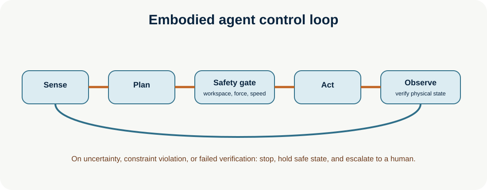

# Embodied Agents and Robotics

**Enterprise Agent · 05** · **Notebook:** [`embodied_agents_robotics.ipynb`](embodied_agents_robotics.ipynb) · **Implementation:** [`lab.py`](lab.py)

Embodied agents connect language and perception to physical action. Unlike purely digital tool use, errors can create safety, hardware, and human risks, so autonomy must be conservative, simulation-led, continuously verified, and easy to stop.

## Scenario and outcomes

A warehouse robot must place a red package into a marked bin. Learn the vision-language-action (VLA) loop, navigation, manipulation, embodied planning, physical feedback, simulation environments, and runtime safety constraints. The included lab is a deterministic simulation; it controls no robot.

## Step-by-step design

1. **Perceive:** fuse camera/depth/proprioception and task instruction; detect uncertainty, occlusion, humans, workspace boundaries, and stale sensor data.
2. **Plan:** map a natural-language goal to a safe sequence: navigate, verify pose, grasp with bounded force, verify grasp, place, verify placement. VLA models map visual/language context toward actions, but application safety layers validate each action.
3. **Simulate first:** test policies in physics/digital-twin environments such as MuJoCo, Isaac Sim, Habitat, or ManiSkill. Evaluate task success, collisions, force/torque, recovery, latency, and distribution shift before hardware trials.
4. **Act in small verified increments:** use motion planning, speed/force/geofence limits, collision checking, watchdogs, emergency stop, and action confirmation. Never treat a one-time visual observation as perpetual truth.
5. **Observe and recover:** compare expected and observed state after every consequential motion. Replan on a real feedback change; stop/escalate on uncertain localization, safety violation, failed grasp, or unexpected human proximity.

## Architecture and safety

| Layer | Responsibility | Example control |
| --- | --- | --- |
| VLA / robot agent | semantic goal and candidate action | “place red package in bin” |
| Planner/controller | feasible trajectory and low-level command | collision-free bounded motion |
| Safety supervisor | independent physical constraints | force/speed/geofence/stop checks |
| Simulation/evaluation | test policy before reality | randomized objects, lighting, friction |
| Human | authority for deployment and recovery | enable/disable, intervention, incident review |

Physical-world feedback is mandatory: a task is not complete because the model emitted a command. It is complete only after sensors verify the intended state. Design for sim-to-real gaps, sensor noise, delayed perception, unknown objects, adversarial visual/language instructions, tool failure, and irreversible contact.

## Practical lab

Run `python lab.py`. It models sense → plan → safety gate → bounded navigation → verified grasp. Change `clear_path` or `force_newtons` to trigger the safe stop path. Exercises: add an object-class confidence threshold; add an approval for a restricted-zone entry; log each action/observation pair; and compare simulation success with a stricter hardware acceptance threshold.

## References

- [RT-2: vision-language-action](https://deepmind.google/blog/rt-2-new-model-translates-vision-and-language-into-action/) · [RT-2 paper](https://robotics-transformer2.github.io/assets/rt2.pdf)
- [OpenVLA](https://openvla.github.io/) and [paper](https://arxiv.org/abs/2406.09246)
- [Gemini Robotics](https://deepmind.google/models/gemini-robotics/)
- [VLA manipulation survey](https://arxiv.org/abs/2508.15201) · [simulation survey](https://arxiv.org/abs/2505.01458)
- [VLA safety survey](https://arxiv.org/abs/2604.23775) · [MuJoCo documentation](https://mujoco.readthedocs.io/)
