# Embodied Agents and Robotics

**Level:** Advanced · **Time:** 60 min · **Prerequisites:** None

**Enterprise Agent · 05** · **Notebook:** [`embodied_agents_robotics.ipynb`](embodied_agents_robotics.ipynb)

When an agent interacts with a web API, a hallucinated response might result in a `400 Bad Request`. When an embodied agent controls a 50kg robotic arm, a hallucination can cause the arm to swing through a glass window. 

Embodied agents connect language and perception to physical action. Because errors create real-world safety and hardware risks, autonomy must be heavily bounded, simulation-led, and continuously verified.

We have broken this curriculum down into three core modules:

1. **[The Vision-Language-Action (VLA) Loop](#the-vision-language-action-vla-loop)** (This Page)
2. **[Deep Dive: Physical Safety & Constraints](PHYSICAL_SAFETY_AND_CONSTRAINTS.md)** (Geofencing, Force Limits, and the Safety Supervisor)
3. **[Deep Dive: Simulation and Digital Twins](SIMULATION_AND_DIGITAL_TWINS.md)** (Sim-to-Real gaps, MuJoCo, and Domain Randomization)

---

## The Vision-Language-Action (VLA) Loop

Embodied agents do not operate like chat bots. They operate in a continuous loop of physical feedback.

1. **Perceive:** The agent fuses camera data, LiDAR/depth sensors, and proprioception (knowing where its joints currently are) into a context window.
2. **Plan (VLA):** The Vision-Language-Action model maps the natural language instruction ("Pick up the red box") to a **Semantic Goal** (e.g., "Move end-effector to coordinates X, Y, Z").
3. **Safety Gate:** The deterministic Safety Supervisor checks the semantic goal against hardcoded constraints. Is it inside the safe geofence? 
4. **Act (Low-Level):** If safe, the low-level controller translates the goal into raw motor voltages.
5. **Observe:** The robot must use physical sensors (e.g., weight/torque sensors) to verify the action succeeded. A task is *never* complete just because the LLM emitted a command.

---

## State of the Art: Technology & Tools

The software and hardware stack for embodied AI is stabilizing around a few core frameworks and simulators.

### Vision-Language-Action (VLA) Models
- **[RT-2 (Robotics Transformer 2)](https://deepmind.google/discover/blog/rt-2-new-model-translates-vision-and-language-into-action/):** Google DeepMind's flagship VLA model that co-finetunes vision-language models on robotic trajectory data, allowing the model to inherently understand physical affordances.
- **[OpenVLA](https://openvla.github.io/):** A state-of-the-art open-source 7B parameter VLA model that can be fine-tuned for specific robotic embodiments using LoRA.
- **[Gemini Robotics](https://deepmind.google/models/gemini-robotics/):** Google's initiative to integrate Gemini directly into robotic control loops for advanced spatial reasoning.

### Simulation and Digital Twins
- **[MuJoCo (Multi-Joint dynamics with Contact)](https://mujoco.org/):** A highly accurate physics engine maintained by Google DeepMind. It is the gold standard for simulating complex physical contacts and grasping before deploying to real hardware.
- **[NVIDIA Isaac Sim](https://developer.nvidia.com/isaac-sim):** A photorealistic robotics simulation platform built on NVIDIA Omniverse, heavily used for generating synthetic training data and testing Domain Randomization.

---

## Watch For

- **Direct Motor Control:** Never let an LLM output raw motor voltages. They must output semantic coordinates, allowing a deterministic low-level controller to safely plan the motion path.
- **Ignoring the Sim-to-Real Gap:** A policy trained in a perfect simulation will fail on real hardware due to sensor noise and friction. You must use Domain Randomization during training.
- **Open-Loop Execution:** If the agent tells the arm to pick up a cup, but the cup slips, the agent must know. It must read physical torque or weight sensors after every action to confirm success before proceeding (Closed-Loop).

---

## Checkpoint

**1. What is the primary role of the "Safety Supervisor" in an embodied agent architecture?**
- A) To translate text into images.
- B) To act as a deterministic, hard-coded layer that instantly overrides the LLM if physical limits (force, speed, geofence) are exceeded.
- C) To make the robot move faster.
- D) To reduce the API cost of the LLM.

Answer

<b>B</b>. LLMs hallucinate. The Safety Supervisor is the non-LLM, deterministic firewall that protects the hardware and humans from dangerous commands.

**2. Why is "Domain Randomization" necessary when training agents in Simulation?**
- A) To make the graphics look more realistic.
- B) To bridge the "Sim-to-Real Gap" by forcing the agent to learn robust policies across thousands of randomized lighting, friction, and mass scenarios.
- C) To save cloud computing costs.
- D) To prevent prompt injection.

Answer

<b>B</b>. If you train an agent in a perfectly lit, frictionless simulation, it will instantly crash in the messy, noisy reality of the physical world.

