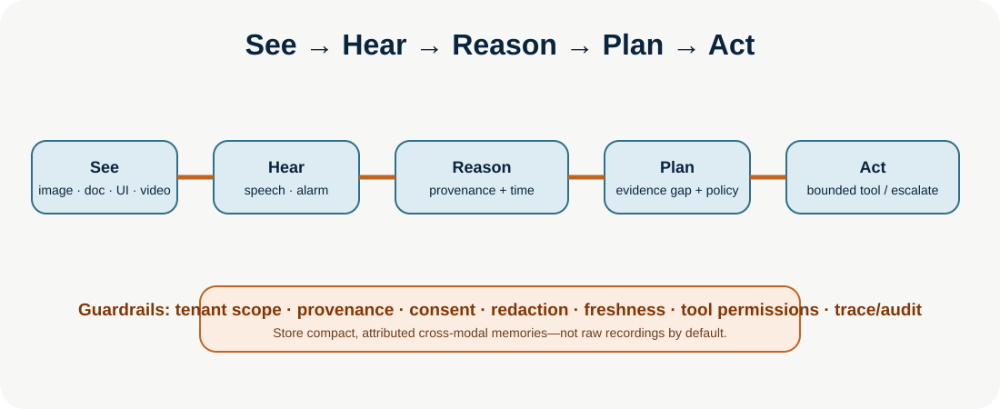

# Multimodal Agents

**Level:** Advanced · **Time:** 60 min · **Prerequisites:** None

**Enterprise Agent · 06** · **Notebook:** [`multimodal_agents.ipynb`](multimodal_agents.ipynb) · **Implementation:** [`lab.py`](lab.py)

Multimodal agents perceive and act over more than text. They correlate vision, audio, video, documents, UI/screens, speech, sensor streams, memory, and tools—but every modality adds context cost, privacy risk, provenance ambiguity, and a new attack surface.

## Scenario and outcomes

In a Northstar warehouse control room, an agent receives a conveyor camera image, alarm audio, maintenance PDF, UI screenshot, and RPM sensor feed. It must decide whether evidence supports a technician escalation. Learn multimodal perception, cross-modal reasoning, memory, tools, and safety boundaries through **See → Hear → Reason → Plan → Act**.

## 1. Inputs and design contracts

| Modality | Capability | Non-negotiable metadata |
| --- | --- | --- |
| Vision/images | objects, layout, OCR | source, timestamp, confidence, privacy/redaction |
| Documents | text, tables, diagrams | page/region citation, OCR quality, version/trust |
| UI/screens | visual grounding and computer use | current screenshot, target confirmation, no stale coordinates |
| Audio/speech | transcript, speaker, alarms | consent, speaker/time, transcript uncertainty |
| Video | temporal events plus audio/vision | segment/timecode grounding, targeted retrieval |
| Sensors | state, location, force, telemetry | calibration, units, freshness, range validation |

## 2. Step-by-step architecture

1. **See / hear / read:** ingest only authorized modalities; capture tenant, source ID, timestamp, consent/classification, hash, and extraction confidence.
2. **Normalize and align:** form compact evidence objects; align time/units; retain source pointers to pages, frames, transcripts, and screens rather than unbounded raw media in context.
3. **Reason:** compare cross-modal claims and state uncertainty. An image, transcript, or PDF is data—not an instruction or authorization.
4. **Plan:** request the smallest next evidence source or read-only tool. Multimodal embedding/retrieval applies only after tenant/trust/freshness filters.
5. **Act:** typed, least-privilege tools; fresh visual grounding for UI action; server-side policy and approval for consequential work.
6. **Remember:** write compact attributed facts with modality/source/time/consent/retention metadata; do not persist raw recordings or sensitive screens by default.

## 3. Multimodal tools, memory, and evaluation

Tools include OCR, document parsing, vision detection, ASR, video segment localization, screen/accessibility inspection, sensor query, search, and computer-use actions. Keep extraction separate from decision: deterministic code validates trust, scope, schema, time, and permission before evidence reaches a model.

Test OCR errors, misleading screens, edited video, prompt injection inside a document/image, transcript error, sensor drift, time misalignment, cross-tenant retrieval, stale screenshots, excessive video cost, and conflicting sources. Evaluate grounding/citations, cross-modal consistency, outcome, tool trajectory, privacy/security, latency, and cost.

## Practical lab and references

Run `python lab.py`. The simulated case aligns trusted Acme image, audio, document, and sensor evidence and prepares a read-only incident escalation. Exercises: inject an untrusted PDF instruction; offset a sensor timestamp; require two modalities for high-risk claims; add retention policy; and compare full-video ingestion with segment retrieval.

- [OpenAI Computer-Using Agent](https://openai.com/index/computer-using-agent/) · [OpenAI agent guide](https://openai.com/business/guides-and-resources/a-practical-guide-to-building-ai-agents/)
- [Gemini report](https://arxiv.org/abs/2312.11805) · [Gemini 1.5 long context](https://arxiv.org/abs/2403.05530) · [multimodal embeddings](https://arxiv.org/abs/2605.27295)
- [Multimodal Agent AI survey](https://doi.org/10.1007/s11390-025-4802-8) · [VideoAgent](https://arxiv.org/abs/2403.11481) · [video understanding docs](https://ai.google.dev/gemini-api/docs/video-understanding)

## Watch For

- **Assumption failure:** The model hallucinates an unsupported parameter.
- **State leak:** Context is incorrectly preserved across runs.
- **Timeout:** The tool takes too long and the agent loops.
- **Auth bypass:** The agent attempts an action it shouldn't.

## Checkpoint

**1. What is the primary purpose of this module?**
- A) To understand the core concept.
- B) To write complex boilerplate.
- C) To ignore system errors.
- D) To bypass security.

**2. How do we mitigate the primary failure mode?**
- A) Retries.
- B) Human approval.
- C) Logging.
- D) Idempotency keys.

