# Cost, Latency, and Agent Economics

**Level:** Advanced · **Time:** 60 min · **Prerequisites:** None

**Enterprise Agent · 07** · **Notebook:** [`agent_economics.ipynb`](agent_economics.ipynb)

In a prototype, developers often use the most expensive flagship models (e.g., GPT-4o, Claude 3.5 Sonnet) for every single step of a workflow. In production, an agent request is an economic trajectory, not a single model call. A user request can trigger planning calls, parallel tool execution, validation failures, retries, and massive token contexts. 

If you do not govern this trajectory, the cost of your agent will exceed the value it provides. Production engineering requires managing a portfolio of latency, cost, and quality constraints.

We have broken this curriculum down into three core modules:

1. **[Core Economics & Tracking ROI](#core-economics--tracking-roi)** (This Page)
2. **[Deep Dive: Model Routing & Cascades](MODEL_ROUTING_AND_CASCADES.md)** (FrugalGPT patterns, small model intent classification)
3. **[Deep Dive: Caching & Latency](CACHING_AND_LATENCY.md)** (Semantic Caching, Parallel Tools, TTFT)

---

## Core Economics & Tracking ROI

To manage agent economics, you must track the **cost per successful task**, not just the price per 1k tokens.

### The Agent Budget

Every time an agent is invoked, it should be assigned a strict budget. If it exceeds this budget, the orchestrator must halt execution and return a graceful failure to the user.

| Budget | What it limits | Example policy | Failure to avoid |
| --- | --- | --- | --- |
| **Token Budget** | The total prompt, completion, and reasoning allocation allowed for this run. | Max 10k tokens for a low-risk investigation. | An infinite context loop that costs $5 per query. |
| **Action Budget** | The maximum number of tool executions and retries allowed. | Max 10 tool calls. Max 2 retries on failure. | The LLM getting stuck in a tool hallucination loop. |
| **Latency Budget** | The total Wall-Clock time the agent is allowed to think. | Max 15 seconds. | A user abandoning the session because the UI froze. |

### The "Failed First Route" Cost
When building LLM Cascades (trying a cheap model first, falling back to an expensive model if it fails), you must calculate the cost of a failure.
If `gpt-4o-mini` fails 60% of the time, and you fall back to `gpt-4o`, you are paying for **both** models 60% of the time. You must evaluate your task success rates to determine if the cascade is actually saving you money.

---

## Watch For

- **The Expensive Classifier:** Using a massive reasoning model just to determine if a user said "Hello" or "Check my balance." Use Semantic Caching or cheap models (`gpt-4o-mini`, `Llama 3 8B`) as the front door.
- **Sequential Latency:** If an agent needs to call three independent APIs, do not let it call them one by one. Force the orchestrator to execute them concurrently (`asyncio`).
- **Ignoring TTFT:** If you do not stream intermediate steps back to the user (Time to First Token), the user will assume the app crashed and refresh the page, triggering a duplicate, expensive run.

---

## Checkpoint

**1. What is the primary benefit of "Semantic Caching"?**
- A) It compresses the JSON payload sent to the LLM.
- B) It uses Vector Embeddings to recognize when two slightly different prompts have the exact same intent, returning a cached answer without hitting the LLM.
- C) It stores the user's password in a secure database.
- D) It makes the LLM hallucinate less.

Answer

<b>B</b>. Traditional caches require exact string matches ("Hello" != "Hi"). Semantic caching understands they mean the same thing, drastically reducing LLM calls for FAQs.

**2. What is an LLM Cascade (The FrugalGPT Pattern)?**
- A) Piping the output of one agent into the input of another agent.
- B) Deleting all logs after a session ends.
- C) Attempting a task with a fast, cheap model first. If it fails a validation check, automatically retrying with a more powerful, expensive model.
- D) Using a load balancer to distribute traffic across regions.

Answer

<b>C</b>. Cascades allow you to run the vast majority of easy requests on models that cost 50x less, reserving flagship models only for complex edge cases.

