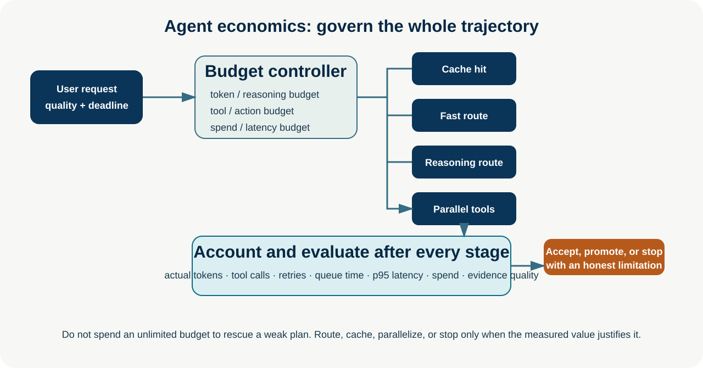
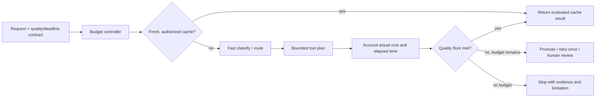

# Cost, Latency, and Agent Economics

**Level:** Advanced · **Time:** 60 min · **Prerequisites:** None

**Enterprise Agent · 07** · **Notebook:** [`agent_economics.ipynb`](agent_economics.ipynb) · **Implementation:** [`lab.py`](lab.py)

An agent request is an economic trajectory, not one model call. A single user request can create planning calls, retrieval/tool calls, retries, evaluator calls, background work, and a more expensive model promotion. Production engineering therefore governs a portfolio of quality, time, capacity, and spend constraints—not merely token price.

## Scenario and outcomes

Northstar's incident assistant receives: “Investigate EU checkout conversion decline and prepare a proposal.” A naïve run makes 8 model calls, 12 tools calls, 3 searches, and 2 retries. The governed version uses a cache where valid, a fast classifier, bounded parallel read-only evidence, a reasoning route only for uncertainty, and explicit stop conditions. It prepares advice; it cannot execute a rollback.

You will define token/action/reasoning/latency/spend budgets, separate cost routing from authorization, choose cache/parallel/speculative strategies, and evaluate cost per successful *safe* task.

## 1. The full cost equation

Estimate each path as `model input + output + reasoning + tool/API/search + storage/cache + network/queue + retries + evaluation + human-review overhead`. Track the actual trace because token estimates and provider latency do not capture tool fan-out, retries, congestion, or a costly failed first route. The meaningful comparison is **cost per successful task** under a quality/safety floor, not the cheapest request.

| Budget | What it limits | Example policy | Failure to avoid |
| --- | --- | --- | --- |
| Token/context | Prompt, completion, and reasoning allocation | 6k tokens for low-risk investigation; compress before promotion | Unlimited context that increases cost and distracts the model |
| Action/tool | Calls, searches, browser actions, retries | 12 total calls; one retry only for transient reads | Tool loops or duplicate side effects |
| Reasoning | Deliberation/model turns for ambiguous cases | Promote once after external acceptance failure | Spending more reasoning to hide missing evidence |
| Latency | End-to-end wall-clock SLO, including queues/tools | p95 < 7 s; reserve time for fallback | Optimizing median model latency while tools time out |
| Spend | Per-run, tenant, and portfolio cost | 8 cents/run plus daily tenant cap | A cheap first call causing unlimited escalation |

## 2. Cost-aware planning and dynamic model selection

First apply hard constraints: tenant/data handling, required modality/tool features, risk/quality floor, availability, and time remaining. Then choose the least costly eligible route based on evaluation evidence for the task family. A small/fast model fits stable classification, extraction with schema checks, and known summarization. A larger reasoning route fits ambiguous evidence synthesis or constraint trade-offs. Multimodal/coding routes are capability requirements, not luxury upgrades.

Dynamic selection must be versioned and auditable. Record catalog/policy versions, predicted and actual spend/latency, route, cache status, promotion/fallback reason, evaluation evidence, and user correction. Routing does not confer tool permission; server-side identity, tenant scope, approval, idempotency, and action budgets remain mandatory.

## 3. Caching, parallelism, and speculative work

**Caching** is powerful only with a key that includes tenant, authorization scope, policy/prompt/catalog version, freshness window, and relevant source version. Cache retrieval/evidence separately from generated final answers when personalization or volatile data makes answer reuse unsafe. Measure hit quality and invalidate/expire aggressively for operational facts.

**Parallelization** reduces wall-clock latency for independent, read-only calls; it usually does not reduce spend. Parallel fan-out must have a concurrency cap, cancellation on an early terminal result, per-tool timeouts, and no shared-write race. Sequential execution is correct when a tool needs the previous output or when a cheap gate can avoid an expensive call.

**Speculative execution** launches a likely next route before the previous decision finishes. It is appropriate only when expected latency value exceeds expected wasted work, inputs are authorized, and cancellation is real. Never speculate consequential actions, broad searches, or private-context calls merely to improve a dashboard metric.

## 4. Step-by-step lab

1. Run `python lab.py`; compare the 30 ms cached path with the complex, 3.45-second reasoning path.
2. Inspect `charge`: every stage checks tokens, actions, spend, and latency before it runs.
3. Toggle `parallel_reads`. It changes wall-clock time, not the number of tools or authority they require.
4. Force a low remaining budget and ensure the run stops with a limitation rather than starts a doomed escalation.
5. Add a cache key field for tenant and policy version; explain the cross-tenant leakage prevented.
6. Compare always-reasoning, fast-only, cache+route, and speculative policies with outcome, safety, p95 latency, total cost, and cost per success.

## 5. Production checklist and exercises

- Set per-run, per-tenant, per-workflow, and global circuit-breaker budgets; reserve enough time/spend for a safe fallback.
- Keep retries narrow: classify transient failures, use backoff/jitter, require idempotency for writes, and count every retry against budget.
- Trace queue, cache, model, tool, evaluator, and human-review time separately. Monitor p95/p99, not just averages.
- Require outcome, evidence, and policy success before declaring an inexpensive path a success. Segment quality/cost by task/risk/language/tenant.
- Re-evaluate after a model, prompt, tool, cache, pricing, or policy change; preserve a last-known-good route policy.

**Exercises:** (1) add a retry policy that cannot retry a write without an idempotency key; (2) calculate whether speculative search is worth it from probability, cost, and saved latency; (3) design a quality-floor gate that promotes once but never exceeds the deadline; (4) create a FinOps dashboard metric that detects a cheap route with poor task success.

## Watch For

- **Assumption failure:** The model hallucinates an unsupported parameter.
- **State leak:** Context is incorrectly preserved across runs.
- **Timeout:** The tool takes too long and the agent loops.
- **Auth bypass:** The agent attempts an action it shouldn't.

## Checkpoint

**1. What is the primary purpose of this module?**
- A) To understand the core concept.
- B) To write complex boilerplate.
- C) To ignore system errors.
- D) To bypass security.

**2. How do we mitigate the primary failure mode?**
- A) Retries.
- B) Human approval.
- C) Logging.
- D) Idempotency keys.

## References

- [FrugalGPT: cost-aware LLM cascades](https://arxiv.org/abs/2305.05176) · [RouteLLM](https://arxiv.org/abs/2406.18665) · [RouterBench](https://arxiv.org/abs/2403.12031) · [Unified routing and cascading](https://arxiv.org/abs/2410.10347)
- [OpenAI practical guide to building agents](https://openai.com/business/guides-and-resources/a-practical-guide-to-building-ai-agents/) · [Anthropic: building effective agents](https://www.anthropic.com/engineering/building-effective-agents) · [Anthropic: agent evals](https://www.anthropic.com/engineering/demystifying-evals-for-ai-agents)
