# Production Agent Architecture

**Level:** Advanced · **Time:** 60 min · **Prerequisites:** None

**Enterprise Agent · 08** · **Notebook:** [`production_agent_architecture.ipynb`](production_agent_architecture.ipynb)

Building a prototype agent in a Jupyter Notebook is easy. Deploying that agent to production—where it must survive pod crashes, handle thousands of concurrent requests, and enforce strict execution policies—requires a complex, stateful architecture.

In a production system, the agent's logic is cleanly separated from the agent's state, queue, and identity boundaries.

Because this transition from prototype to production is where most agentic systems fail, we have broken this curriculum down into three core modules:

1. **[Core Component Boundaries](#core-component-boundaries)** (This Page)
2. **[Deep Dive: State & Persistence](STATE_AND_PERSISTENCE.md)** (Durable Execution & Checkpointers)
3. **[Deep Dive: Scale & Resilience](SCALE_AND_RESILIENCE.md)** (Idempotency, Auto-scaling, DLQs)

---

## Core Component Boundaries

A robust agentic system relies on distributed components, separating synchronous user requests from long-running, asynchronous LLM reasoning loops.

### The Stateless vs Stateful Divide

| Component | Architecture | Responsibility |
| --- | --- | --- |
| **API Gateway** | Stateless | Handles auth, rate limiting, and drops jobs into the Message Queue. Returns `202 Accepted`. |
| **Message Queue** | Stateful | Holds pending agent jobs. Routes toxic/failing jobs to a Dead Letter Queue (DLQ). |
| **Agent Worker** | Stateless Compute | Pulls a job from the queue, loads state from DB, runs a reasoning step, saves state, and dies/pauses. |
| **Checkpointer DB** | Stateful Storage | The source of truth for the agent's memory, conversation history, and pending Human-in-the-Loop approvals. |
| **Tool Gateway** | Stateless | Validates tool authorization policies (OPA) and enforces Idempotency Keys to prevent duplicate actions. |

---

## Watch For

- **The `time.sleep()` Anti-Pattern:** Never pause an agent script to wait for an external event or human approval. The server connection will timeout. You must checkpoint the state to a database and exit the process (Durable Execution).
- **Duplicate Tool Executions:** If a network blip occurs, the LLM will often assume a tool failed and try to execute it again. If the tool charges a credit card, you will double-charge the user unless you enforce strict Idempotency Keys.
- **CPU-Based Autoscaling:** Do not scale your agent worker pods based on CPU utilization. Agents are I/O bound (waiting for the LLM API to respond). Scale your workers based on **Queue Depth** instead.

---

## Checkpoint

**1. Why must you use Idempotency Keys at the tool boundary?**
- A) To make the LLM respond faster.
- B) To ensure that if the LLM accidentally tries to execute a state-mutating tool (like a refund) twice due to a network retry, the tool only executes once.
- C) To encrypt the payload before sending it to the LLM.
- D) To bypass the API Gateway rate limits.

Answer

<b>B</b>. LLMs are non-deterministic and network calls fail. Idempotency guarantees that a single tool call UUID will only ever cause one side-effect, returning the cached success on subsequent attempts.

**2. How should an agent worker handle waiting for a Human-in-the-Loop (HITL) approval?**
- A) Enter a `while True` loop and continuously poll the database every 5 seconds.
- B) Run `time.sleep(3600)` and wait for the human to click a button.
- C) Save its entire state (graph, context, history) to a Checkpointer Database, and exit. When the human approves, a webhook spawns a new worker that loads the checkpoint and resumes.
- D) Send an email to the user and terminate the agent forever.

Answer

<b>C</b>. This is known as Durable Execution. It decouples the long-running state of the agent from the ephemeral compute nodes, saving money and preventing timeouts.

