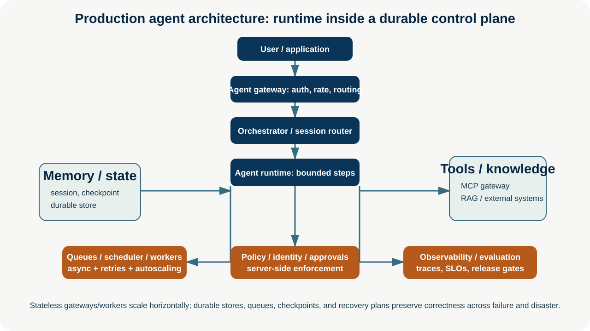
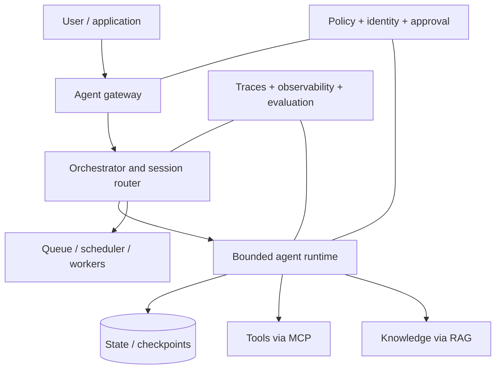

# Production Agent Architecture

**Enterprise Agent · 08** · **Notebook:** [`production_agent_architecture.ipynb`](production_agent_architecture.ipynb) · **Implementation:** [`lab.py`](lab.py)

Production agents are systems, not a model call with tools. The runtime performs bounded reasoning and tool selection, while the surrounding platform owns identity, policy, sessions, persistence, queues, recovery, observability, evaluation, and operational resilience. This module assembles those components into one architecture and explains which state may be transient and which must survive failure.

## Scenario and outcomes

Northstar accepts an EU checkout investigation through an authenticated gateway. An orchestrator assigns a session and durable run. A worker gathers permitted evidence, checkpoints while waiting for an external deployment event, resumes after recovery, and creates a proposal. Policy/identity remain server-side; the system does not execute remediation.

You will distinguish stateless from stateful components, design session/persistence/queue boundaries, and implement durable asynchronous recovery, caching, retries, rate limits, autoscaling, and disaster recovery controls.

## 1. Component boundaries

| Component | Usually stateless or stateful? | Owns | Production controls |
| --- | --- | --- | --- |
| Gateway | Stateless | authentication, request validation, rate limits, request IDs | WAF, quotas, tenant routing, backpressure |
| Orchestrator | Stateful coordination | session/run selection, routing, lifecycle | idempotent commands, deadlines, policy decision record |
| Agent runtime/worker | Replaceable, checkpointed | one bounded reasoning/tool step | token/action/time budgets, leases, cancellation |
| Session/state store | Durable stateful | conversation/run state and checkpoints | schema versioning, encryption, TTL, tenant isolation |
| Queue/scheduler | Durable stateful | async work, delayed wake-ups, retry delivery | dedupe, visibility timeout, DLQ, concurrency limits |
| Memory/knowledge | Durable stateful | scoped memories and governed retrieval | provenance, freshness, authorization, retention |
| Tool/MCP gateway | Stateless policy enforcement + audited state | tool mediation | capability scope, rate/concurrency, idempotency, secrets isolation |
| Observability/evaluation | Durable analytical state | trace, SLO, quality/release evidence | sampling/privacy, alerting, regression gates |

## 2. Sessions, checkpoints, and asynchronous execution

A session is a user/task continuity boundary; it is not permission to retain everything forever. A durable run is a versioned state machine: run ID, tenant/owner, policy/catalog versions, input hash, state schema, allowed tools, deadlines/budgets, idempotency keys, pending approval/event correlation, cancellation, and audit trace. Checkpoint after meaningful transitions. A worker may fail; a new worker resumes the persisted state, revalidates policy/freshness, and never repeats a side effect without idempotency/reconciliation.

Use queues for minutes-to-days work, schedules for bounded periodic runs, and authenticated events for external wake-ups. Do not poll a model while waiting. Implement dead-letter queues and human/operator resolution for poisoned or repeatedly failing jobs.

## 3. Performance and resilience

**Caching:** cache only scoped, versioned, fresh data; include tenant, authorization, source/version, policy/prompt/catalog keys. Cache retrieval evidence separately from personalized answer text when necessary.

**Retries/rate limits:** classify transient failures, apply bounded exponential backoff/jitter, count retries against job budgets, use idempotency for writes, and propagate backpressure. Rate-limit at gateway, tenant, tool, model, queue, and concurrency levels.

**Autoscaling:** scale stateless gateways/workers horizontally from queue depth, service time, and SLO signals—not just CPU. Protect dependencies with concurrency caps/circuit breakers. Do not autoscale unbounded agent fan-out.

**Disaster recovery:** define RPO/RTO, backup/restore and encryption-key plans, multi-region/failover strategy, state schema migration, queue replay rules, degraded read-only modes, tested runbooks, and regular recovery exercises. A DR plan must include cancellation/revocation and idempotent replay safety.

## 4. Step-by-step lab and exercises

1. Run `python lab.py`: authenticated gateway → queue → checkpointed wait → worker recovery → proposal-ready completion.
2. Make the gateway reject an unauthenticated or rate-limited request; ensure no job is queued.
3. Simulate worker loss after `waiting-evidence`; show that recovery uses the checkpoint rather than restarting the whole run.
4. Add a duplicate event and an idempotency key. Then add a dead-letter route after bounded retry.
5. Draw SLOs for gateway acceptance, queue delay, worker step, tool, model, total run, and recovery. Define alerts and a release gate.

## Production checklist and references

- Separate data plane (requests/work) from control plane (policy, catalog, evaluation, deployment, audit); do not trust the model as either plane.
- Enforce identity/tenant scope at every boundary, especially caches, stores, queues, and tools.
- Bound tokens, actions, retries, queue age, concurrency, spend, runtime, and child fan-out; expose cancellation and escalation.
- Test dependency outage, duplicate/late event, worker crash, partial write, schema migration, cache leak/staleness, queue replay, region failover, and restore.

References: [OpenAI agent guide](https://openai.com/business/guides-and-resources/a-practical-guide-to-building-ai-agents/), [LangGraph durable execution](https://docs.langchain.com/oss/python/langgraph/durable-execution), [Temporal workflows](https://docs.temporal.io/workflows), [MCP authorization](https://modelcontextprotocol.io/extensions/auth/enterprise-managed-authorization), and [NIST AI RMF](https://www.nist.gov/itl/ai-risk-management-framework).
