# Agent Governance and Responsible AI

**Level:** Advanced · **Time:** 60 min · **Prerequisites:** None

**Enterprise Agent · 09** · **Notebook:** [`agent_governance_responsible_ai.ipynb`](agent_governance_responsible_ai.ipynb)

Agent governance is the operating system for accountable autonomy. It governs a deployed socio-technical system—models, instructions, tools, memory, data, people, and operational controls—not just a compliance label attached to one model. 

An agent remains useful only while its purpose, owner, scope, evidence, and recovery paths are explicitly defined and easily revocable.

Because Governance bridges the gap between engineering, legal, and security, we have broken this curriculum down into three core modules:

1. **[The Governance Lifecycle](#the-governance-lifecycle)** (This Page)
2. **[Deep Dive: AI Risk Management & Autonomy](AI_RISK_MANAGEMENT.md)** (NIST, EU AI Act, Autonomy Tiers)
3. **[Deep Dive: AI BOM & Agent Registration](AI_BOM_AND_REGISTRATION.md)** (System Cards, Deployment Gates, Kill Switches)

---

## The Governance Lifecycle

Deploying an agent is not like deploying a static microservice. The CI/CD pipeline must enforce organizational accountability before the agent is granted its Identity.

### Essential Lifecycle Controls

| Control | Questions it answers | Evidence |
| --- | --- | --- |
| **Accountability** | Who can approve purpose, risk, release, access, and shutdown? | A named Human Owner; escalation/on-call paths in the AI BOM. |
| **Risk/Autonomy** | What harm could occur? Does it assist, propose, or execute autonomously? | Threat model, impact tier (e.g. EU AI Act High-Risk), approval policy. |
| **Access Inventory** | Which read/write tools, MCP servers, and scopes can it use? | Capability grants, least privilege definitions. |
| **Data Governance** | Which tenants, retention policies, and provenance rules apply? | Data classification; PII masking policies. |
| **Incident Response** | How do we stop the agent if it hallucinates or is hijacked? | Global IAM Kill Switch, versioned artifacts, privacy-aware trace. |

### Registration and CI/CD Gating

Maintain an agent inventory (The AI BOM) with immutable ID/versions, business purpose, accountable owners, model/prompt dependencies, and risk tiers. 

This inventory is **not a static spreadsheet**. It must be evaluated in your deployment pipeline. If a developer attempts to deploy an agent that is classified as "High Risk" but the codebase does not include a Human-in-the-loop (HITL) approval step, the pipeline must reject the deployment.

---

## Watch For

- **Phantom Ownership:** An agent deployed under a generic service account or distribution list (`team@corp.com`). When it causes a P0 incident, no specific human can be held accountable or authorize the kill switch.
- **Rubber Stamping:** Human oversight that provides no context. The human just clicks "Approve" without understanding what the agent is doing.
- **Inability to Revoke:** You realize the agent is corrupted, but because it relies on a hardcoded API key instead of Workload Identity, you cannot shut it down without breaking other production systems.

---

## Checkpoint

**1. What is the primary purpose of an AI Bill of Materials (AI BOM)?**
- A) To track software licenses for open source libraries.
- B) To cryptographically bind the specific models, prompts, tools, and accountable Human Owner to a specific release version of an agent.
- C) To calculate the API costs of the agent.
- D) To train the LLM on better data.

Answer

<b>B</b>. The AI BOM acts as the system card and inventory record. It ensures that during an incident, investigators know exactly what components were running and who is accountable.

**2. How should you design a "Kill Switch" for an autonomous agent?**
- A) Tell the LLM in its system prompt to stop executing if it detects an error.
- B) Build an API endpoint in the agent's code that calls `sys.exit()`.
- C) Revoke the agent's Workload Identity (e.g. its SPIFFE SVID or AWS IAM Role) at the infrastructure layer, causing all tool calls to fail with `401 Unauthorized`.
- D) Unplug the server.

Answer

<b>C</b>. A compromised agent cannot be trusted to shut itself down (B). You must revoke its identity at the infrastructure level (C) so it loses all authority immediately.

