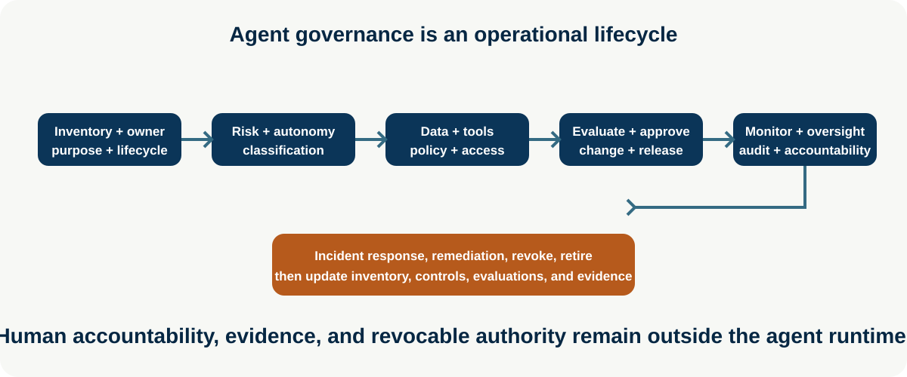
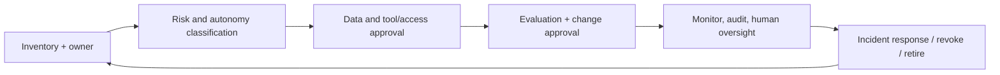

# Agent Governance and Responsible AI

**Level:** Advanced · **Time:** 60 min · **Prerequisites:** None

**Enterprise Agent · 09** · **Notebook:** [`agent_governance_responsible_ai.ipynb`](agent_governance_responsible_ai.ipynb) · **Implementation:** [`lab.py`](lab.py)

Agent governance is the operating system for accountable autonomy. It governs a deployed socio-technical system—models, instructions, tools, memory, data, people, workflows, vendors, and operational controls—not a compliance label attached to one model. The agent remains useful only while its purpose, owner, scope, evidence, access, and recovery path are current and revocable.

## Scenario and outcomes

Northstar wants to release an incident adviser that reads internal logs, prepares evidence-backed remediation proposals, and requires an incident commander before any consequential change. Learners register it, assign accountability, classify its risk/autonomy/data/tools, gate release on evidence, monitor it, handle an incident, and retire/revoke it safely.

## 1. Inventory, ownership, and lifecycle

Maintain an agent inventory with immutable ID/version, business purpose/non-goals, accountable business owner, technical owner, model/prompt/tool/memory/knowledge dependencies, tenant/data classification, risk/autonomy tier, allowed actions, approval requirements, evaluation evidence, deployment/change history, incident contacts, retention, and retirement date. An inventory is not a static spreadsheet: discovery, change, revocation, and audit must update it.

| Control | Questions it answers | Evidence |
| --- | --- | --- |
| Ownership/accountability | Who can approve purpose, risk, release, access, and shutdown? | named owner, RACI, escalation/on-call |
| Risk/autonomy classification | What harm could occur; does it assist, propose, or execute under approval? | threat model, impact tier, approval policy |
| Tool/access inventory | Which read/write tools, credentials, MCP servers, and scopes can it use? | capability grants, least privilege, revocation test |
| Data governance | Which data, tenants, retention, residency, consent, and provenance rules apply? | classification, DPIA/records where required, access logs |
| Auditability | Can an investigator reconstruct input, policy, tool/evidence trace, decision, and action? | privacy-aware trace, versioned artifacts, retention policy |

## 2. Human oversight, change management, and incidents

Human oversight is an explicit authority design: who can approve, modify, reject, pause, revoke, or override an agent; what information they receive; deadlines; and how resumes are idempotent. Use least autonomy that reliably achieves the outcome. High-impact actions should be proposal-only or execute-with-approval with an exact action fingerprint, evidence, expiry, and audit.

Change management treats model/catalog/prompt/tool/MCP/memory/policy/data/evaluation changes as releases. Assess changed risk, run regression and adversarial evaluations, version artifacts, obtain appropriate approval, use staged rollout/rollback, and update inventory. Incident response covers detection, containment (disable/revoke/kill switch), evidence preservation, owner notification, user/customer process where required, root cause, remediation, re-evaluation, and lifecycle update.

## 3. Step-by-step lab and operational checklist

1. Run `python lab.py`; the high-risk adviser passes only because it has an owner, valid autonomy classification, data classification, and an approval control.
2. Remove `approval` from the tool inventory and observe the release gate block it.
3. Add a versioned evaluation record, access-review date, kill-switch owner, and incident runbook reference.
4. Simulate a prompt-injection/tool misuse incident: freeze deployment, revoke the capability, preserve the trace, and require re-evaluation before re-enablement.

- Review inventory and tool/data grants on a schedule and on every meaningful change.
- Keep policy/identity/approval server-side; prompts alone cannot supply governance.
- Monitor outcome, trajectory, access denials, policy blocks, overrides, latency/cost, drift, and fairness/safety slices.
- Test revocation, audit retrieval, incident containment, rollback, and retirement/deletion.

## Watch For

- **Assumption failure:** The model hallucinates an unsupported parameter.
- **State leak:** Context is incorrectly preserved across runs.
- **Timeout:** The tool takes too long and the agent loops.
- **Auth bypass:** The agent attempts an action it shouldn't.

## Checkpoint

**1. What is the primary purpose of this module?**
- A) To understand the core concept.
- B) To write complex boilerplate.
- C) To ignore system errors.
- D) To bypass security.

**2. How do we mitigate the primary failure mode?**
- A) Retries.
- B) Human approval.
- C) Logging.
- D) Idempotency keys.

## References

- [OWASP Top 10 for Agentic Applications](https://genai.owasp.org/resource/owasp-top-10-for-agentic-applications/) · [NIST AI RMF](https://www.nist.gov/itl/ai-risk-management-framework) · [NIST AI RMF Playbook](https://airc.nist.gov/airmf-resources/playbook)
- [OpenAI practical guide to building agents](https://openai.com/business/guides-and-resources/a-practical-guide-to-building-ai-agents/) · [Anthropic: building effective agents](https://www.anthropic.com/engineering/building-effective-agents)
