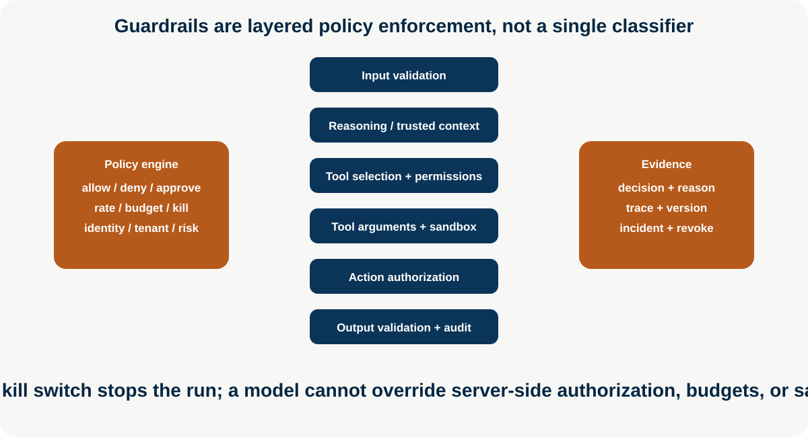
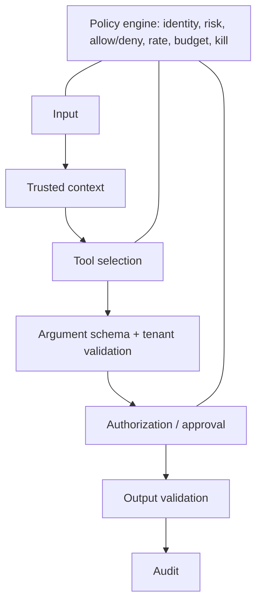

# Guardrails and Policy Enforcement

**Enterprise Agent · 10** · **Notebook:** [`guardrails_policy_enforcement.ipynb`](guardrails_policy_enforcement.ipynb) · **Implementation:** [`lab.py`](lab.py)

Reliable guardrails are defense in depth. They validate and constrain an agent at the input, context, tool-selection, argument, action, output, and audit boundaries. A prompt can guide behavior, but policy engines, identity checks, schemas, sandboxes, budgets, approval services, and kill switches enforce it.

## Scenario and outcomes

Northstar's incident adviser may read tenant-scoped status and runbooks, but cannot restart a service or cross tenant boundaries. A poisoned runbook asks it to bypass instructions. Learners apply deterministic controls before the model sees sensitive context, before a tool is exposed, before arguments/action, and after output.

## 1. Guardrail layers

| Boundary | Enforce | Example |
| --- | --- | --- |
| Input | schema, size, malware/content handling, injection signals, rate limits | quarantine “ignore previous instructions” rather than relying only on detection |
| Context/reasoning | provenance, tenant/trust/freshness scope, prompt-injection containment | retrieved text is data and cannot grant authority |
| Tool selection | allow/deny list, capability/role/tenant scope, discovery policy | expose only `read_status` and `search_runbook` |
| Arguments | typed schema, resource ownership, bounds, idempotency | tool argument tenant must equal authenticated tenant |
| Action | authorization, approval, risk, sandbox, rate/action/budget limit | restart requires exact human-approved request |
| Output | structured contract, sensitive-data redaction, citation/evidence and policy validation | reject unsupported customer claim |
| Audit | policy decision/reason, versions, trace, privacy-aware retention | reconstruct deny/allow/approval evidence |

## 2. Policy engines and operational controls

Centralize policy decisions with explicit inputs: subject identity, tenant, resource, tool/action, risk, data class, environment, time, budget, and approval. Return allow, deny, require approval, or safe degradation with a reason and policy version. Keep enforcement near the resource: gateways enforce authentication/rate limits, tool gateways enforce capabilities/arguments, sandboxes constrain code/browser execution, and action services require idempotency and approval.

Allow lists are safer than broad deny lists for high-risk tools. Sandboxes use short-lived credentials, isolated filesystem/network/process boundaries, resource quotas, and no production secrets by default. A kill switch must revoke execution paths promptly, cancel queued work, prevent resume, and preserve audit evidence.

## 3. Step-by-step lab, production checklist, references

1. Run `python lab.py`; a valid tenant-scoped read is allowed and audited.
2. Pass injected input, an unlisted tool, or cross-tenant arguments; each fails at a different boundary.
3. Mark a request high risk; it changes from an execution path to `approval-required`.
4. Exhaust the action budget and verify it cannot be bypassed by retrying.

- Use policy-as-code with tests/versioning/rollout/rollback; log decisions without retaining unnecessary sensitive prompt content.
- Default deny, least privilege, schema validation, short credentials, sandboxing, rate/budget limits, and independent authorization.
- Test prompt injection, tool hallucination, argument smuggling, SSRF/file/network escape, cross-tenant access, output leakage, retry/budget bypass, and kill-switch propagation.

References: [OWASP Top 10 for Agentic Applications](https://genai.owasp.org/resource/owasp-top-10-for-agentic-applications/), [OWASP prompt injection](https://genai.owasp.org/llmrisk/llm01-prompt-injection/), [NIST AI RMF](https://www.nist.gov/itl/ai-risk-management-framework), [OpenAI agent safety](https://developers.openai.com/api/docs/guides/agent-builder-safety).
