# Guardrails and Policy Enforcement

**Level:** Advanced · **Time:** 60 min · **Prerequisites:** None

**Enterprise Agent · 10** · **Notebook:** [`guardrails_policy_enforcement.ipynb`](guardrails_policy_enforcement.ipynb)

Reliable guardrails are defense in depth. A prompt can guide behavior, but policy engines, schemas, sandboxes, and input firewalls enforce it. If an attacker bypasses the system prompt, the guardrail guarantees the system degrades safely.

Because Guardrails span multiple architectural boundaries, we have broken this curriculum down into three core modules:

1. **[Core Guardrail Layers](#core-guardrail-layers)** (This Page)
2. **[Deep Dive: Application Layer Guardrails](NEMO_AND_LAKERA.md)** (Input/Output interception with NeMo and Lakera)
3. **[Deep Dive: Runtime Policy Enforcement](RUNTIME_POLICY.md)** (Tool execution validation with OPA and Rego)

---

## Core Guardrail Layers

Guardrails must be applied deterministically before the model sees sensitive context, before a tool is exposed, before arguments execute, and after output is generated.

### Boundary Definitions

| Boundary | Enforce | Security Example |
| --- | --- | --- |
| **Input** | Schema, Content handling, Injection signatures | Use an API firewall to quarantine "ignore previous instructions" before the LLM reads it. |
| **Context** | Provenance, Tenant/Trust boundaries | Retrieved RAG text is *data* and cannot grant authority; wrap it in `<untrusted>` tags. |
| **Tool Selection** | Allow/deny lists, Role scopes | Expose only `read_status` to a basic agent; hide `restart_server` entirely. |
| **Arguments** | Typed schemas, Resource ownership | Validate that the generated `user_id` argument belongs to the authenticated session. |
| **Action** | Authorization, Sandboxing, Rate/Budget limits | Send generated Python code to an ephemeral Sandbox instead of running `eval()`. |
| **Output** | PII Redaction, Formatting | Strip Social Security Numbers from the LLM's final response before showing it to the user. |

### Centralized Policy Engines

Centralize policy decisions using explicit inputs: subject identity, tenant, resource, action, risk, and budget. Return *allow*, *deny*, or *require approval*.

Keep enforcement near the resource: 
- API Gateways enforce authentication.
- Application Guardrails enforce Prompt Injections.
- Runtime Gateways (like OPA/Rego) enforce Tool arguments.

---

## Watch For

- **Relying on LLM Self-Correction:** Asking an LLM to evaluate if its own output is safe is flawed; if it is hijacked, it will lie. You must use deterministic rules (Regex/Rego) or secondary smaller classifier models (NeMo).
- **Format vs. Policy:** Validating that an argument is a string (Pydantic) does not mean the agent is *authorized* to query that string.
- **Budget Exhaustion:** Without circuit breakers, an agent stuck in a loop will call an expensive API until the billing account is drained.

---

## Checkpoint

**1. What is the primary difference between a System Prompt and an Application Guardrail?**
- A) A system prompt is faster.
- B) A system prompt suggests behavior to an LLM; a Guardrail is a deterministic or secondary-model firewall that intercepts traffic before/after the LLM.
- C) Guardrails only work in Python.
- D) There is no difference.

Answer

<b>B</b>. Prompts are instructions that can be overridden by malicious context. Guardrails are physical code barriers that enforce policy regardless of what the LLM decides.

**2. Why is Pydantic insufficient for securing tool execution?**
- A) It doesn't support JSON.
- B) It only validates the *shape* and *type* of the data, not if the agent has the *authority* (tenant/RBAC) to use that data.
- C) It is too slow.
- D) It only works for Output guardrails.

Answer

<b>B</b>. Pydantic validates schemas. You need a Policy Engine (like OPA/Rego) to validate authority and context.

